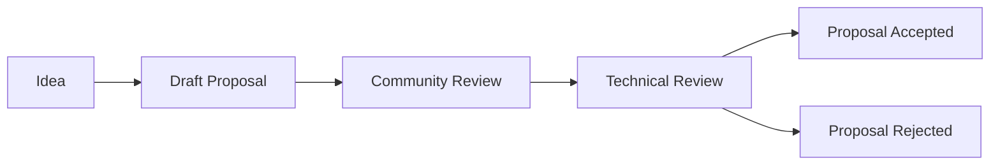
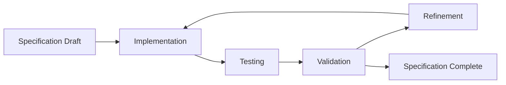
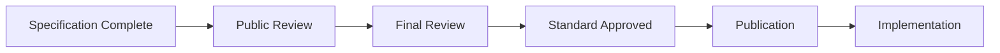

# MPLP Specifications and Standards

**Multi-Agent Protocol Lifecycle Platform - Specifications and Standards v1.0.0-alpha**

[](../README.md)
[](../protocol-foundation/protocol-specification.md)
[](./formal-specification.md)
[](./formal-specification.md)
[](./formal-specification.md)
[](../zh-CN/specifications/README.md)

---

## 🎯 Specifications Overview

This section contains the **production-ready** formal technical specifications and standards for the Multi-Agent Protocol Lifecycle Platform (MPLP). These documents provide the authoritative reference for protocol implementation, data formats, and compliance requirements, validated through 2,869/2,869 tests across all 10 completed modules with enterprise-grade quality standards.

### **Specification Categories**
- **Formal Specifications**: Rigorous technical specifications with formal definitions
- **RFC-Style Documents**: Internet Engineering Task Force (IETF) style specifications
- **Protocol Buffer Definitions**: Binary serialization format specifications
- **JSON Schema Definitions**: Data validation and structure specifications
- **OpenAPI Specifications**: REST API interface definitions
- **Compliance Standards**: Certification and validation requirements

### **Specification Hierarchy**

```mermaid
graph TD
    A[MPLP Specifications] --> B[Formal Specification]
    A --> C[RFC-Style Specifications]
    A --> D[Protocol Buffer Definitions]
    A --> E[JSON Schema Definitions]
    A --> F[OpenAPI Specifications]
    
    B --> B1[Core Protocol Specification]
    B --> B2[L1-L3 Layer Specifications]
    B --> B3[Module Interface Specifications]
    
    C --> C1[MPLP-RFC-001: Core Protocol]
    C --> C2[MPLP-RFC-002: Context Management]
    C --> C3[MPLP-RFC-003: Plan Execution]
    
    D --> D1[Core Protocol Buffers]
    D --> D2[Module Protocol Buffers]
    D --> D3[Transport Protocol Buffers]
    
    E --> E1[Core JSON Schemas]
    E --> E2[Module JSON Schemas]
    E --> E3[Validation Schemas]
    
    F --> F1[Core API Specification]
    F --> F2[Module API Specifications]
    F --> F3[Management API Specification]
```


---

## 📋 Specification Documents

### **Core Specifications**
- **[Formal Specification](./formal-specification.md)** - Rigorous technical specification with formal definitions
- **[RFC-Style Specifications](./rfc-specifications.md)** - IETF-style protocol specifications
- **[Protocol Buffer Definitions](./protobuf-definitions.md)** - Binary serialization format specifications
- **[JSON Schema Definitions](./json-schema-definitions.md)** - Data validation and structure specifications
- **[OpenAPI Specifications](./openapi-specifications.md)** - REST API interface definitions

### **Compliance and Validation**
- **[Compliance Testing](../testing/protocol-compliance-testing.md)** - Protocol compliance validation
- **[Interoperability Testing](../testing/interoperability-testing.md)** - Cross-platform compatibility
- **[Performance Benchmarking](../testing/performance-benchmarking.md)** - Performance validation
- **[Security Testing](../testing/security-testing.md)** - Security compliance validation

---

## 🔧 Specification Standards

### **Document Standards**

#### **Formal Specification Format**
```markdown
# MPLP-SPEC-XXX: [Title]

## Abstract
Brief description of the specification scope and purpose.

## Status
Current status: Draft | Proposed | Accepted | Deprecated

## 1. Introduction
### 1.1 Purpose
### 1.2 Scope
### 1.3 Terminology

## 2. Requirements
### 2.1 Functional Requirements
### 2.2 Non-Functional Requirements
### 2.3 Compliance Requirements

## 3. Specification
### 3.1 Protocol Definition
### 3.2 Data Formats
### 3.3 Interface Definitions

## 4. Implementation Guidelines
### 4.1 Mandatory Features
### 4.2 Optional Features
### 4.3 Extension Points

## 5. Compliance Testing
### 5.1 Test Requirements
### 5.2 Validation Procedures
### 5.3 Certification Process

## 6. Security Considerations
### 6.1 Security Requirements
### 6.2 Threat Model
### 6.3 Mitigation Strategies

## 7. References
### 7.1 Normative References
### 7.2 Informative References
```

#### **RFC-Style Format**
```markdown
# MPLP-RFC-XXX: [Title]

## Abstract
## Status of This Document
## Copyright Notice
## Table of Contents

## 1. Introduction
## 2. Conventions and Terminology
## 3. Protocol Overview
## 4. Detailed Specification
## 5. Security Considerations
## 6. IANA Considerations
## 7. References
## 8. Acknowledgments

## Authors' Addresses
```

### **Version Management**

#### **Specification Versioning**
```yaml
specification_versioning:
  format: "MAJOR.MINOR.PATCH"
  
  major_version:
    description: "Breaking changes to protocol or API"
    examples: ["1.0.0 -> 2.0.0"]
    
  minor_version:
    description: "Backward-compatible feature additions"
    examples: ["1.0.0 -> 1.1.0"]
    
  patch_version:
    description: "Backward-compatible bug fixes"
    examples: ["1.0.0 -> 1.0.1"]
    
  pre_release:
    format: "MAJOR.MINOR.PATCH-PRERELEASE"
    examples: ["1.0.0-alpha", "1.0.0-beta", "1.0.0-rc.1"]
```

#### **Compatibility Matrix**
```yaml
compatibility_matrix:
  mplp_1_0_0_alpha:
    protocol_version: "1.0.0-alpha"
    supported_clients: ["typescript-1.0.0-alpha", "python-1.0.0-alpha", "java-1.0.0-alpha"]
    supported_servers: ["node-1.0.0-alpha", "python-1.0.0-alpha", "java-1.0.0-alpha"]
    breaking_changes: []
    deprecated_features: []
    
  mplp_1_0_0_beta:
    protocol_version: "1.0.0-beta"
    supported_clients: ["typescript-1.0.0-beta", "python-1.0.0-beta", "java-1.0.0-beta"]
    supported_servers: ["node-1.0.0-beta", "python-1.0.0-beta", "java-1.0.0-beta"]
    breaking_changes: ["context_api_v2", "plan_execution_v2"]
    deprecated_features: ["legacy_context_format"]
```

---

## 🔍 Specification Process

### **Specification Development Lifecycle**

#### **1. Proposal Phase**


#### **2. Development Phase**


#### **3. Standardization Phase**


### **Review Process**

#### **Technical Review Criteria**
```yaml
technical_review:
  completeness:
    - All required sections present
    - Clear and unambiguous language
    - Comprehensive examples
    - Complete reference implementations
    
  correctness:
    - Technically sound approach
    - Consistent with existing standards
    - No logical contradictions
    - Proper error handling
    
  implementability:
    - Feasible to implement
    - Clear implementation guidelines
    - Reasonable performance requirements
    - Testable requirements
    
  interoperability:
    - Compatible with existing systems
    - Clear integration points
    - Standard data formats
    - Protocol versioning support
```

#### **Community Review Process**
```yaml
community_review:
  duration: "30 days minimum"
  
  review_channels:
    - GitHub Issues and Pull Requests
    - Community Forum discussions
    - Technical Working Group meetings
    - Public comment periods
    
  review_criteria:
    - Usability and developer experience
    - Real-world applicability
    - Community needs alignment
    - Documentation quality
    
  feedback_incorporation:
    - All feedback must be addressed
    - Changes require additional review
    - Rationale for rejections documented
    - Final approval by Technical Committee
```

---

## 📊 Specification Metrics

### **Quality Metrics**
```yaml
quality_metrics:
  completeness:
    target: "> 95%"
    measurement: "Required sections completed"
    
  clarity:
    target: "> 90%"
    measurement: "Community comprehension score"
    
  implementability:
    target: "> 85%"
    measurement: "Successful reference implementations"
    
  interoperability:
    target: "> 90%"
    measurement: "Cross-platform compatibility tests"
```

### **Adoption Metrics**
```yaml
adoption_metrics:
  implementations:
    target: "> 3 independent implementations"
    measurement: "Verified compliant implementations"
    
  usage:
    target: "> 100 production deployments"
    measurement: "Reported production usage"
    
  community_engagement:
    target: "> 50 active contributors"
    measurement: "Contributors to specification process"
    
  feedback_quality:
    target: "> 80% actionable feedback"
    measurement: "Useful feedback ratio"
```

---

## 🔧 Implementation Guidelines

### **Specification Implementation**

#### **Mandatory Requirements**
```yaml
mandatory_requirements:
  protocol_compliance:
    - Must implement all MUST requirements
    - Must pass all compliance tests
    - Must support required data formats
    - Must implement error handling
    
  interoperability:
    - Must support standard protocols
    - Must use standard data formats
    - Must implement version negotiation
    - Must support backward compatibility
    
  security:
    - Must implement required security features
    - Must pass security compliance tests
    - Must support secure transport
    - Must implement access controls
```

#### **Optional Features**
```yaml
optional_features:
  performance_optimizations:
    - Caching mechanisms
    - Connection pooling
    - Batch processing
    - Compression support
    
  advanced_features:
    - Custom extensions
    - Advanced monitoring
    - Custom authentication
    - Performance analytics
    
  integration_features:
    - Third-party integrations
    - Custom adapters
    - Webhook support
    - Event streaming
```

### **Compliance Certification**

#### **Certification Levels**
```yaml
certification_levels:
  basic_compliance:
    requirements:
      - Core protocol implementation
      - Basic interoperability tests
      - Security baseline tests
    benefits:
      - Official compliance badge
      - Listed in certified implementations
      - Community recognition
      
  advanced_compliance:
    requirements:
      - Full protocol implementation
      - Advanced interoperability tests
      - Comprehensive security tests
      - Performance benchmarks
    benefits:
      - Advanced compliance badge
      - Priority support
      - Technical advisory access
      
  enterprise_compliance:
    requirements:
      - Enterprise feature support
      - High availability tests
      - Scalability benchmarks
      - Security audit
    benefits:
      - Enterprise compliance badge
      - Enterprise support
      - Custom certification
```

---

## 🔗 Related Resources

### **Technical Documentation**
- **[Protocol Foundation](../protocol-foundation/README.md)** - Core protocol concepts
- **[Architecture Guide](../architecture/README.md)** - System architecture overview
- **[Implementation Guide](../implementation/README.md)** - Implementation strategies
- **[Testing Framework](../testing/README.md)** - Testing and validation

### **Development Resources**
- **[Developer Resources](../developers/README.md)** - Developer guide and tools
- **[SDK Documentation](../developers/sdk.md)** - Language-specific SDKs
- **[Code Examples](../developers/examples.md)** - Working code samples
- **[Community Resources](../developers/community-resources.md)** - Community support

### **Standards and Compliance**
- **[Compliance Testing](../testing/protocol-compliance-testing.md)** - Compliance validation
- **[Security Requirements](../implementation/security-requirements.md)** - Security standards
- **[Performance Requirements](../implementation/performance-requirements.md)** - Performance standards

---

**Specifications and Standards Version**: 1.0.0-alpha  
**Last Updated**: September 4, 2025  
**Next Review**: December 4, 2025  
**Status**: Formal Specification Ready  

**⚠️ Alpha Notice**: These specifications provide formal technical standards for MPLP v1.0 Alpha. Additional specifications and standardization processes will be added in Beta release based on implementation feedback and community requirements.
