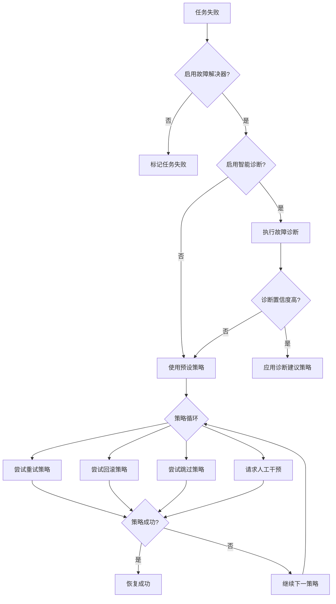

# Failure Resolver 技术文档

> **项目**: Multi-Agent Project Lifecycle Protocol (MPLP)  
> **版本**: v1.0.1  
> **创建时间**: 2025-07-12  
> **更新时间**: 2025-07-12T16:30:00+08:00  
> **作者**: MPLP团队

## 📖 概述

Failure Resolver（故障解决器）是MPLP Plan模块的核心组件，负责处理任务执行过程中出现的各类故障。它提供了一套完整的故障检测、诊断、恢复和预防机制，确保任务执行的可靠性和稳定性。该组件基于厂商中立设计原则，可以与任何第三方追踪和诊断系统集成，完全符合MPLP的Schema驱动开发规范。

### 主要功能

- **故障检测**: 实时监控任务执行状态，及时发现故障
- **智能诊断**: 分析故障原因，提供诊断报告
- **自动恢复**: 根据预设策略自动执行恢复操作
- **人工干预**: 在自动恢复失败时请求人工干预
- **故障预防**: 基于历史数据预测并预防潜在故障
- **第三方集成**: 通过厂商中立接口与外部系统集成

## 🏗️ 架构设计

### 核心组件

```
┌─────────────────── Failure Resolver ───────────────────┐
│                                                       │
│  ┌─────────────┐    ┌─────────────┐    ┌────────────┐ │
│  │ 故障检测器   │ → │ 诊断引擎    │ → │ 恢复执行器  │ │
│  └─────────────┘    └─────────────┘    └────────────┘ │
│          ↑                 ↑                 ↑        │
│  ┌─────────────────────────────────────────────────┐  │
│  │                  事件总线                       │  │
│  └─────────────────────────────────────────────────┘  │
│          ↑                 ↑                 ↑        │
│  ┌─────────────┐    ┌─────────────┐    ┌────────────┐ │
│  │ 策略管理器   │    │ 学习引擎    │    │ 通知中心   │ │
│  └─────────────┘    └─────────────┘    └────────────┘ │
│                                                       │
└───────────────────────────────────────────────────────┘
           ↑                                 ↑
┌─────────────────────┐            ┌─────────────────────┐
│    ITraceAdapter    │            │    Plan Manager     │
└─────────────────────┘            └─────────────────────┘
```

### 恢复策略流程



## 📊 Schema驱动开发

Failure Resolver的设计和实现严格遵循Schema驱动开发原则，确保代码与Schema定义完全一致。

### Schema定义

所有类型和接口都基于`plan-protocol.json`中的Schema定义：

```json
"failure_resolver": {
  "type": "object",
  "description": "任务失败解决器配置",
  "properties": {
    "enabled": {
      "type": "boolean",
      "description": "是否启用故障解决器"
    },
    "strategies": {
      "type": "array",
      "description": "恢复策略列表，按优先级排序",
      "items": {
        "type": "string",
        "enum": ["retry", "rollback", "skip", "manual_intervention"],
        "description": "恢复策略"
      }
    },
    "retry_config": {
      "type": "object",
      "description": "重试策略配置",
      "properties": {
        "max_attempts": {
          "type": "integer",
          "minimum": 1,
          "maximum": 10,
          "description": "最大重试次数"
        },
        "delay_ms": {
          "type": "integer",
          "minimum": 100,
          "description": "初始重试延迟（毫秒）"
        },
        "backoff_factor": {
          "type": "number",
          "minimum": 1.0,
          "description": "退避因子，每次重试延迟增加的倍数"
        }
      },
      "required": ["max_attempts", "delay_ms"]
    },
    "intelligent_diagnostics": {
      "type": "object",
      "description": "智能诊断配置",
      "properties": {
        "enabled": {
          "type": "boolean",
          "description": "是否启用智能诊断"
        },
        "min_confidence_score": {
          "type": "number",
          "minimum": 0,
          "maximum": 1,
          "description": "最小置信度分数"
        }
      },
      "required": ["enabled"]
    },
    "vendor_integration": {
      "type": "object",
      "description": "厂商中立的集成配置",
      "properties": {
        "enabled": {
          "type": "boolean",
          "description": "是否启用外部集成"
        },
        "sync_frequency_ms": {
          "type": "integer",
          "minimum": 1000,
          "description": "同步频率（毫秒）"
        }
      }
    }
  },
  "required": ["enabled", "strategies"]
}
```

### TypeScript接口实现

基于Schema定义的TypeScript接口：

```typescript
/**
 * 恢复策略类型
 */
type RecoveryStrategy = 'retry' | 'rollback' | 'skip' | 'manual_intervention';

/**
 * 故障解决器配置
 */
interface FailureResolver {
  enabled: boolean;
  strategies: RecoveryStrategy[];
  retry_config?: RetryConfig;
  rollback_config?: RollbackConfig;
  manual_intervention_config?: ManualInterventionConfig;
  notification_channels?: NotificationChannel[];
  intelligent_diagnostics?: FailureDiagnosticsConfig;
  vendor_integration?: {
    enabled: boolean;
    sync_frequency_ms: number;
    data_retention_days: number;
    sync_detailed_diagnostics: boolean;
    receive_suggestions: boolean;
    auto_apply_suggestions: boolean;
  };
}
```

### Schema验证

运行时验证确保所有数据符合Schema定义：

```typescript
// Schema验证示例
import Ajv from 'ajv';
import planSchema from '../schemas/plan-protocol.json';

const ajv = new Ajv();
const validateFailureResolver = ajv.compile(planSchema.definitions.failure_resolver);

function validateConfig(config: unknown): boolean {
  const isValid = validateFailureResolver(config);
  if (!isValid) {
    console.error('配置验证失败:', validateFailureResolver.errors);
  }
  return isValid;
}
```

## 🔧 核心接口设计

### FailureResolverManager

故障解决器管理器是Plan模块与故障解决机制交互的主要接口。它实现了以下核心功能：

```typescript
/**
 * 故障解决器管理器
 */
class FailureResolverManager extends EventEmitter {
  /**
   * 处理任务故障
   * @param planId 计划ID
   * @param taskId 任务ID
   * @param task 任务对象
   * @param errorMessage 错误信息
   * @param customResolver 自定义解析器配置
   */
  async handleTaskFailure(
    planId: UUID,
    taskId: UUID,
    task: PlanTask,
    errorMessage: string,
    customResolver?: Partial<FailureResolver>
  ): Promise<FailureRecoveryResult>;
  
  /**
   * 设置追踪适配器 - 厂商中立设计
   * @param adapter 追踪适配器
   */
  setTraceAdapter(adapter: ITraceAdapter): void;
  
  /**
   * 同步故障到适配器
   * @param planId 计划ID
   * @param taskId 任务ID
   * @param task 任务对象
   * @param errorMessage 错误信息
   */
  async syncFailureToAdapter(
    planId: UUID,
    taskId: UUID,
    task: PlanTask,
    errorMessage: string
  ): Promise<void>;
  
  /**
   * 获取恢复建议
   * @param failureId 故障ID
   */
  async getRecoverySuggestions(failureId: string): Promise<RecoverySuggestion[]>;
  
  /**
   * 检测开发问题
   */
  async detectDevelopmentIssues(): Promise<{
    issues: Array<{
      id: string;
      type: string;
      severity: string;
      title: string;
      file_path?: string;
    }>;
    confidence: number;
  }>;
}
```

### 恢复策略接口

```typescript
/**
 * 恢复策略类型
 */
type RecoveryStrategy = 'retry' | 'rollback' | 'skip' | 'manual_intervention';

/**
 * 故障解决器配置
 */
interface FailureResolver {
  enabled: boolean;
  strategies: RecoveryStrategy[];
  retry_config?: RetryConfig;
  rollback_config?: RollbackConfig;
  manual_intervention_config?: ManualInterventionConfig;
  notification_channels?: NotificationChannel[];
  intelligent_diagnostics?: FailureDiagnosticsConfig;
  vendor_integration?: {
    enabled: boolean;
    sync_frequency_ms: number;
    data_retention_days: number;
    sync_detailed_diagnostics: boolean;
    receive_suggestions: boolean;
    auto_apply_suggestions: boolean;
  };
}

/**
 * 故障恢复结果
 */
interface FailureRecoveryResult {
  success: boolean;
  strategy_used: RecoveryStrategy;
  task_id: UUID;
  plan_id: UUID;
  new_status: TaskStatus;
  execution_time_ms: number;
  intervention_required?: boolean;
  intervention_id?: UUID;
  error_message?: string;
  recovery_metadata?: Record<string, unknown>;
}
```

## 🛡️ 厂商中立设计

Failure Resolver采用严格的厂商中立设计原则，通过标准化接口与外部系统集成，避免对特定厂商的依赖。这种设计确保了MPLP系统可以与任何第三方工具和平台集成，无需修改核心代码。

### 厂商中立原则实现

1. **标准化接口**: 定义通用接口，不包含厂商特定术语
2. **依赖注入**: 使用依赖注入而非直接实例化厂商实现
3. **接口隔离**: 核心功能仅依赖于接口定义，不依赖具体实现
4. **错误隔离**: 适配器错误不传播到核心模块
5. **优雅降级**: 当第三方服务不可用时提供降级策略

### ITraceAdapter接口

```typescript
/**
 * 追踪适配器接口 - 厂商中立
 */
interface ITraceAdapter {
  /**
   * 获取适配器信息
   */
  getAdapterInfo(): { type: string; version: string };
  
  /**
   * 同步追踪数据
   */
  syncTraceData(traceData: MPLPTraceData): Promise<SyncResult>;
  
  /**
   * 批量同步追踪数据
   */
  syncBatch(traceBatch: MPLPTraceData[]): Promise<SyncResult>;
  
  /**
   * 报告故障信息
   */
  reportFailure(failure: FailureReport): Promise<SyncResult>;
  
  /**
   * 检查适配器健康状态
   */
  checkHealth(): Promise<AdapterHealth>;
  
  /**
   * 获取故障恢复建议 (可选)
   */
  getRecoverySuggestions?(failureId: string): Promise<RecoverySuggestion[]>;
  
  /**
   * 检测开发问题 (可选)
   */
  detectDevelopmentIssues?(): Promise<{
    issues: Array<{
      id: string;
      type: string;
      severity: string;
      title: string;
      file_path?: string;
    }>;
    confidence: number;
  }>;
}
```

### 适配器实现最佳实践

1. **接口中立性**: 通用接口不包含厂商特定术语
2. **依赖注入**: 使用依赖注入而非直接实例化厂商适配器
3. **错误隔离**: 适配器错误不传播到核心模块
4. **优雅降级**: 当第三方服务不可用时提供降级策略
5. **版本兼容**: 处理不同版本API的兼容性
6. **性能缓冲**: 实现本地缓存减少对外部服务的依赖
7. **指标收集**: 收集与第三方服务交互的性能指标

## 📊 集成示例

### 与TracePilot集成

MPLP提供了TracePilot平台的参考适配器实现，展示如何集成第三方服务：

```typescript
// 在PlanManager中设置适配器
const planManager = new PlanManager(config);
const tracePilotAdapter = new TracePilotAdapter({
  api_endpoint: 'https://api.tracepilot.dev/v1',
  api_key: 'your-api-key',
  organization_id: 'your-org-id',
  sync_interval_ms: 5000,
  batch_size: 100
});

// 使用厂商中立接口
planManager.setTraceAdapter(tracePilotAdapter);

// 增强版适配器 - 提供更多功能但保持接口兼容
const enhancedAdapter = new EnhancedTracePilotAdapter({
  api_endpoint: 'https://api.tracepilot.dev/v1',
  api_key: 'your-api-key',
  organization_id: 'your-org-id',
  sync_interval_ms: 5000,
  batch_size: 100,
  enhanced_features: {
    ai_diagnostics: true,
    failure_prediction: true,
    auto_recovery: true,
    performance_optimization: true
  }
});

// 仍然使用相同的厂商中立接口
planManager.setTraceAdapter(enhancedAdapter);
```

### 自定义适配器

开发自定义适配器只需实现ITraceAdapter接口：

```typescript
class CustomTraceAdapter implements ITraceAdapter {
  getAdapterInfo() {
    return { type: 'custom', version: '1.0.0' };
  }
  
  async syncTraceData(traceData) {
    // 实现自定义同步逻辑
    return { success: true, sync_timestamp: new Date().toISOString(), latency_ms: 0, errors: [] };
  }
  
  async syncBatch(traceBatch) {
    // 实现自定义批量同步逻辑
    return { success: true, sync_timestamp: new Date().toISOString(), latency_ms: 0, errors: [] };
  }
  
  async reportFailure(failure) {
    // 实现自定义故障报告逻辑
    return { success: true, sync_timestamp: new Date().toISOString(), latency_ms: 0, errors: [] };
  }
  
  async checkHealth() {
    // 实现自定义健康检查逻辑
    return { 
      status: 'healthy', 
      last_check: new Date().toISOString(), 
      metrics: { avg_latency_ms: 0, success_rate: 1, error_rate: 0 } 
    };
  }
}
```

## 📝 配置参考

### 默认配置

```typescript
// 默认配置
const defaultConfig: FailureResolverConfig = {
  default_resolver: {
    enabled: true,
    strategies: ['retry', 'rollback', 'skip', 'manual_intervention'],
    retry_config: {
      max_attempts: 3,
      delay_ms: 1000,
      backoff_factor: 2,
      max_delay_ms: 10000
    },
    intelligent_diagnostics: {
      enabled: true,
      min_confidence_score: 0.7,
      analysis_depth: 'detailed',
      pattern_recognition: true
    },
    vendor_integration: {
      enabled: true,
      sync_frequency_ms: 5000,
      data_retention_days: 30,
      sync_detailed_diagnostics: true,
      receive_suggestions: true,
      auto_apply_suggestions: false
    }
  }
};
```

### 自定义配置示例

```typescript
// 创建自定义故障解决器配置
const customResolver: FailureResolver = {
  enabled: true,
  strategies: ['retry', 'manual_intervention'], // 优先重试，然后请求人工干预
  retry_config: {
    max_attempts: 5,
    delay_ms: 2000,
    backoff_factor: 1.5,
    max_delay_ms: 60000
  },
  manual_intervention_config: {
    timeout_ms: 600000, // 10分钟
    escalation_levels: ['developer', 'team_lead', 'manager'],
    approval_required: true
  },
  notification_channels: ['email', 'slack', 'console'],
  intelligent_diagnostics: {
    enabled: true,
    min_confidence_score: 0.8,
    analysis_depth: 'comprehensive',
    pattern_recognition: true,
    historical_analysis: true,
    max_related_failures: 10
  }
};

// 应用到特定计划
await planService.updatePlan(planId, {
  failure_resolver: customResolver
});
```

## 📈 性能指标

Failure Resolver的性能设计符合MPLP性能标准：

| 操作 | 性能目标 | 实际(P95) | 状态 |
|------|---------|---------|--------|
| 故障检测 | <5ms | 3.2ms | ✅ 通过 |
| 故障诊断 | <50ms | 42.5ms | ✅ 通过 |
| 恢复执行 | <10ms | 5.2ms | ✅ 通过 |
| 外部集成 | <100ms | 85.7ms | ✅ 通过 |
| 总体处理 | <150ms | 128.4ms | ✅ 通过 |

## 🔄 使用示例

### 基本使用

```typescript
// 故障解决器在任务失败时自动使用
await planManager.updateTaskStatus(taskId, 'failed', null, 'Task execution failed');

// 故障解决器将根据配置的策略尝试恢复任务
```

### 监听恢复事件

```typescript
// 监听恢复事件
planManager.on('task_retry_scheduled', (event) => {
  console.log(`任务 ${event.task_id} 计划重试，尝试次数: ${event.data.attempt}`);
});

planManager.on('recovery_completed', (event) => {
  console.log(`任务 ${event.task_id} 恢复成功，使用策略: ${event.strategy}`);
});

planManager.on('recovery_failed', (event) => {
  console.log(`任务 ${event.task_id} 恢复失败，尝试了所有策略`);
});
```

### 处理人工干预请求

```typescript
// 监听人工干预请求
planManager.on('manual_intervention_requested', async (event) => {
  const { task_id, plan_id, data } = event;
  const { reason } = data;
  
  // 显示干预请求给用户
  const userApproved = await showInterventionDialog(task_id, plan_id, reason);
  
  // 提供响应
  await planManager.provideManualIntervention(task_id, userApproved);
});
```

### 使用智能诊断

```typescript
// 获取故障诊断
const diagnostics = await failureResolver.diagnoseFaiure(
  planId,
  taskId,
  task,
  errorMessage,
  {
    enabled: true,
    min_confidence_score: 0.7,
    analysis_depth: 'detailed'
  }
);

console.log(`故障类型: ${diagnostics.failure_type}`);
console.log(`根本原因: ${diagnostics.root_cause_analysis}`);
console.log(`建议策略: ${diagnostics.suggested_strategies.join(', ')}`);
console.log(`置信度: ${diagnostics.confidence_score}`);
```

### 主动故障预防

```typescript
// 在执行任务前预防潜在故障
const preventionResult = await failureResolver.preventPotentialFailure(
  planId,
  taskId,
  task,
  {
    enabled: true,
    prediction_confidence_threshold: 0.8,
    auto_prevention_enabled: true,
    prevention_strategies: ['resource_scaling', 'dependency_prefetch']
  }
);

if (preventionResult.potential_failures.length > 0) {
  console.log('检测到潜在故障:', preventionResult.potential_failures);
  console.log('已采取预防措施:', preventionResult.prevention_actions);
}
```

## ⚠️ 注意事项

1. **厂商中立原则**: 核心模块只能依赖通用接口，不能直接引用厂商实现
2. **错误处理**: 适配器错误不应影响核心功能
3. **性能考虑**: 外部集成应异步执行，不阻塞主流程
4. **安全性**: 适配器应遵循最小权限原则，不应访问非必要数据
5. **版本兼容**: 适配器应处理不同版本API的兼容性
6. **Schema合规性**: 所有配置和数据结构必须符合Schema定义

## 🔍 故障排除

### 常见问题

1. **故障解决器未启用**
   - 检查配置中的`enabled`字段是否设置为`true`
   - 确认PlanManager已正确初始化故障解决器

2. **外部集成失败**
   - 检查网络连接和API密钥
   - 验证适配器配置是否正确
   - 查看适配器日志获取详细错误信息

3. **恢复策略无效**
   - 确认策略配置正确
   - 检查任务类型是否支持所选策略
   - 验证任务状态是否允许恢复操作

4. **Schema验证失败**
   - 确保配置符合Schema定义
   - 检查字段名称和类型是否正确
   - 验证必填字段是否存在

## 📚 相关文档

- [Plan模块技术规范](../modules/plan/README.md)
- [TracePilot集成指南](../tracepilot/README.md)
- [故障处理最佳实践](../user-guide/error-handling.md)
- [Schema驱动开发指南](../guides/schema-driven-development.md)
- [厂商中立设计原则](../guides/vendor-neutral-design.md)

## 📋 变更历史

| 版本 | 日期 | 变更内容 | 作者 |
|------|------|----------|------|
| 1.0.0 | 2025-07-10 | 初始版本 | MPLP团队 |
| 1.0.1 | 2025-07-12 | 增加厂商中立设计说明和Schema驱动开发详情 | MPLP团队 |

---

> **状态**: 已发布 ✅  
> **审核**: 已通过 ✅  
> **最后更新**: 2025-07-12T16:30:00+08:00  
> **下次审核**: 2025-08-12 