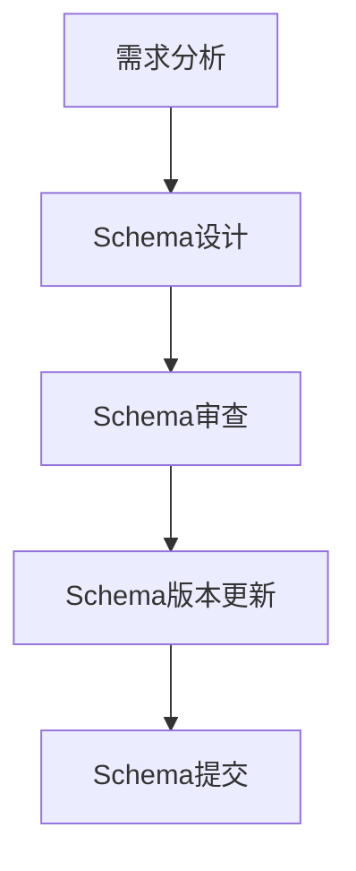
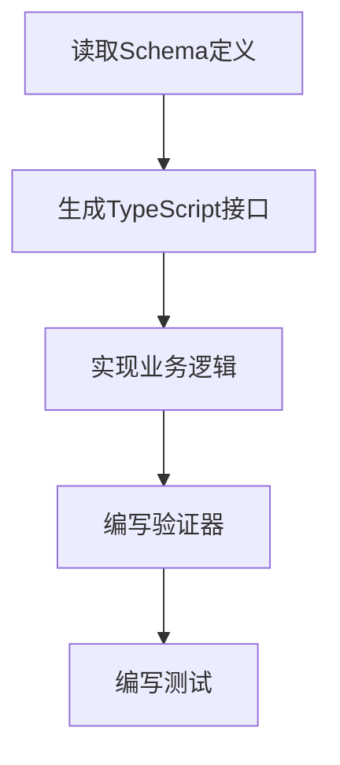
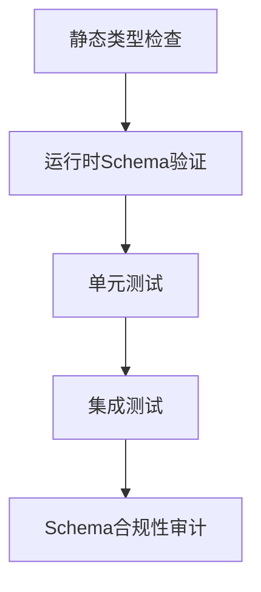

# Schema驱动开发指南

> **项目**: Multi-Agent Project Lifecycle Protocol (MPLP)  
> **版本**: v1.0.0  
> **创建时间**: 2025-07-12  
> **更新时间**: 2025-07-12T14:00:00+08:00  
> **作者**: MPLP团队

## 📖 概述

Schema驱动开发（Schema-Driven Development，SDD）是MPLP项目采用的核心开发方法论，它将Schema定义作为开发过程的中心和权威来源，确保代码实现与数据模型的一致性。本指南详细说明了MPLP项目中Schema驱动开发的原则、实践和流程。

## 🎯 核心原则

### 1. Schema优先

在MPLP项目中，所有开发工作必须以Schema定义为起点：

- Schema是数据结构和接口的唯一权威来源
- 代码实现必须严格遵循Schema定义
- 任何数据模型的变更必须先在Schema中定义，然后再实现到代码中

### 2. 单一真相源

- 所有模块使用统一的Schema定义
- 避免重复或冗余的数据模型定义
- Schema版本控制与代码版本控制同步

### 3. 强类型约束

- 使用TypeScript接口严格映射Schema定义
- 运行时验证确保数据符合Schema约束
- 编译时类型检查防止类型错误

### 4. 向后兼容性

- Schema演进必须保持向后兼容性
- 新增字段应设为可选
- 避免删除或重命名已存在的字段
- 使用版本控制管理不兼容变更

## 🔧 Schema定义规范

### JSON Schema标准

MPLP项目使用JSON Schema Draft 2020-12标准定义所有Schema：

```json
{
  "$schema": "https://json-schema.org/draft/2020-12/schema",
  "$id": "https://mplp.dev/schemas/v1.0/module-protocol.json",
  "title": "MPLP Module Protocol",
  "description": "模块协议Schema定义",
  "type": "object",
  "properties": {
    // 属性定义
  }
}
```

### 命名约定

- Schema文件命名: `{module}-protocol.json`
- 属性命名: 使用snake_case（如`context_id`, `failure_resolver`）
- 类型命名: 使用PascalCase（如`ContextProtocol`, `FailureResolver`）
- 枚举值: 使用snake_case或小写字母（如`active`, `manual_intervention`）

### 版本控制

- 每个Schema文件必须包含版本信息
- 使用语义化版本（SemVer）格式：`MAJOR.MINOR.PATCH`
- 主版本（MAJOR）: 不兼容的API修改
- 次版本（MINOR）: 向后兼容的功能性新增
- 修订版（PATCH）: 向后兼容的问题修正

## 📋 开发流程

### 1. Schema定义阶段



1. 根据需求分析设计Schema
2. 进行Schema审查，确保符合设计规范
3. 更新Schema版本
4. 提交Schema到代码库

### 2. 代码实现阶段



1. 读取最新的Schema定义
2. 生成或更新TypeScript接口
3. 基于接口实现业务逻辑
4. 编写Schema验证器
5. 编写单元测试和集成测试

### 3. 验证阶段



1. 使用TypeScript进行静态类型检查
2. 使用验证器进行运行时Schema验证
3. 运行单元测试确保功能正确
4. 运行集成测试确保模块间交互正确
5. 进行Schema合规性审计

## 🛠️ 工具和技术

### Schema验证工具

```typescript
// Schema验证示例
import Ajv from 'ajv';
import schema from '../schemas/module-protocol.json';

const ajv = new Ajv();
const validate = ajv.compile(schema);

function validateData(data: unknown): boolean {
  const isValid = validate(data);
  if (!isValid) {
    console.error('验证失败:', validate.errors);
  }
  return isValid;
}
```

### TypeScript接口生成

```typescript
// 基于Schema生成的TypeScript接口
interface ModuleProtocol {
  protocol_version: string;
  timestamp: string;
  module_id: string;
  status: 'active' | 'inactive' | 'deprecated';
  configuration: {
    enabled: boolean;
    options: Record<string, unknown>;
  };
  // 其他属性...
}
```

### 自动化测试

```typescript
// Schema合规性测试
describe('Schema Compliance Tests', () => {
  test('ModuleProtocol符合Schema定义', () => {
    const data: ModuleProtocol = {
      protocol_version: '1.0.0',
      timestamp: new Date().toISOString(),
      module_id: 'test-module',
      status: 'active',
      configuration: {
        enabled: true,
        options: {}
      }
    };
    
    expect(validateSchema(data)).toBe(true);
  });
});
```

## 📚 最佳实践

### 1. Schema设计最佳实践

- 使用明确的字段名称，避免缩写
- 为每个字段提供详细的描述
- 使用适当的约束（最小/最大值，模式等）
- 提供示例值帮助理解
- 合理组织嵌套结构，避免过深的嵌套

### 2. 接口实现最佳实践

- 使用TypeScript的严格模式
- 避免使用`any`类型
- 使用类型守卫确保类型安全
- 实现运行时类型检查
- 使用工厂函数创建符合Schema的对象

### 3. 测试最佳实践

- 编写专门的Schema验证测试
- 测试边界条件和异常情况
- 测试Schema的向后兼容性
- 使用快照测试捕获Schema变化
- 自动化Schema合规性检查

## ⚠️ 常见问题与解决方案

### 1. Schema与代码不一致

**问题**: Schema定义与实际代码实现不匹配

**解决方案**:
- 使用自动化工具生成接口
- 实施CI/CD检查确保一致性
- 定期进行Schema合规性审计

### 2. Schema演进管理

**问题**: 如何管理Schema的变更而不破坏兼容性

**解决方案**:
- 遵循语义化版本规则
- 新增字段设为可选
- 使用废弃标记而非直接删除
- 维护变更日志记录所有修改

### 3. 性能问题

**问题**: Schema验证可能影响运行时性能

**解决方案**:
- 仅在关键点进行验证
- 使用编译时生成的验证器
- 实现验证结果缓存
- 在非生产环境进行更严格的验证

## 📋 检查清单

开发前确认：
- [ ] 已阅读并理解相关Schema定义
- [ ] Schema版本与项目版本一致
- [ ] 了解Schema中的必填字段和可选字段
- [ ] 了解Schema中的约束条件

开发中确认：
- [ ] TypeScript接口与Schema定义一致
- [ ] 所有数据结构符合Schema约束
- [ ] 实现了适当的验证机制
- [ ] 遵循命名约定和编码规范

提交前确认：
- [ ] 通过所有Schema验证测试
- [ ] 文档与Schema保持同步
- [ ] 更新了相关的变更日志
- [ ] 完成了Schema合规性审计

## 📚 相关资源

- [JSON Schema官方文档](https://json-schema.org/)
- [TypeScript官方文档](https://www.typescriptlang.org/docs/)
- [Ajv JSON Schema验证器](https://ajv.js.org/)
- [MPLP Schema仓库](../schemas/)

## 📋 变更历史

| 版本 | 日期 | 变更内容 | 作者 |
|------|------|----------|------|
| 1.0.0 | 2025-07-12 | 初始版本 | MPLP团队 |

---

> **状态**: 已发布 ✅  
> **审核**: 已通过 ✅  
> **最后更新**: 2025-07-12T14:00:00+08:00  
> **下次审核**: 2025-08-12 