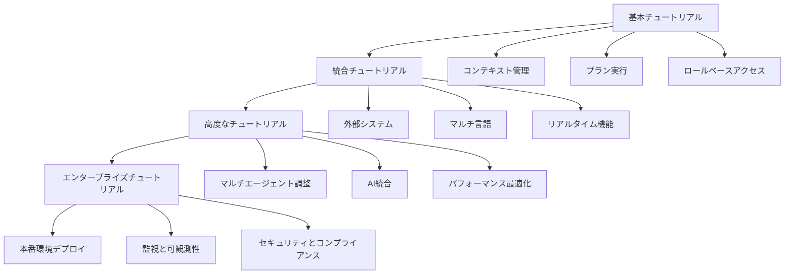

# MPLPチュートリアル

> **🌐 言語ナビゲーション**: [English](../../en/developers/tutorials.md) | [中文](../../zh-CN/developers/tutorials.md) | [日本語](tutorials.md)


**Multi-Agent Protocol Lifecycle Platform - 包括的なチュートリアル v1.0.0-alpha**

[](./README.md)
[](./examples.md)
[](./quick-start.md)
[](../../en/developers/tutorials.md)

---

## 🎯 チュートリアル概要

MPLP包括的なチュートリアルシリーズへようこそ！これらのステップバイステップガイドは、基本概念から高度なマルチエージェントシステム開発まで、段階的に学習を進めます。各チュートリアルは前の知識の上に構築され、動作するコード例、ベストプラクティス、実世界のシナリオが含まれています。

### **学習パス**


### **チュートリアルカテゴリ**
- **初心者チュートリアル**: コア概念と基本実装
- **中級チュートリアル**: 統合パターンと高度な機能
- **上級チュートリアル**: マルチエージェント調整と最適化
- **エンタープライズチュートリアル**: 本番環境デプロイとエンタープライズ機能

---

## 🚀 基本チュートリアル: 最初のMPLPアプリケーションを構築する

### **チュートリアル概要**
**所要時間**: 30分
**前提条件**: [クイックスタートガイド](./quick-start.md)を完了
**構築するもの**: コンテキスト共有とプラン実行を備えたタスク管理システム

### **ステップ1: プロジェクトセットアップ**
```bash
# 新しいプロジェクトを作成
mkdir mplp-task-manager
cd mplp-task-manager

# プロジェクトを初期化
npm init -y
npm install @mplp/core @mplp/context @mplp/plan @mplp/role @mplp/confirm @mplp/trace
npm install -D typescript @types/node ts-node

# TypeScript設定を作成
cat > tsconfig.json << EOF
{
  "compilerOptions": {
    "target": "ES2020",
    "module": "commonjs",
    "lib": ["ES2020"],
    "outDir": "./dist",
    "rootDir": "./src",
    "strict": true,
    "esModuleInterop": true,
    "skipLibCheck": true,
    "forceConsistentCasingInFileNames": true
  },
  "include": ["src/**/*"],
  "exclude": ["node_modules", "dist"]
}
EOF
```

### **ステップ2: 設定セットアップ**
```typescript
// src/config.ts
import { MPLPConfiguration } from '@mplp/core';

export const config: MPLPConfiguration = {
  core: {
    protocolVersion: '1.0.0-alpha',
    environment: 'development',
    logLevel: 'info'
  },
  modules: {
    context: { enabled: true },
    plan: { enabled: true },
    role: { enabled: true },
    confirm: { enabled: true },
    trace: { enabled: true }
  },
  database: {
    type: 'memory', // チュートリアルの簡略化のため
    options: {}
  },
  cache: {
    type: 'memory',
    options: {}
  }
};
```

### **ステップ3: タスク管理サービス**
```typescript
// src/task-manager.ts
import { MPLPClient } from '@mplp/core';
import { config } from './config';

export interface Task {
  taskId: string;
  title: string;
  description: string;
  priority: 'low' | 'medium' | 'high';
  status: 'pending' | 'in_progress' | 'completed' | 'cancelled';
  assignedTo?: string;
  dueDate?: Date;
  dependencies?: string[];
}

export class TaskManager {
  private client: MPLPClient;

  constructor() {
    this.client = new MPLPClient(config);
  }

  async initialize(): Promise<void> {
    await this.client.initialize();
    console.log('✅ タスクマネージャーが初期化されました');
  }

  async createTask(task: Omit<Task, 'taskId' | 'status'>): Promise<Task> {
    const taskId = `task-${Date.now()}-${Math.random().toString(36).substr(2, 9)}`;

    // タスク調整用のコンテキストを作成
    const context = await this.client.context.createContext({
      contextId: `ctx-${taskId}`,
      contextType: 'task_management',
      contextData: {
        taskId,
        title: task.title,
        description: task.description,
        priority: task.priority,
        assignedTo: task.assignedTo,
        dueDate: task.dueDate?.toISOString(),
        dependencies: task.dependencies || [],
        createdAt: new Date().toISOString()
      },
      createdBy: 'task-manager'
    });

    const fullTask: Task = {
      taskId,
      ...task,
      status: 'pending'
    };

    console.log(`📋 タスクが作成されました: ${taskId} - ${task.title}`);
    return fullTask;
  }

  async executeTask(taskId: string): Promise<void> {
    const contextId = `ctx-${taskId}`;

    // タスクコンテキストを取得
    const context = await this.client.context.getContext(contextId);
    if (!context) {
      throw new Error(`タスクが見つかりません: ${taskId}`);
    }

    // 実行プランを作成
    const plan = await this.client.plan.createPlan({
      planId: `plan-${taskId}`,
      contextId: contextId,
      planType: 'sequential_workflow',
      planSteps: [
        {
          stepId: 'step-001',
          operation: 'validate_task',
          parameters: { taskId },
          estimatedDuration: 5
        },
        {
          stepId: 'step-002',
          operation: 'check_dependencies',
          parameters: { dependencies: context.contextData.dependencies },
          estimatedDuration: 10
        },
        {
          stepId: 'step-003',
          operation: 'execute_task_logic',
          parameters: {
            taskId,
            priority: context.contextData.priority,
            assignedTo: context.contextData.assignedTo
          },
          estimatedDuration: 30
        },
        {
          stepId: 'step-004',
          operation: 'update_status',
          parameters: { taskId, status: 'completed' },
          estimatedDuration: 5
        }
      ],
      createdBy: 'task-manager'
    });

    // トレースを開始
    const trace = await this.client.trace.startTrace({
      traceId: `trace-${taskId}`,
      contextId: contextId,
      planId: plan.planId,
      traceType: 'task_execution',
      operation: 'execute_task',
      startedBy: 'task-manager'
    });

    console.log(`⚡ タスクを実行中: ${taskId}`);

    // プランを実行
    const result = await this.client.plan.executePlan(plan.planId, {
      traceId: trace.traceId,
      executionMode: 'sequential',
      timeoutSeconds: 120
    });

    // トレースを終了
    await this.client.trace.endTrace(trace.traceId);

    if (result.executionStatus === 'completed') {
      console.log(`✅ タスクが完了しました: ${taskId}`);

      // 完了でコンテキストを更新
      await this.client.context.updateContext(contextId, {
        contextData: {
          ...context.contextData,
          status: 'completed',
          completedAt: new Date().toISOString(),
          executionDuration: result.totalDuration
        },
        updatedBy: 'task-manager'
      });
    } else {
      console.log(`❌ タスクが失敗しました: ${taskId} - ${result.error}`);
      throw new Error(`タスク実行が失敗しました: ${result.error}`);
    }
  }

  async getTaskStatus(taskId: string): Promise<Task | null> {
    const contextId = `ctx-${taskId}`;
    const context = await this.client.context.getContext(contextId);

    if (!context) {
      return null;
    }

    return {
      taskId,
      title: context.contextData.title,
      description: context.contextData.description,
      priority: context.contextData.priority,
      status: context.contextData.status || 'pending',
      assignedTo: context.contextData.assignedTo,
      dueDate: context.contextData.dueDate ? new Date(context.contextData.dueDate) : undefined,
      dependencies: context.contextData.dependencies || []
    };
  }

  async listTasks(): Promise<Task[]> {
    const contexts = await this.client.context.searchContexts({
      contextType: 'task_management',
      limit: 100
    });

    return contexts.results.map(context => ({
      taskId: context.contextData.taskId,
      title: context.contextData.title,
      description: context.contextData.description,
      priority: context.contextData.priority,
      status: context.contextData.status || 'pending',
      assignedTo: context.contextData.assignedTo,
      dueDate: context.contextData.dueDate ? new Date(context.contextData.dueDate) : undefined,
      dependencies: context.contextData.dependencies || []
    }));
  }
}
```

### **ステップ4: メインアプリケーション**
```typescript
// src/app.ts
import { TaskManager } from './task-manager';

async function main() {
  console.log('🚀 MPLPタスクマネージャーチュートリアルを開始します...');

  const taskManager = new TaskManager();
  await taskManager.initialize();

  try {
    // サンプルタスクを作成
    const task1 = await taskManager.createTask({
      title: '開発環境のセットアップ',
      description: 'MPLP開発ツールをインストールして設定',
      priority: 'high',
      assignedTo: 'developer-001'
    });

    const task2 = await taskManager.createTask({
      title: '単体テストの作成',
      description: 'タスクマネージャーの包括的な単体テストを作成',
      priority: 'medium',
      assignedTo: 'developer-002',
      dependencies: [task1.taskId]
    });

    const task3 = await taskManager.createTask({
      title: 'ステージングへのデプロイ',
      description: 'タスクマネージャーをステージング環境にデプロイ',
      priority: 'low',
      assignedTo: 'devops-001',
      dependencies: [task1.taskId, task2.taskId]
    });

    console.log('\n📋 作成されたタスク:');
    const tasks = await taskManager.listTasks();
    tasks.forEach(task => {
      console.log(`  - ${task.taskId}: ${task.title} (${task.priority}) -> ${task.assignedTo}`);
    });

    // 依存関係の順序でタスクを実行
    console.log('\n⚡ タスクを実行中:');

    // task1を実行（依存関係なし）
    await taskManager.executeTask(task1.taskId);

    // task2を実行（task1に依存）
    await taskManager.executeTask(task2.taskId);

    // task3を実行（task1とtask2に依存）
    await taskManager.executeTask(task3.taskId);

    // 最終ステータスを表示
    console.log('\n📊 最終タスクステータス:');
    const finalTasks = await taskManager.listTasks();
    finalTasks.forEach(task => {
      console.log(`  - ${task.title}: ${task.status}`);
    });

    console.log('\n🎉 チュートリアルが正常に完了しました！');

  } catch (error) {
    console.error('❌ チュートリアルが失敗しました:', error);
  }
}

main().catch(console.error);
```

### **ステップ5: チュートリアルを実行**
```bash
# ディレクトリ構造を作成
mkdir src

# 上記のコードファイルをsrc/にコピー

# チュートリアルを実行
npx ts-node src/app.ts

# 期待される出力:
# 🚀 MPLPタスクマネージャーチュートリアルを開始します...
# ✅ タスクマネージャーが初期化されました
# 📋 タスクが作成されました: task-1725456789123-abc123 - 開発環境のセットアップ
# 📋 タスクが作成されました: task-1725456789456-def456 - 単体テストの作成
# 📋 タスクが作成されました: task-1725456789789-ghi789 - ステージングへのデプロイ
#
# 📋 作成されたタスク:
#   - task-1725456789123-abc123: 開発環境のセットアップ (high) -> developer-001
#   - task-1725456789456-def456: 単体テストの作成 (medium) -> developer-002
#   - task-1725456789789-ghi789: ステージングへのデプロイ (low) -> devops-001
#
# ⚡ タスクを実行中:
# ⚡ タスクを実行中: task-1725456789123-abc123
# ✅ タスクが完了しました: task-1725456789123-abc123
# ⚡ タスクを実行中: task-1725456789456-def456
# ✅ タスクが完了しました: task-1725456789456-def456
# ⚡ タスクを実行中: task-1725456789789-ghi789
# ✅ タスクが完了しました: task-1725456789789-ghi789
#
# 📊 最終タスクステータス:
#   - 開発環境のセットアップ: completed
#   - 単体テストの作成: completed
#   - ステージングへのデプロイ: completed
#
# 🎉 チュートリアルが正常に完了しました！
```

---

## 🔧 統合チュートリアル: 外部システムとの接続

### **チュートリアル概要**
**所要時間**: 45分
**前提条件**: 基本チュートリアルを完了
**構築するもの**: 外部APIとデータベースとの統合

### **ステップ1: 外部サービス統合**
```typescript
// src/integrations/external-api.ts
import { MPLPClient } from '@mplp/core';

export class ExternalAPIIntegration {
  private client: MPLPClient;

  constructor(client: MPLPClient) {
    this.client = client;
  }

  async integrateWithCRM(customerId: string): Promise<any> {
    // CRM統合用のコンテキストを作成
    const context = await this.client.context.createContext({
      contextId: `crm-integration-${customerId}`,
      contextType: 'external_integration',
      contextData: {
        integrationType: 'crm',
        customerId: customerId,
        integrationStarted: new Date().toISOString()
      },
      createdBy: 'integration-service'
    });

    // 統合プランを作成
    const plan = await this.client.plan.createPlan({
      planId: `crm-plan-${customerId}`,
      contextId: context.contextId,
      planType: 'external_integration',
      planSteps: [
        {
          stepId: 'authenticate',
          operation: 'crm_authenticate',
          parameters: { apiKey: process.env.CRM_API_KEY },
          estimatedDuration: 10
        },
        {
          stepId: 'fetch_customer',
          operation: 'crm_fetch_customer',
          parameters: { customerId },
          estimatedDuration: 20
        },
        {
          stepId: 'sync_data',
          operation: 'crm_sync_data',
          parameters: { customerId },
          estimatedDuration: 30
        }
      ],
      createdBy: 'integration-service'
    });

    // 統合を実行
    const result = await this.client.plan.executePlan(plan.planId);

    if (result.executionStatus === 'completed') {
      console.log(`✅ 顧客のCRM統合が完了しました: ${customerId}`);
      return result.executionResult;
    } else {
      throw new Error(`CRM統合が失敗しました: ${result.error}`);
    }
  }
}
```

### **ステップ2: データベース統合**
```typescript
// src/integrations/database.ts
import { MPLPClient } from '@mplp/core';

export class DatabaseIntegration {
  private client: MPLPClient;

  constructor(client: MPLPClient) {
    this.client = client;
  }

  async syncWithDatabase(tableName: string, data: any[]): Promise<void> {
    const context = await this.client.context.createContext({
      contextId: `db-sync-${tableName}-${Date.now()}`,
      contextType: 'database_sync',
      contextData: {
        tableName,
        recordCount: data.length,
        syncStarted: new Date().toISOString()
      },
      createdBy: 'database-service'
    });

    const plan = await this.client.plan.createPlan({
      planId: `db-plan-${tableName}-${Date.now()}`,
      contextId: context.contextId,
      planType: 'parallel_workflow',
      planSteps: data.map((record, index) => ({
        stepId: `sync-record-${index}`,
        operation: 'database_upsert',
        parameters: { tableName, record },
        estimatedDuration: 5
      })),
      createdBy: 'database-service'
    });

    const result = await this.client.plan.executePlan(plan.planId, {
      executionMode: 'parallel',
      maxParallelSteps: 10
    });

    if (result.executionStatus === 'completed') {
      console.log(`✅ テーブルのデータベース同期が完了しました: ${tableName}`);
    } else {
      throw new Error(`データベース同期が失敗しました: ${result.error}`);
    }
  }
}
```

---

## 🎯 高度なチュートリアル: マルチエージェント調整

### **チュートリアル概要**
**所要時間**: 60分
**前提条件**: 統合チュートリアルを完了
**構築するもの**: ロールベースのコラボレーションを備えた調整されたマルチエージェントシステム

### **ステップ1: エージェント調整システム**
```typescript
// src/agents/coordination-system.ts
import { MPLPClient } from '@mplp/core';

export interface Agent {
  agentId: string;
  agentType: string;
  capabilities: string[];
  status: 'idle' | 'busy' | 'offline';
  currentTask?: string;
}

export class MultiAgentCoordinator {
  private client: MPLPClient;
  private agents: Map<string, Agent> = new Map();

  constructor(client: MPLPClient) {
    this.client = client;
  }

  async registerAgent(agent: Agent): Promise<void> {
    // エージェント登録用のコンテキストを作成
    const context = await this.client.context.createContext({
      contextId: `agent-${agent.agentId}`,
      contextType: 'agent_registration',
      contextData: {
        agentId: agent.agentId,
        agentType: agent.agentType,
        capabilities: agent.capabilities,
        registeredAt: new Date().toISOString()
      },
      createdBy: 'coordination-system'
    });

    // エージェントにロールを割り当て
    await this.client.role.assignRole({
      userId: agent.agentId,
      roleId: `agent-${agent.agentType}`,
      assignedBy: 'coordination-system',
      contextId: context.contextId
    });

    this.agents.set(agent.agentId, agent);
    console.log(`🤖 エージェントが登録されました: ${agent.agentId} (${agent.agentType})`);
  }

  async coordinateTask(taskDescription: string, requiredCapabilities: string[]): Promise<string> {
    // 適切なエージェントを見つける
    const suitableAgents = Array.from(this.agents.values()).filter(agent =>
      agent.status === 'idle' &&
      requiredCapabilities.every(cap => agent.capabilities.includes(cap))
    );

    if (suitableAgents.length === 0) {
      throw new Error('利用可能な適切なエージェントがありません');
    }

    // 調整コンテキストを作成
    const coordinationId = `coordination-${Date.now()}`;
    const context = await this.client.context.createContext({
      contextId: coordinationId,
      contextType: 'multi_agent_coordination',
      contextData: {
        taskDescription,
        requiredCapabilities,
        availableAgents: suitableAgents.map(a => a.agentId),
        coordinationStarted: new Date().toISOString()
      },
      createdBy: 'coordination-system'
    });

    // 調整プランを作成
    const plan = await this.client.plan.createPlan({
      planId: `coord-plan-${coordinationId}`,
      contextId: context.contextId,
      planType: 'multi_agent_workflow',
      planSteps: [
        {
          stepId: 'agent-selection',
          operation: 'select_optimal_agent',
          parameters: {
            availableAgents: suitableAgents.map(a => a.agentId),
            requiredCapabilities
          },
          estimatedDuration: 10
        },
        {
          stepId: 'task-assignment',
          operation: 'assign_task_to_agent',
          parameters: { taskDescription },
          estimatedDuration: 5
        },
        {
          stepId: 'monitor-execution',
          operation: 'monitor_agent_execution',
          parameters: { monitoringInterval: 5000 },
          estimatedDuration: 60
        }
      ],
      createdBy: 'coordination-system'
    });

    // 調整を実行
    const result = await this.client.plan.executePlan(plan.planId);

    if (result.executionStatus === 'completed') {
      console.log(`✅ タスク調整が完了しました: ${coordinationId}`);
      return coordinationId;
    } else {
      throw new Error(`タスク調整が失敗しました: ${result.error}`);
    }
  }

  async getCoordinationStatus(coordinationId: string): Promise<any> {
    const context = await this.client.context.getContext(coordinationId);
    return context?.contextData;
  }
}
```

### **ステップ2: 専門エージェント**
```typescript
// src/agents/specialized-agents.ts
export class DataProcessingAgent {
  constructor(private agentId: string, private coordinator: MultiAgentCoordinator) {}

  async processData(data: any[]): Promise<any> {
    console.log(`📊 ${this.agentId}: ${data.length}件のレコードを処理中`);

    // データ処理をシミュレート
    await new Promise(resolve => setTimeout(resolve, 2000));

    return {
      processedRecords: data.length,
      processingTime: 2000,
      agentId: this.agentId
    };
  }
}

export class ValidationAgent {
  constructor(private agentId: string, private coordinator: MultiAgentCoordinator) {}

  async validateData(data: any[]): Promise<boolean> {
    console.log(`✅ ${this.agentId}: ${data.length}件のレコードを検証中`);

    // 検証をシミュレート
    await new Promise(resolve => setTimeout(resolve, 1000));

    return true; // デモ用にすべて有効
  }
}

export class ReportingAgent {
  constructor(private agentId: string, private coordinator: MultiAgentCoordinator) {}

  async generateReport(processedData: any): Promise<string> {
    console.log(`📋 ${this.agentId}: レポートを生成中`);

    // レポート生成をシミュレート
    await new Promise(resolve => setTimeout(resolve, 1500));

    return `${this.agentId}によって${new Date().toISOString()}に生成されたレポート`;
  }
}
```

---

## 🔗 関連リソース

- **[開発者リソース概要](./README.md)** - 完全な開発者ガイド
- **[クイックスタートガイド](./quick-start.md)** - すぐに始める
- **[コード例](./examples.md)** - 動作するコードサンプル
- **[SDKドキュメント](./sdk.md)** - 言語固有のガイド
- **[コミュニティリソース](./community-resources.md)** - コミュニティサポート

---

**チュートリアルバージョン**: 1.0.0-alpha
**最終更新**: 2025年9月4日
**次回レビュー**: 2025年12月4日
**ステータス**: 学習準備完了

**⚠️ アルファ版の注意**: これらのチュートリアルは、MPLP v1.0 Alpha開発の包括的な学習パスを提供します。追加のチュートリアルとインタラクティブな学習機能は、開発者のフィードバックと学習分析に基づいて、ベータリリースで追加される予定です。


**Multi-Agent Protocol Lifecycle Platform - 包括的チュートリアル v1.0.0-alpha**

[](./README.md)
[](./examples.md)
[](./quick-start.md)
[](../../en/developers/tutorials.md)

---

## 🎯 チュートリアル概要

MPLP包括的チュートリアルシリーズへようこそ！これらのステップバイステップガイドは、基本概念から高度なマルチエージェントシステム開発まであなたを導きます。各チュートリアルは以前の知識に基づいて構築され、動作するコード例、ベストプラクティス、実世界のシナリオが含まれています。

### **学習パス**
```
基本チュートリアル → 統合チュートリアル → 高度なチュートリアル → エンタープライズチュートリアル

基本:
- コンテキスト管理
- プラン実行
- ロールベースアクセス

統合:
- 外部システム
- 多言語対応
- リアルタイム機能

高度:
- マルチエージェント調整
- AI統合
- パフォーマンス最適化

エンタープライズ:
- 本番環境デプロイメント
- 監視とオブザーバビリティ
- セキュリティとコンプライアンス
```

### **チュートリアルカテゴリ**
- **初心者チュートリアル**: コア概念と基本実装
- **中級チュートリアル**: 統合パターンと高度な機能
- **上級チュートリアル**: マルチエージェント調整と最適化
- **エンタープライズチュートリアル**: 本番環境デプロイメントとエンタープライズ機能

---

## 🚀 基本チュートリアル: 最初のMPLPアプリケーションを構築

### **チュートリアル概要**
**所要時間**: 30分  
**前提条件**: [クイックスタートガイド](./quick-start.md)を完了  
**構築するもの**: コンテキスト共有とプラン実行を備えたタスク管理システム

### **ステップ1: プロジェクトセットアップ**
```bash
# 新しいプロジェクトを作成
mkdir mplp-task-manager
cd mplp-task-manager

# プロジェクトを初期化
npm init -y
npm install @mplp/core @mplp/context @mplp/plan @mplp/role @mplp/confirm @mplp/trace
npm install -D typescript @types/node ts-node

# TypeScript設定を作成
cat > tsconfig.json << EOF
{
  "compilerOptions": {
    "target": "ES2020",
    "module": "commonjs",
    "lib": ["ES2020"],
    "outDir": "./dist",
    "rootDir": "./src",
    "strict": true,
    "esModuleInterop": true,
    "skipLibCheck": true,
    "forceConsistentCasingInFileNames": true
  },
  "include": ["src/**/*"],
  "exclude": ["node_modules", "dist"]
}
EOF
```

### **ステップ2: 設定セットアップ**
```typescript
// src/config.ts
import { MPLPConfiguration } from '@mplp/core';

export const config: MPLPConfiguration = {
  core: {
    protocolVersion: '1.0.0-alpha',
    environment: 'development',
    logLevel: 'info'
  },
  modules: {
    context: { enabled: true },
    plan: { enabled: true },
    role: { enabled: true },
    confirm: { enabled: true },
    trace: { enabled: true }
  },
  transport: {
    type: 'http',
    baseUrl: 'http://localhost:3000',
    timeout: 30000
  }
};
```

### **ステップ3: タスクマネージャーの実装**
```typescript
// src/task-manager.ts
import { MPLPClient } from '@mplp/core';
import { config } from './config';

class TaskManager {
  private client: MPLPClient;

  constructor() {
    this.client = new MPLPClient(config);
  }

  async initialize(): Promise<void> {
    await this.client.initialize();
    console.log('✅ タスクマネージャーが初期化されました');
  }

  async createTask(taskData: any): Promise<any> {
    // コンテキストを作成
    const context = await this.client.context.createContext({
      contextId: `task-${Date.now()}`,
      contextType: 'task_management',
      contextData: taskData,
      createdBy: 'task-manager'
    });

    // タスク実行プランを作成
    const plan = await this.client.plan.createPlan({
      planId: `plan-${Date.now()}`,
      contextId: context.contextId,
      planType: 'sequential_workflow',
      planSteps: [
        {
          stepId: 'validate-task',
          operation: 'validate_task_data',
          parameters: { taskData },
          estimatedDuration: 500
        },
        {
          stepId: 'assign-task',
          operation: 'assign_to_user',
          parameters: { userId: taskData.assignee },
          estimatedDuration: 1000
        },
        {
          stepId: 'notify-user',
          operation: 'send_notification',
          parameters: { notificationType: 'task_assigned' },
          estimatedDuration: 500
        }
      ],
      createdBy: 'task-manager'
    });

    // プランを実行
    const result = await this.client.plan.executePlan(plan.planId);
    
    return {
      taskId: context.contextId,
      planId: plan.planId,
      status: result.status,
      result: result.data
    };
  }

  async getTask(taskId: string): Promise<any> {
    return await this.client.context.getContext(taskId);
  }

  async updateTask(taskId: string, updates: any): Promise<any> {
    return await this.client.context.updateContext(taskId, {
      contextData: updates,
      updatedBy: 'task-manager'
    });
  }

  async deleteTask(taskId: string): Promise<void> {
    await this.client.context.deleteContext(taskId);
  }
}

// 使用例
async function main() {
  const taskManager = new TaskManager();
  await taskManager.initialize();

  // タスクを作成
  const task = await taskManager.createTask({
    title: 'MPLPドキュメントをレビュー',
    description: 'すべてのAPIドキュメントをレビューして更新',
    assignee: 'user-123',
    priority: 'high',
    dueDate: '2025-09-10'
  });

  console.log('✅ タスクが作成されました:', task.taskId);

  // タスクを取得
  const retrievedTask = await taskManager.getTask(task.taskId);
  console.log('📋 タスク詳細:', retrievedTask);

  // タスクを更新
  await taskManager.updateTask(task.taskId, {
    status: 'in_progress',
    progress: 50
  });

  console.log('🔄 タスクが更新されました');
}

main().catch(console.error);
```

---

## 🔧 中級チュートリアル: 外部システム統合

### **チュートリアル概要**
**所要時間**: 45分  
**前提条件**: 基本チュートリアルを完了  
**構築するもの**: Slack統合を備えた通知システム

### **実装例**
```typescript
// src/notification-system.ts
import { MPLPClient } from '@mplp/core';
import { SlackAdapter } from '@mplp/adapters-slack';

class NotificationSystem {
  private client: MPLPClient;
  private slackAdapter: SlackAdapter;

  constructor() {
    this.client = new MPLPClient(config);
    this.slackAdapter = new SlackAdapter({
      token: process.env.SLACK_TOKEN,
      channel: '#notifications'
    });
  }

  async sendNotification(message: string, priority: string): Promise<void> {
    // コンテキストを作成
    const context = await this.client.context.createContext({
      contextId: `notification-${Date.now()}`,
      contextType: 'notification',
      contextData: { message, priority },
      createdBy: 'notification-system'
    });

    // Slackに送信
    await this.slackAdapter.sendMessage({
      text: message,
      priority: priority,
      contextId: context.contextId
    });

    console.log('✅ 通知が送信されました');
  }
}
```

---

**ドキュメントバージョン**: 1.0
**最終更新**: 2025年9月4日
**チュートリアルバージョン**: v1.0.0-alpha
**言語**: 日本語
