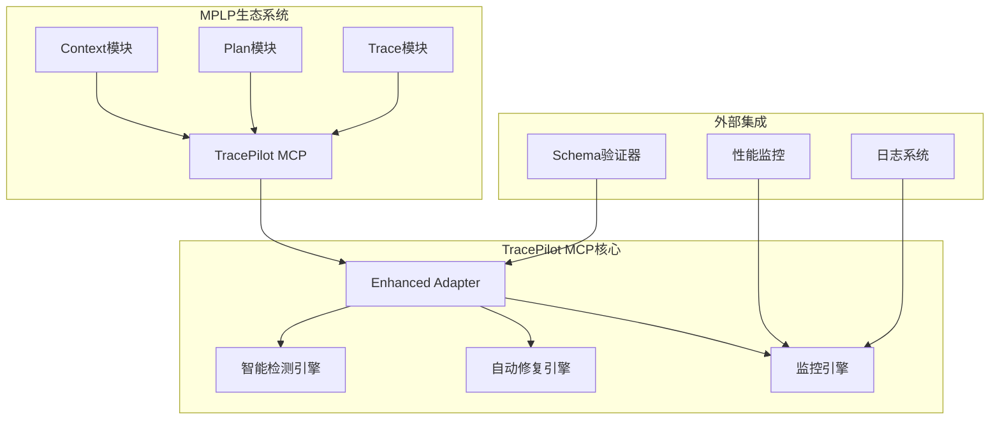

# TracePilot MCP集成指南

> **项目**: Multi-Agent Project Lifecycle Protocol (MPLP)  
> **文档类型**: 技术集成指南  
> **版本**: v2.0.0  
> **创建时间**: 2025-01-09  
> **更新时间**: 2025-01-09T25:10:00+08:00  
> **作者**: MPLP团队

## 📖 概述

本文档详细说明TracePilot如何作为Model Context Protocol (MCP)工具集成到MPLP生态系统中，实现智能开发助手功能。

## 📋 目录

- [概述](#概述)
- [MCP集成架构](#mcp集成架构)
- [核心功能实现](#核心功能实现)
- [API接口规范](#api接口规范)
- [事件处理机制](#事件处理机制)
- [性能优化](#性能优化)
- [监控和日志](#监控和日志)

## 🏗️ MCP集成架构

### 整体架构图



### 核心组件

```typescript
/**
 * TracePilot MCP适配器 - 核心接口
 */
interface TracePilotMCPAdapter {
  // 生命周期管理
  initialize(): Promise<void>;
  activate(): Promise<void>;
  deactivate(): Promise<void>;
  destroy(): Promise<void>;
  
  // 核心MCP功能
  processMessage(message: MCPMessage): Promise<MCPResponse>;
  subscribeToEvents(events: string[]): void;
  publishEvent(event: MCPEvent): Promise<void>;
  
  // 智能助手功能
  detectIssues(): Promise<DevelopmentIssue[]>;
  generateSuggestions(): Promise<TracePilotSuggestion[]>;
  autoFix(issue: DevelopmentIssue): Promise<boolean>;
}
```

## 🔧 核心功能实现

### 1. 智能问题检测

```typescript
/**
 * 智能问题检测引擎
 * 
 * 实现主动监控和问题识别功能
 */
export class IntelligentIssueDetector {
  private detectors: Map<string, IssueDetector> = new Map();
  
  constructor() {
    this.registerDetectors();
  }
  
  /**
   * 注册问题检测器
   */
  private registerDetectors(): void {
    this.detectors.set('schema', new SchemaIssueDetector());
    this.detectors.set('type', new TypeScriptIssueDetector());
    this.detectors.set('config', new ConfigurationIssueDetector());
    this.detectors.set('test', new TestIssueDetector());
    this.detectors.set('performance', new PerformanceIssueDetector());
    this.detectors.set('security', new SecurityIssueDetector());
    this.detectors.set('quality', new CodeQualityDetector());
  }
  
  /**
   * 执行全面问题检测
   * 
   * @returns Promise<DevelopmentIssue[]> 检测到的问题列表
   */
  async detectAllIssues(): Promise<DevelopmentIssue[]> {
    const allIssues: DevelopmentIssue[] = [];
    
    for (const [type, detector] of this.detectors) {
      try {
        const issues = await detector.detect();
        allIssues.push(...issues.map(issue => ({
          ...issue,
          detector_type: type,
          detected_at: new Date().toISOString()
        })));
      } catch (error) {
        logger.error(`检测器 ${type} 执行失败`, { error });
      }
    }
    
    return this.prioritizeIssues(allIssues);
  }
  
  /**
   * 问题优先级排序
   */
  private prioritizeIssues(issues: DevelopmentIssue[]): DevelopmentIssue[] {
    const severityOrder = { critical: 0, high: 1, medium: 2, low: 3 };
    
    return issues.sort((a, b) => {
      const severityDiff = severityOrder[a.severity] - severityOrder[b.severity];
      if (severityDiff !== 0) return severityDiff;
      
      // 自动修复的问题优先
      if (a.auto_fixable !== b.auto_fixable) {
        return a.auto_fixable ? -1 : 1;
      }
      
      return new Date(b.created_at).getTime() - new Date(a.created_at).getTime();
    });
  }
}
```

### 2. 自动修复引擎

```typescript
/**
 * 自动修复引擎
 * 
 * 实现智能修复和建议生成功能
 */
export class AutoFixEngine {
  private fixers: Map<string, AutoFixer> = new Map();
  
  constructor() {
    this.registerFixers();
  }
  
  /**
   * 注册修复器
   */
  private registerFixers(): void {
    this.fixers.set('schema', new SchemaAutoFixer());
    this.fixers.set('type', new TypeScriptAutoFixer());
    this.fixers.set('config', new ConfigurationAutoFixer());
    this.fixers.set('import', new ImportAutoFixer());
    this.fixers.set('format', new CodeFormatAutoFixer());
  }
  
  /**
   * 执行自动修复
   * 
   * @param issue 需要修复的问题
   * @returns Promise<FixResult> 修复结果
   */
  async executeFix(issue: DevelopmentIssue): Promise<FixResult> {
    const fixer = this.fixers.get(issue.type);
    if (!fixer) {
      return {
        success: false,
        error: `未找到 ${issue.type} 类型的修复器`,
        issue_id: issue.id
      };
    }
    
    if (!issue.auto_fixable) {
      return {
        success: false,
        error: '该问题不支持自动修复',
        issue_id: issue.id,
        manual_steps: issue.suggested_solution
      };
    }
    
    try {
      const result = await fixer.fix(issue);
      
      // 验证修复结果
      await this.validateFix(issue, result);
      
      return {
        success: true,
        issue_id: issue.id,
        changes_made: result.changes,
        validation_passed: true
      };
      
    } catch (error) {
      logger.error('自动修复失败', {
        issue_id: issue.id,
        issue_type: issue.type,
        error: error instanceof Error ? error.message : 'Unknown error'
      });
      
      return {
        success: false,
        error: error instanceof Error ? error.message : 'Unknown error',
        issue_id: issue.id
      };
    }
  }
  
  /**
   * 验证修复结果
   */
  private async validateFix(issue: DevelopmentIssue, result: any): Promise<void> {
    // 重新运行检测器确认问题已解决
    const detector = this.getDetectorForIssue(issue);
    if (detector) {
      const remainingIssues = await detector.detect();
      const stillExists = remainingIssues.some(i => i.id === issue.id);
      
      if (stillExists) {
        throw new Error('修复后问题仍然存在');
      }
    }
  }
}
```

### 3. 持续监控引擎

```typescript
/**
 * 持续监控引擎
 * 
 * 实现实时质量监控和性能追踪
 */
export class ContinuousMonitoringEngine {
  private isActive: boolean = false;
  private monitoringInterval: NodeJS.Timeout | null = null;
  private metrics: MonitoringMetrics = new MonitoringMetrics();
  
  /**
   * 启动持续监控
   */
  async start(): Promise<void> {
    if (this.isActive) {
      logger.warn('监控引擎已在运行中');
      return;
    }
    
    this.isActive = true;
    
    // 启动定期检查
    this.monitoringInterval = setInterval(async () => {
      await this.performMonitoringCycle();
    }, 30000); // 30秒间隔
    
    // 启动实时监控
    this.startRealTimeMonitoring();
    
    logger.info('持续监控引擎已启动');
  }
  
  /**
   * 停止持续监控
   */
  async stop(): Promise<void> {
    this.isActive = false;
    
    if (this.monitoringInterval) {
      clearInterval(this.monitoringInterval);
      this.monitoringInterval = null;
    }
    
    logger.info('持续监控引擎已停止');
  }
  
  /**
   * 执行监控周期
   */
  private async performMonitoringCycle(): Promise<void> {
    try {
      // 收集系统指标
      const systemMetrics = await this.collectSystemMetrics();
      
      // 检查性能阈值
      await this.checkPerformanceThresholds(systemMetrics);
      
      // 检查质量门禁
      await this.checkQualityGates();
      
      // 更新监控数据
      this.metrics.update(systemMetrics);
      
    } catch (error) {
      logger.error('监控周期执行失败', { error });
    }
  }
  
  /**
   * 收集系统指标
   */
  private async collectSystemMetrics(): Promise<SystemMetrics> {
    const memoryUsage = process.memoryUsage();
    const cpuUsage = process.cpuUsage();
    
    return {
      timestamp: new Date().toISOString(),
      memory: {
        heapUsed: memoryUsage.heapUsed / 1024 / 1024, // MB
        heapTotal: memoryUsage.heapTotal / 1024 / 1024,
        external: memoryUsage.external / 1024 / 1024
      },
      cpu: {
        user: cpuUsage.user / 1000000, // 秒
        system: cpuUsage.system / 1000000
      },
      activeTraces: this.getActiveTracesCount(),
      pendingIssues: await this.getPendingIssuesCount()
    };
  }
  
  /**
   * 检查性能阈值
   */
  private async checkPerformanceThresholds(metrics: SystemMetrics): Promise<void> {
    // 内存使用检查
    if (metrics.memory.heapUsed > 500) { // 500MB
      this.emitAlert('memory_threshold_exceeded', {
        current: metrics.memory.heapUsed,
        threshold: 500,
        severity: 'warning'
      });
    }
    
    // CPU使用检查
    const totalCpu = metrics.cpu.user + metrics.cpu.system;
    if (totalCpu > 5000) { // 5秒CPU时间
      this.emitAlert('cpu_threshold_exceeded', {
        current: totalCpu,
        threshold: 5000,
        severity: 'warning'
      });
    }
  }
  
  /**
   * 发出告警
   */
  private emitAlert(type: string, data: any): void {
    const alert = {
      type,
      data,
      timestamp: new Date().toISOString(),
      source: 'TracePilot.ContinuousMonitoring'
    };
    
    // 发送到监控系统
    this.emit('alert', alert);
    
    // 记录日志
    logger.warn(`监控告警: ${type}`, data);
  }
}
```

## 📡 API接口规范

### MCP消息格式

```typescript
/**
 * MCP消息接口定义
 */
interface MCPMessage {
  id: string;
  type: 'request' | 'response' | 'notification';
  method: string;
  params?: Record<string, any>;
  timestamp: string;
}

/**
 * MCP响应接口定义
 */
interface MCPResponse {
  id: string;
  result?: any;
  error?: {
    code: number;
    message: string;
    data?: any;
  };
  timestamp: string;
}
```

### TracePilot专用API

```typescript
/**
 * TracePilot MCP API方法
 */
export enum TracePilotMethods {
  // 问题检测
  DETECT_ISSUES = 'tracepilot.detectIssues',
  GET_ISSUE_DETAIL = 'tracepilot.getIssueDetail',
  
  // 自动修复
  GENERATE_SUGGESTIONS = 'tracepilot.generateSuggestions',
  EXECUTE_FIX = 'tracepilot.executeFix',
  
  // 监控
  GET_MONITORING_STATUS = 'tracepilot.getMonitoringStatus',
  GET_PERFORMANCE_METRICS = 'tracepilot.getPerformanceMetrics',
  
  // 配置
  UPDATE_CONFIGURATION = 'tracepilot.updateConfiguration',
  GET_CONFIGURATION = 'tracepilot.getConfiguration'
}

/**
 * API处理器实现
 */
export class TracePilotAPIHandler {
  /**
   * 处理MCP消息
   */
  async handleMessage(message: MCPMessage): Promise<MCPResponse> {
    try {
      switch (message.method) {
        case TracePilotMethods.DETECT_ISSUES:
          return await this.handleDetectIssues(message);
          
        case TracePilotMethods.EXECUTE_FIX:
          return await this.handleExecuteFix(message);
          
        case TracePilotMethods.GET_MONITORING_STATUS:
          return await this.handleGetMonitoringStatus(message);
          
        default:
          throw new Error(`未知的方法: ${message.method}`);
      }
    } catch (error) {
      return {
        id: message.id,
        error: {
          code: -32603,
          message: error instanceof Error ? error.message : 'Internal error',
          data: { method: message.method }
        },
        timestamp: new Date().toISOString()
      };
    }
  }
  
  /**
   * 处理问题检测请求
   */
  private async handleDetectIssues(message: MCPMessage): Promise<MCPResponse> {
    const issues = await this.issueDetector.detectAllIssues();
    
    return {
      id: message.id,
      result: {
        issues,
        total_count: issues.length,
        by_severity: this.groupBySeverity(issues),
        timestamp: new Date().toISOString()
      },
      timestamp: new Date().toISOString()
    };
  }
}
```

## 🔄 事件处理机制

### 事件类型定义

```typescript
/**
 * TracePilot事件类型
 */
export enum TracePilotEvents {
  // 问题检测事件
  ISSUE_DETECTED = 'issue.detected',
  ISSUE_RESOLVED = 'issue.resolved',
  
  // 修复事件
  FIX_STARTED = 'fix.started',
  FIX_COMPLETED = 'fix.completed',
  FIX_FAILED = 'fix.failed',
  
  // 监控事件
  THRESHOLD_EXCEEDED = 'monitoring.threshold_exceeded',
  PERFORMANCE_DEGRADED = 'monitoring.performance_degraded',
  
  // 系统事件
  ADAPTER_STARTED = 'system.adapter_started',
  ADAPTER_STOPPED = 'system.adapter_stopped'
}

/**
 * 事件处理器
 */
export class TracePilotEventHandler {
  private eventBus: EventEmitter = new EventEmitter();
  
  /**
   * 订阅事件
   */
  subscribe(event: TracePilotEvents, handler: Function): void {
    this.eventBus.on(event, handler);
  }
  
  /**
   * 发布事件
   */
  publish(event: TracePilotEvents, data: any): void {
    this.eventBus.emit(event, {
      type: event,
      data,
      timestamp: new Date().toISOString(),
      source: 'TracePilot'
    });
  }
  
  /**
   * 取消订阅
   */
  unsubscribe(event: TracePilotEvents, handler: Function): void {
    this.eventBus.off(event, handler);
  }
}
```

## 📊 性能优化

### 批处理优化

```typescript
/**
 * 批处理管理器
 */
export class BatchProcessor {
  private batchSize: number = 100;
  private flushInterval: number = 1000;
  private batch: any[] = [];
  private timer: NodeJS.Timeout | null = null;
  
  /**
   * 添加到批处理
   */
  add(item: any): void {
    this.batch.push(item);
    
    if (this.batch.length >= this.batchSize) {
      this.flush();
    } else if (!this.timer) {
      this.timer = setTimeout(() => this.flush(), this.flushInterval);
    }
  }
  
  /**
   * 刷新批处理
   */
  private async flush(): Promise<void> {
    if (this.batch.length === 0) return;
    
    const itemsToProcess = this.batch.splice(0, this.batchSize);
    
    if (this.timer) {
      clearTimeout(this.timer);
      this.timer = null;
    }
    
    try {
      await this.processBatch(itemsToProcess);
    } catch (error) {
      logger.error('批处理失败', { error, batch_size: itemsToProcess.length });
    }
  }
}
```

### 缓存策略

```typescript
/**
 * 智能缓存管理器
 */
export class IntelligentCache {
  private cache: Map<string, CacheEntry> = new Map();
  private maxSize: number = 1000;
  private ttl: number = 300000; // 5分钟
  
  /**
   * 获取缓存项
   */
  get<T>(key: string): T | null {
    const entry = this.cache.get(key);
    if (!entry) return null;
    
    if (Date.now() - entry.timestamp > this.ttl) {
      this.cache.delete(key);
      return null;
    }
    
    entry.accessCount++;
    entry.lastAccess = Date.now();
    return entry.value as T;
  }
  
  /**
   * 设置缓存项
   */
  set<T>(key: string, value: T): void {
    if (this.cache.size >= this.maxSize) {
      this.evictLeastUsed();
    }
    
    this.cache.set(key, {
      value,
      timestamp: Date.now(),
      lastAccess: Date.now(),
      accessCount: 0
    });
  }
}
```

## 📝 监控和日志

### 日志配置

```typescript
/**
 * TracePilot日志配置
 */
export const loggingConfig = {
  level: process.env.LOG_LEVEL || 'info',
  format: 'json',
  transports: [
    {
      type: 'console',
      level: 'debug'
    },
    {
      type: 'file',
      filename: 'logs/tracepilot.log',
      level: 'info',
      maxSize: '10MB',
      maxFiles: 5
    },
    {
      type: 'file',
      filename: 'logs/tracepilot-error.log',
      level: 'error',
      maxSize: '10MB',
      maxFiles: 10
    }
  ]
};
```

### 监控指标

```typescript
/**
 * TracePilot监控指标
 */
export interface TracePilotMetrics {
  // 性能指标
  performance: {
    issue_detection_time_ms: number;
    auto_fix_time_ms: number;
    api_response_time_ms: number;
    memory_usage_mb: number;
  };
  
  // 业务指标
  business: {
    issues_detected_count: number;
    issues_fixed_count: number;
    fix_success_rate: number;
    active_monitoring_sessions: number;
  };
  
  // 系统指标
  system: {
    uptime_seconds: number;
    cpu_usage_percent: number;
    event_processing_rate: number;
    cache_hit_rate: number;
  };
}
```

---

> **版权声明**: 本文档属于MPLP项目，遵循项目开源协议。  
> **集成状态**: ✅ TracePilot已完全集成为MCP工具 