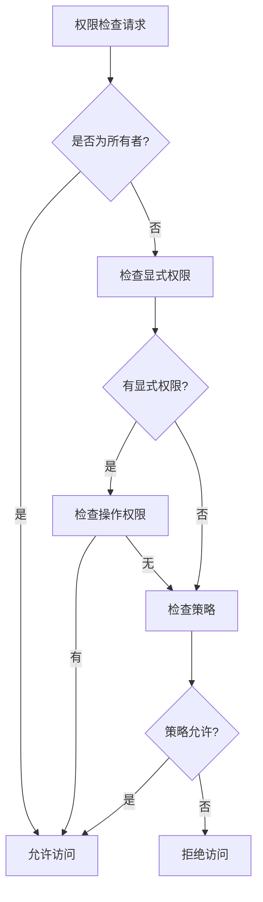

# Context模块访问控制详解

## 📋 概述

访问控制是Context模块的核心安全功能，提供细粒度的权限管理、基于角色的访问控制(RBAC)和灵活的策略配置。通过AccessControl值对象和专门的管理服务，确保多智能体系统的安全性和合规性。

## 🏗️ 架构设计

### AccessControl值对象

```typescript
export class AccessControl {
  constructor(
    public readonly owner: Owner,
    public readonly permissions: Permission[],
    public readonly policies: Policy[]
  ) {}
  
  // 权限检查和管理方法
  hasPermission(principal: string, resource: string, action: Action): boolean;
  addPermission(permission: Permission): AccessControl;
  addPolicy(policy: Policy): AccessControl;
  getPermissionsForPrincipal(principal: string): Permission[];
}
```

**设计特点**：
- **分层权限**: Owner > 显式权限 > 策略权限 > 默认拒绝
- **不可变性**: 所有操作返回新的AccessControl实例
- **类型安全**: 严格的权限类型定义
- **策略驱动**: 支持复杂的访问策略配置

## 🔒 核心组件详解

### 1. 所有者(Owner)管理

所有者拥有Context的完全控制权，可以执行任何操作。

```typescript
// 定义所有者
const owner: Owner = {
  userId: "admin-123",
  role: "project_manager"
};

// 创建访问控制
const accessControl = accessControlService.createAccessControl(owner);

// 所有者权限检查（始终返回true）
const hasPermission = accessControl.hasPermission(
  "admin-123",
  "any-resource",
  Action.admin
); // true
```

**所有者特权**：
- 对所有资源的完全访问权限
- 可以修改访问控制配置
- 可以授予和撤销其他用户权限
- 不受策略限制

### 2. 权限(Permission)管理

权限定义了特定主体对特定资源的操作权限。

#### 权限结构

```typescript
interface Permission {
  principal: string;           // 主体标识（用户ID、角色名、组名）
  principalType: PrincipalType; // 主体类型（user/role/group）
  resource: string;            // 资源标识
  actions: Action[];           // 允许的操作列表
  conditions?: Record<string, unknown>; // 条件限制
}

enum Action {
  read = 'read',       // 读取权限
  write = 'write',     // 写入权限
  execute = 'execute', // 执行权限
  delete = 'delete',   // 删除权限
  admin = 'admin'      // 管理权限
}
```

#### 权限管理示例

```typescript
// 创建只读权限
const readOnlyPermission = accessControlService.createReadOnlyPermission(
  "user-456",
  PrincipalType.USER,
  "context-data"
);

// 创建读写权限
const readWritePermission = accessControlService.createReadWritePermission(
  "developer-team",
  PrincipalType.GROUP,
  "shared-state"
);

// 创建管理员权限
const adminPermission = accessControlService.createAdminPermission(
  "admin-role",
  PrincipalType.ROLE,
  "access-control"
);

// 添加权限到访问控制
let updatedAccessControl = accessControlService.addPermission(
  accessControl, 
  readOnlyPermission
);
updatedAccessControl = accessControlService.addPermission(
  updatedAccessControl, 
  readWritePermission
);

// 检查权限
const canRead = accessControlService.checkPermission(
  updatedAccessControl,
  "user-456",
  "context-data",
  Action.read
); // true

const canWrite = accessControlService.checkPermission(
  updatedAccessControl,
  "user-456",
  "context-data",
  Action.write
); // false
```

#### 条件权限

```typescript
// 带条件的权限
const conditionalPermission: Permission = {
  principal: "temp-user",
  principalType: PrincipalType.USER,
  resource: "context-data",
  actions: [Action.read],
  conditions: {
    timeRange: {
      start: "09:00",
      end: "17:00"
    },
    ipWhitelist: ["192.168.1.0/24"],
    maxRequests: 100
  }
};
```

### 3. 策略(Policy)管理

策略提供基于规则的动态权限控制，支持复杂的业务逻辑。

#### 策略结构

```typescript
interface Policy {
  id: UUID;
  name: string;
  type: PolicyType;           // security/compliance/operational
  rules: PolicyRule[];
  enforcement: PolicyEnforcement; // strict/advisory/disabled
}

interface PolicyRule {
  condition: string;          // 条件表达式
  action: string;            // 目标操作
  effect: 'allow' | 'deny';  // 规则效果
}
```

#### 策略配置示例

```typescript
// 安全策略：管理员全权限
const adminPolicy: Policy = {
  id: "admin-policy-001",
  name: "Administrator Full Access",
  type: PolicyType.SECURITY,
  rules: [
    {
      condition: "user.role == 'admin'",
      action: "*",
      effect: "allow"
    }
  ],
  enforcement: PolicyEnforcement.STRICT
};

// 合规策略：工作时间限制
const workHoursPolicy: Policy = {
  id: "work-hours-policy",
  name: "Work Hours Access Control",
  type: PolicyType.COMPLIANCE,
  rules: [
    {
      condition: "time.hour >= 9 && time.hour <= 17",
      action: "read",
      effect: "allow"
    },
    {
      condition: "time.hour < 9 || time.hour > 17",
      action: "*",
      effect: "deny"
    }
  ],
  enforcement: PolicyEnforcement.ADVISORY
};

// 运营策略：资源配额限制
const quotaPolicy: Policy = {
  id: "resource-quota-policy",
  name: "Resource Quota Management",
  type: PolicyType.OPERATIONAL,
  rules: [
    {
      condition: "user.quota.used < user.quota.limit",
      action: "write",
      effect: "allow"
    },
    {
      condition: "user.quota.used >= user.quota.limit",
      action: "write",
      effect: "deny"
    }
  ],
  enforcement: PolicyEnforcement.STRICT
};

// 添加策略
let policyAccessControl = accessControlService.addPolicy(accessControl, adminPolicy);
policyAccessControl = accessControlService.addPolicy(policyAccessControl, workHoursPolicy);
```

## 🔄 权限检查流程

### 权限检查算法



### 权限检查实现

```typescript
export class AccessControlManagementService {
  checkPermission(
    accessControl: AccessControl,
    principal: string,
    resource: string,
    action: Action
  ): boolean {
    // 1. 检查所有者权限
    if (principal === accessControl.owner.userId) {
      return true;
    }

    // 2. 检查显式权限
    const permission = accessControl.permissions.find(
      p => p.principal === principal && p.resource === resource
    );
    
    if (permission && permission.actions.includes(action)) {
      return this.checkConditions(permission.conditions);
    }

    // 3. 检查策略权限
    for (const policy of accessControl.policies) {
      if (policy.enforcement === PolicyEnforcement.DISABLED) {
        continue;
      }

      for (const rule of policy.rules) {
        if (this.evaluateCondition(rule.condition, { principal, resource, action })) {
          if (rule.action === action.toString() || rule.action === "*") {
            return rule.effect === 'allow';
          }
        }
      }
    }

    // 4. 默认拒绝
    return false;
  }

  private checkConditions(conditions?: Record<string, unknown>): boolean {
    if (!conditions) return true;
    
    // 实现条件检查逻辑
    // 例如：时间范围、IP白名单、请求频率等
    return true;
  }

  private evaluateCondition(
    condition: string, 
    context: { principal: string; resource: string; action: Action }
  ): boolean {
    // 实现条件表达式评估
    // 可以使用表达式引擎或简单的字符串匹配
    return true;
  }
}
```

## 🔄 完整使用示例

### 多层权限控制场景

```typescript
// 1. 创建访问控制配置
const owner: Owner = {
  userId: "project-manager-001",
  role: "manager"
};

const accessControl = accessControlService.createAccessControl(owner);

// 2. 配置团队权限
const teamPermissions: Permission[] = [
  // 开发团队：读写共享状态
  {
    principal: "dev-team",
    principalType: PrincipalType.GROUP,
    resource: "shared-state",
    actions: [Action.read, Action.write]
  },
  // 测试团队：只读访问
  {
    principal: "test-team",
    principalType: PrincipalType.GROUP,
    resource: "context-data",
    actions: [Action.read]
  },
  // 运维团队：执行权限
  {
    principal: "ops-team",
    principalType: PrincipalType.GROUP,
    resource: "system-control",
    actions: [Action.read, Action.execute]
  }
];

let updatedAccessControl = accessControl;
for (const permission of teamPermissions) {
  updatedAccessControl = accessControlService.addPermission(
    updatedAccessControl, 
    permission
  );
}

// 3. 配置安全策略
const securityPolicies: Policy[] = [
  // 管理员策略
  {
    id: "admin-full-access",
    name: "Administrator Full Access",
    type: PolicyType.SECURITY,
    rules: [{
      condition: "user.role == 'admin'",
      action: "*",
      effect: "allow"
    }],
    enforcement: PolicyEnforcement.STRICT
  },
  // 紧急访问策略
  {
    id: "emergency-access",
    name: "Emergency Access Control",
    type: PolicyType.OPERATIONAL,
    rules: [{
      condition: "system.emergency_mode == true",
      action: "*",
      effect: "allow"
    }],
    enforcement: PolicyEnforcement.STRICT
  }
];

for (const policy of securityPolicies) {
  updatedAccessControl = accessControlService.addPolicy(
    updatedAccessControl, 
    policy
  );
}

// 4. 应用访问控制到Context
await contextService.updateAccessControl(contextId, updatedAccessControl);

// 5. 权限检查示例
const checkResults = [
  // 项目经理（所有者）- 应该有所有权限
  await contextService.checkPermission(
    contextId, 
    "project-manager-001", 
    "any-resource", 
    Action.admin
  ), // true

  // 开发团队成员 - 应该能读写共享状态
  await contextService.checkPermission(
    contextId, 
    "dev-team", 
    "shared-state", 
    Action.write
  ), // true

  // 测试团队成员 - 不应该能写入上下文数据
  await contextService.checkPermission(
    contextId, 
    "test-team", 
    "context-data", 
    Action.write
  ), // false

  // 未授权用户 - 应该被拒绝
  await contextService.checkPermission(
    contextId, 
    "unauthorized-user", 
    "context-data", 
    Action.read
  ) // false
];

console.log("Permission check results:", checkResults);
```

## 🔒 安全最佳实践

### 1. 最小权限原则

```typescript
// ✅ 正确：只授予必要的权限
const minimalPermission: Permission = {
  principal: "data-processor",
  principalType: PrincipalType.USER,
  resource: "input-data",
  actions: [Action.read] // 只需要读取权限
};

// ❌ 错误：授予过多权限
const excessivePermission: Permission = {
  principal: "data-processor",
  principalType: PrincipalType.USER,
  resource: "input-data",
  actions: [Action.read, Action.write, Action.delete, Action.admin] // 权限过多
};
```

### 2. 权限分离

```typescript
// 分离读写权限
const readPermission = accessControlService.createReadOnlyPermission(
  "analyst-role",
  PrincipalType.ROLE,
  "analytics-data"
);

const writePermission: Permission = {
  principal: "data-engineer-role",
  principalType: PrincipalType.ROLE,
  resource: "analytics-data",
  actions: [Action.write]
};
```

### 3. 定期权限审查

```typescript
// 权限审查工具
class PermissionAuditor {
  auditPermissions(accessControl: AccessControl): AuditReport {
    const report: AuditReport = {
      totalPermissions: accessControl.permissions.length,
      excessivePermissions: [],
      unusedPermissions: [],
      recommendations: []
    };

    // 检查过度权限
    for (const permission of accessControl.permissions) {
      if (permission.actions.includes(Action.admin)) {
        report.excessivePermissions.push(permission);
      }
    }

    return report;
  }
}
```

## 📊 监控和审计

### 权限使用监控

```typescript
class AccessControlMonitor {
  private accessLog: AccessLogEntry[] = [];

  logAccess(
    principal: string,
    resource: string,
    action: Action,
    result: boolean,
    timestamp: Date = new Date()
  ): void {
    this.accessLog.push({
      principal,
      resource,
      action,
      result,
      timestamp
    });
  }

  getAccessStats(timeRange: { start: Date; end: Date }): AccessStats {
    const relevantLogs = this.accessLog.filter(
      log => log.timestamp >= timeRange.start && log.timestamp <= timeRange.end
    );

    return {
      totalAccess: relevantLogs.length,
      successfulAccess: relevantLogs.filter(log => log.result).length,
      deniedAccess: relevantLogs.filter(log => !log.result).length,
      topUsers: this.getTopUsers(relevantLogs),
      topResources: this.getTopResources(relevantLogs)
    };
  }
}
```

## 🎯 故障排查

### 常见权限问题

```typescript
// 权限诊断工具
class PermissionDiagnostic {
  diagnosePermissionDenial(
    accessControl: AccessControl,
    principal: string,
    resource: string,
    action: Action
  ): DiagnosticResult {
    const result: DiagnosticResult = {
      isOwner: principal === accessControl.owner.userId,
      hasExplicitPermission: false,
      matchingPolicies: [],
      recommendations: []
    };

    // 检查显式权限
    const permission = accessControl.permissions.find(
      p => p.principal === principal && p.resource === resource
    );
    
    if (permission) {
      result.hasExplicitPermission = permission.actions.includes(action);
      if (!result.hasExplicitPermission) {
        result.recommendations.push(
          `Add ${action} action to existing permission for ${principal} on ${resource}`
        );
      }
    } else {
      result.recommendations.push(
        `Create new permission for ${principal} on ${resource} with ${action} action`
      );
    }

    return result;
  }
}
```

---

**文档版本**: v1.0.0  
**最后更新**: 2025-08-07  
**维护状态**: ✅ 活跃维护
