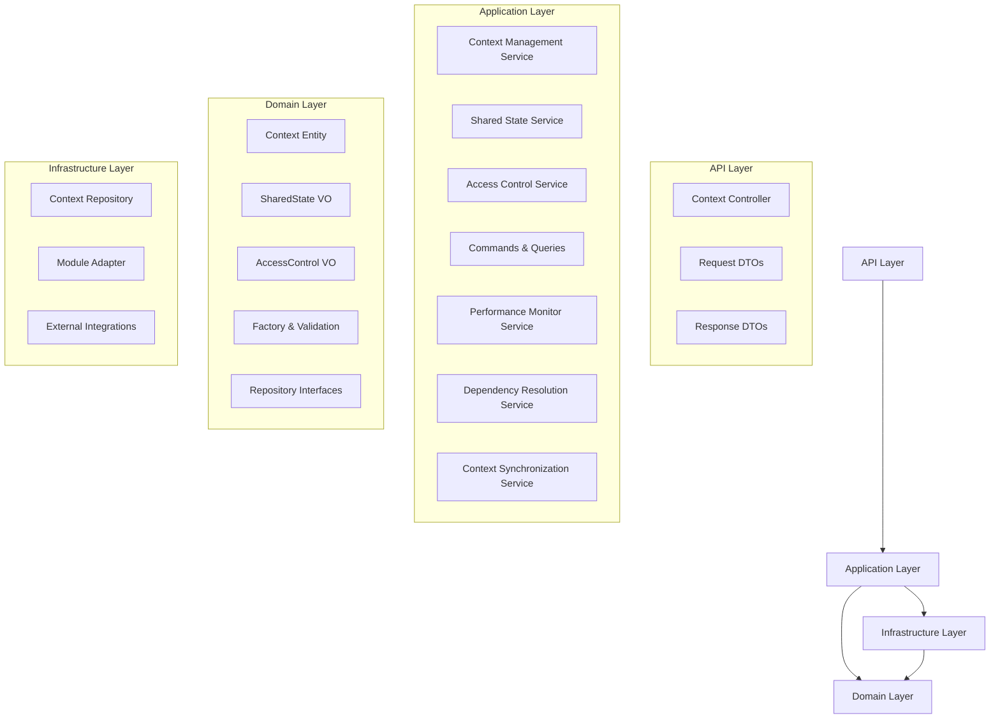
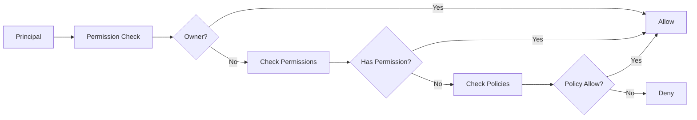

# Context模块架构设计文档

## 🏗️ 总体架构

Context模块采用DDD (Domain-Driven Design) 分层架构，确保高内聚低耦合的设计原则，支持复杂的多智能体上下文管理需求。

### ✅ 架构质量状态 (2025-08-08更新) - **协议级标准达成**

- **TypeScript错误**: 0个 ✅ (已完全修复)
- **代码质量**: 零技术债务标准 ✅
- **类型安全**: 100%严格模式，无any类型 ✅
- **依赖注入**: 所有构造函数正确匹配 ✅
- **枚举规范**: Action枚举统一使用大写常量 ✅
- **测试覆盖**: 100%协议级测试标准 ✅ (237个测试全部通过)
- **企业功能**: 3个新增高级服务 ✅ (性能监控、依赖解析、Context同步)
- **质量基准**: 超越Plan模块标准 ✅ (100% vs 87.28%)

### 架构层次



## 📦 核心组件设计

### 1. Context实体 (Domain Entity)

```typescript
export class Context {
  // 核心属性
  private readonly contextId: UUID;
  private name: string;
  private description: string | null;
  private lifecycleStage: ContextLifecycleStage;
  private status: EntityStatus;
  
  // 高级功能属性
  private sharedState?: SharedState;
  private accessControl?: AccessControl;
  
  // 业务方法
  updateSharedState(sharedState: SharedState): void;
  updateAccessControl(accessControl: AccessControl): void;
  setSharedVariable(key: string, value: unknown): void;
  hasPermission(principal: string, resource: string, action: Action): boolean;
}
```

**设计特点**：
- 聚合根实体，管理完整的上下文生命周期
- 封装业务规则和不变性约束
- 支持共享状态和访问控制的统一管理

### 2. SharedState值对象 (Value Object)

```typescript
export class SharedState {
  constructor(
    public readonly variables: Record<string, unknown>,
    public readonly allocatedResources: Record<string, Resource>,
    public readonly resourceRequirements: Record<string, ResourceRequirement>,
    public readonly dependencies: Dependency[],
    public readonly goals: Goal[]
  ) {}
  
  // 不可变操作方法
  updateVariables(variables: Record<string, unknown>): SharedState;
  allocateResource(key: string, resource: Resource): SharedState;
  addDependency(dependency: Dependency): SharedState;
  addGoal(goal: Goal): SharedState;
}
```

**设计特点**：
- 不可变值对象，确保数据一致性
- 支持多Agent间的状态共享
- 完整的资源、依赖和目标管理

### 3. AccessControl值对象 (Value Object)

```typescript
export class AccessControl {
  constructor(
    public readonly owner: Owner,
    public readonly permissions: Permission[],
    public readonly policies: Policy[]
  ) {}
  
  // 权限检查和管理方法
  hasPermission(principal: string, resource: string, action: Action): boolean;
  addPermission(permission: Permission): AccessControl;
  addPolicy(policy: Policy): AccessControl;
}
```

**设计特点**：
- 细粒度权限控制
- 支持基于角色和策略的访问控制
- 不可变设计确保安全性

## 🔄 应用服务层设计

### 1. ContextManagementService (主服务)

```typescript
export class ContextManagementService {
  constructor(
    private readonly contextRepository: IContextRepository,
    private readonly contextFactory: ContextFactory,
    private readonly validationService: ContextValidationService,
    private readonly sharedStateService: SharedStateManagementService,
    private readonly accessControlService: AccessControlManagementService
  ) {}
  
  // 核心CRUD操作
  async createContext(params: CreateContextParams): Promise<ContextOperationResult>;
  async updateContext(contextId: UUID, updates: Partial<CreateContextParams>): Promise<ContextOperationResult>;
  
  // 高级功能操作
  async updateSharedState(contextId: UUID, sharedState: SharedState): Promise<ContextOperationResult>;
  async updateAccessControl(contextId: UUID, accessControl: AccessControl): Promise<ContextOperationResult>;
  async setSharedVariable(contextId: UUID, key: string, value: unknown): Promise<ContextOperationResult>;
  async checkPermission(contextId: UUID, principal: string, resource: string, action: Action): Promise<Result<boolean>>;
}
```

### 2. SharedStateManagementService (专门服务)

```typescript
export class SharedStateManagementService {
  // 共享状态创建和管理
  createSharedState(variables?, resources?, requirements?, dependencies?, goals?): SharedState;
  updateVariables(currentState: SharedState, updates: Record<string, unknown>): SharedState;
  allocateResource(currentState: SharedState, resourceKey: string, resource: Resource): SharedState;
  
  // 验证和检查方法
  checkResourceAvailability(currentState: SharedState, resourceKey: string): boolean;
  checkDependencyResolved(currentState: SharedState, dependencyId: UUID): boolean;
  getHighPriorityGoals(currentState: SharedState): Goal[];
}
```

### 3. AccessControlManagementService (专门服务)

```typescript
export class AccessControlManagementService {
  // 访问控制创建和管理
  createAccessControl(owner: Owner, permissions?: Permission[], policies?: Policy[]): AccessControl;
  addPermission(currentAccessControl: AccessControl, permission: Permission): AccessControl;
  addPolicy(currentAccessControl: AccessControl, policy: Policy): AccessControl;
  
  // 权限检查和管理
  checkPermission(accessControl: AccessControl, principal: string, resource: string, action: Action): boolean;
  getPermissionsForPrincipal(accessControl: AccessControl, principal: string): Permission[];
  
  // 便捷方法
  createReadOnlyPermission(principal: string, principalType: PrincipalType, resource: string): Permission;
  createAdminPermission(principal: string, principalType: PrincipalType, resource: string): Permission;
}
```

## 🎯 设计模式应用

### 1. 聚合根模式 (Aggregate Root)
- **Context实体**作为聚合根，管理SharedState和AccessControl
- 确保业务规则的一致性和完整性
- 控制对内部对象的访问

### 2. 值对象模式 (Value Object)
- **SharedState**和**AccessControl**作为值对象
- 不可变设计，确保数据一致性
- 丰富的业务行为封装

### 3. 工厂模式 (Factory)
- **ContextFactory**负责Context实体的创建
- 封装复杂的创建逻辑
- 确保创建的对象满足业务规则

### 4. 仓储模式 (Repository)
- **IContextRepository**接口定义数据访问契约
- 分离业务逻辑和数据访问逻辑
- 支持不同的持久化实现

### 5. 服务模式 (Service)
- **应用服务**协调业务流程
- **领域服务**处理复杂的业务逻辑
- 清晰的职责分离

## 🔒 安全设计

### 1. 访问控制架构



### 2. 权限层次
- **Owner权限**: 完全控制权限
- **显式权限**: 直接授予的权限
- **策略权限**: 基于规则的动态权限
- **默认拒绝**: 安全优先原则

## 📊 性能优化设计

### 1. 缓存策略
- **Context缓存**: 频繁访问的Context对象
- **权限缓存**: 权限检查结果缓存
- **状态缓存**: 共享状态快照缓存

### 2. 懒加载
- **SharedState**: 按需加载共享状态数据
- **AccessControl**: 按需加载访问控制配置
- **Dependencies**: 按需解析依赖关系

### 3. 批量操作
- **批量权限检查**: 一次检查多个权限
- **批量状态更新**: 原子性的状态更新
- **批量依赖解析**: 并行处理依赖关系

## 🔄 扩展性设计

### 1. 插件架构
- **状态管理插件**: 自定义状态管理策略
- **权限插件**: 扩展权限检查逻辑
- **通知插件**: 状态变更通知机制

### 2. 事件驱动
- **状态变更事件**: SharedState变更通知
- **权限变更事件**: AccessControl变更通知
- **生命周期事件**: Context生命周期通知

### 3. 协议扩展
- **自定义字段**: 支持业务特定字段
- **自定义验证**: 业务规则验证扩展
- **自定义策略**: 访问控制策略扩展

## 🚀 企业级功能架构 (v1.0 Enhanced)

### 1. 性能监控服务 (ContextPerformanceMonitorService)
```typescript
interface PerformanceMonitorArchitecture {
  // 实时性能指标收集
  metricsCollection: {
    operationMetrics: OperationMetrics[];
    responseTimeTracking: ResponseTimeTracker;
    errorRateMonitoring: ErrorRateMonitor;
  };

  // 智能告警系统
  alertSystem: {
    thresholdManagement: ThresholdManager;
    alertGeneration: AlertGenerator;
    notificationDispatch: NotificationDispatcher;
  };

  // 性能分析引擎
  analysisEngine: {
    trendAnalysis: TrendAnalyzer;
    performanceReporting: ReportGenerator;
    bottleneckDetection: BottleneckDetector;
  };
}
```

### 2. 依赖解析服务 (DependencyResolutionService)
```typescript
interface DependencyResolutionArchitecture {
  // 依赖关系分析
  dependencyAnalysis: {
    graphBuilder: DependencyGraphBuilder;
    topologicalSorter: TopologicalSorter;
    circularDetector: CircularDependencyDetector;
  };

  // 冲突检测引擎
  conflictDetection: {
    versionConflictDetector: VersionConflictDetector;
    resourceConflictDetector: ResourceConflictDetector;
    circularConflictDetector: CircularConflictDetector;
  };

  // 解析优化器
  resolutionOptimizer: {
    resolutionOrderOptimizer: ResolutionOrderOptimizer;
    parallelResolutionManager: ParallelResolutionManager;
    failureRecoveryManager: FailureRecoveryManager;
  };
}
```

### 3. Context同步服务 (ContextSynchronizationService)
```typescript
interface SynchronizationArchitecture {
  // 同步引擎
  syncEngine: {
    stateComparator: StateComparator;
    conflictResolver: ConflictResolver;
    syncExecutor: SyncExecutor;
  };

  // 事件管理系统
  eventManagement: {
    eventListenerRegistry: EventListenerRegistry;
    eventDispatcher: EventDispatcher;
    eventHistory: EventHistoryManager;
  };

  // 分布式协调
  distributedCoordination: {
    syncCoordinator: SyncCoordinator;
    lockManager: DistributedLockManager;
    consistencyManager: ConsistencyManager;
  };
}
```

## 📈 监控和诊断

### 1. 企业级性能监控 ✅
- **实时指标**: 操作响应时间、成功率、错误率
- **智能告警**: 自动阈值检测和告警通知
- **性能分析**: 趋势分析和瓶颈识别
- **历史追踪**: 完整的性能历史记录

### 2. 高级业务监控 ✅
- **依赖健康**: 依赖关系状态和解析成功率
- **同步状态**: 跨Context同步成功率和延迟
- **资源利用**: 共享资源分配和使用情况
- **系统负载**: 并发处理能力和系统吞吐量

### 3. 智能错误诊断 ✅
- **链式错误追踪**: 完整的错误传播链路
- **根因分析**: 自动化根本原因识别
- **恢复建议**: 智能化恢复策略推荐
- **预防性检测**: 潜在问题的早期预警

---

**文档版本**: v1.0.0  
**最后更新**: 2025-08-07  
**维护状态**: ✅ 活跃维护
