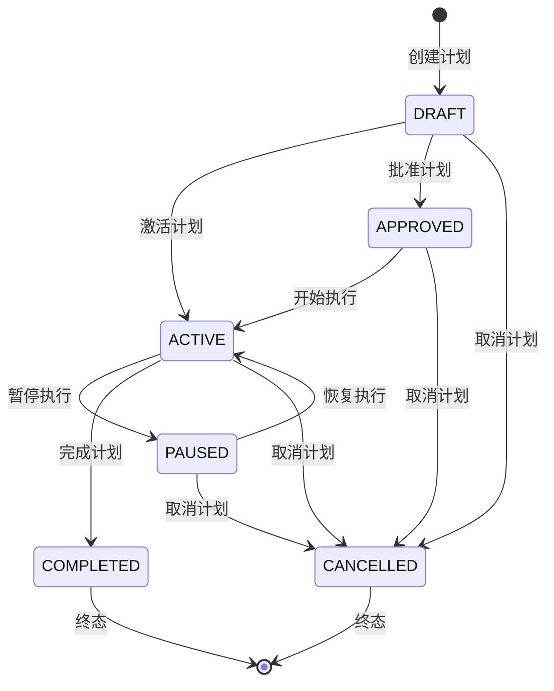
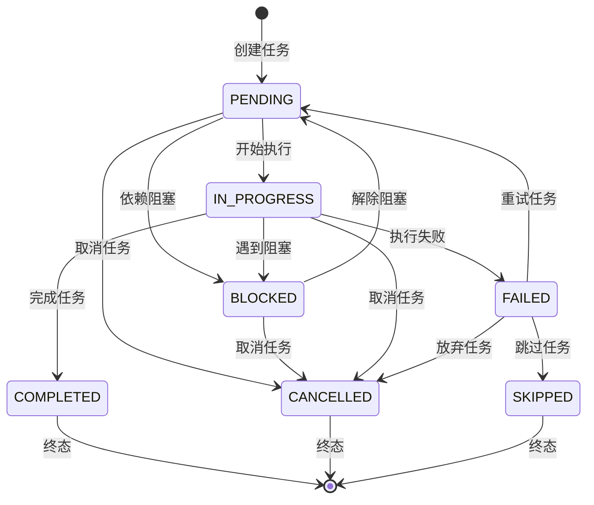

# Plan模块状态管理详解

## 📋 概述

Plan模块实现了完整的状态管理系统，包括计划状态和任务状态的生命周期管理。状态转换遵循严格的业务规则，确保数据一致性和业务逻辑的正确性。

## 🔄 计划状态管理

### 状态定义

```typescript
enum PlanStatus {
  DRAFT = 'draft',           // 草稿状态
  ACTIVE = 'active',         // 活跃状态
  PAUSED = 'paused',         // 暂停状态
  COMPLETED = 'completed',   // 完成状态
  CANCELLED = 'cancelled',   // 取消状态
  APPROVED = 'approved'      // 已批准状态
}
```

### 状态转换图



### 状态转换规则

#### 1. DRAFT (草稿状态)
- **描述**：计划刚创建，尚未激活
- **允许操作**：编辑计划、添加任务、修改配置
- **可转换到**：
  - `ACTIVE`：直接激活计划
  - `APPROVED`：提交审批
  - `CANCELLED`：取消计划

```typescript
// 状态转换实现
public updateStatus(newStatus: PlanStatus): void {
  if (this.status === PlanStatus.DRAFT) {
    if ([PlanStatus.ACTIVE, PlanStatus.APPROVED, PlanStatus.CANCELLED].includes(newStatus)) {
      this.status = newStatus;
      this.updatedAt = new Date().toISOString();
    } else {
      throw new Error(`Invalid status transition from ${this.status} to ${newStatus}`);
    }
  }
}
```

#### 2. APPROVED (已批准状态)
- **描述**：计划已通过审批，等待执行
- **允许操作**：查看计划、开始执行
- **可转换到**：
  - `ACTIVE`：开始执行
  - `CANCELLED`：取消计划

#### 3. ACTIVE (活跃状态)
- **描述**：计划正在执行中
- **允许操作**：监控进度、更新任务状态
- **可转换到**：
  - `PAUSED`：暂停执行
  - `COMPLETED`：完成计划
  - `CANCELLED`：取消计划

#### 4. PAUSED (暂停状态)
- **描述**：计划执行被暂停
- **允许操作**：查看状态、恢复执行
- **可转换到**：
  - `ACTIVE`：恢复执行
  - `CANCELLED`：取消计划

#### 5. COMPLETED (完成状态)
- **描述**：计划已成功完成
- **允许操作**：查看历史、生成报告
- **可转换到**：无（终态）

#### 6. CANCELLED (取消状态)
- **描述**：计划被取消
- **允许操作**：查看历史
- **可转换到**：无（终态）

### 可执行性检查

```typescript
public isExecutable(): ExecutabilityResult {
  const reasons: string[] = [];
  
  // 检查状态
  if (![PlanStatus.ACTIVE, PlanStatus.APPROVED].includes(this.status)) {
    reasons.push(`Plan status is ${this.status}, must be ACTIVE or APPROVED`);
  }
  
  // 检查任务
  if (!this.tasks || this.tasks.length === 0) {
    reasons.push('Plan must have at least one task');
  }
  
  // 检查循环依赖
  if (this.hasCyclicDependencies()) {
    reasons.push('Plan contains cyclic dependencies');
  }
  
  return {
    executable: reasons.length === 0,
    reasons
  };
}
```

## 📋 任务状态管理

### 状态定义

```typescript
enum TaskStatus {
  PENDING = 'pending',           // 待处理
  IN_PROGRESS = 'in_progress',   // 进行中
  COMPLETED = 'completed',       // 已完成
  FAILED = 'failed',             // 失败
  CANCELLED = 'cancelled',       // 已取消
  BLOCKED = 'blocked',           // 被阻塞
  SKIPPED = 'skipped'            // 已跳过
}
```

### 任务状态转换图



### 任务状态转换规则

#### 1. PENDING (待处理)
- **描述**：任务已创建，等待执行
- **前置条件**：依赖任务已完成
- **可转换到**：`IN_PROGRESS`, `CANCELLED`, `BLOCKED`

#### 2. BLOCKED (被阻塞)
- **描述**：任务因依赖未满足而被阻塞
- **前置条件**：存在未完成的依赖任务
- **可转换到**：`PENDING`, `CANCELLED`

#### 3. IN_PROGRESS (进行中)
- **描述**：任务正在执行
- **前置条件**：所有依赖任务已完成
- **可转换到**：`COMPLETED`, `FAILED`, `CANCELLED`, `BLOCKED`

#### 4. COMPLETED (已完成)
- **描述**：任务成功完成
- **可转换到**：无（终态）

#### 5. FAILED (失败)
- **描述**：任务执行失败
- **可转换到**：`PENDING`, `CANCELLED`, `SKIPPED`

#### 6. CANCELLED (已取消)
- **描述**：任务被取消
- **可转换到**：无（终态）

#### 7. SKIPPED (已跳过)
- **描述**：任务被跳过
- **可转换到**：无（终态）

## 🔗 依赖关系管理

### 依赖类型

```typescript
enum DependencyType {
  FINISH_TO_START = 'finish_to_start',     // 完成-开始
  START_TO_START = 'start_to_start',       // 开始-开始
  FINISH_TO_FINISH = 'finish_to_finish',   // 完成-完成
  START_TO_FINISH = 'start_to_finish'      // 开始-完成
}
```

### 循环依赖检测

```typescript
public hasCyclicDependencies(): boolean {
  const visited = new Set<UUID>();
  const recursionStack = new Set<UUID>();
  
  for (const task of this.tasks) {
    if (this.hasCyclicDependenciesUtil(task.taskId, visited, recursionStack)) {
      return true;
    }
  }
  
  return false;
}

private hasCyclicDependenciesUtil(
  taskId: UUID, 
  visited: Set<UUID>, 
  recursionStack: Set<UUID>
): boolean {
  visited.add(taskId);
  recursionStack.add(taskId);
  
  const dependencies = this.getTaskDependencies(taskId);
  for (const depId of dependencies) {
    if (!visited.has(depId)) {
      if (this.hasCyclicDependenciesUtil(depId, visited, recursionStack)) {
        return true;
      }
    } else if (recursionStack.has(depId)) {
      return true;
    }
  }
  
  recursionStack.delete(taskId);
  return false;
}
```

## 📊 状态统计和监控

### 计划进度计算

```typescript
public calculateProgress(): PlanProgress {
  const totalTasks = this.tasks.length;
  if (totalTasks === 0) {
    return { percentage: 0, completedTasks: 0, totalTasks: 0 };
  }
  
  const completedTasks = this.tasks.filter(task => 
    task.status === TaskStatus.COMPLETED
  ).length;
  
  const percentage = Math.round((completedTasks / totalTasks) * 100);
  
  return {
    percentage,
    completedTasks,
    totalTasks,
    pendingTasks: this.tasks.filter(t => t.status === TaskStatus.PENDING).length,
    inProgressTasks: this.tasks.filter(t => t.status === TaskStatus.IN_PROGRESS).length,
    failedTasks: this.tasks.filter(t => t.status === TaskStatus.FAILED).length,
    blockedTasks: this.tasks.filter(t => t.status === TaskStatus.BLOCKED).length
  };
}
```

### 状态变更事件

```typescript
interface StateChangeEvent {
  planId: UUID;
  taskId?: UUID;
  oldStatus: PlanStatus | TaskStatus;
  newStatus: PlanStatus | TaskStatus;
  timestamp: Timestamp;
  reason?: string;
  metadata?: Record<string, unknown>;
}

// 状态变更时触发事件
private emitStateChangeEvent(event: StateChangeEvent): void {
  this.eventEmitter.emit('stateChanged', event);
}
```

## 🔧 状态管理最佳实践

### 1. 状态验证

```typescript
// 在状态转换前进行验证
public validateStatusTransition(newStatus: PlanStatus): ValidationResult {
  const allowedTransitions = this.getAllowedTransitions();
  
  if (!allowedTransitions.includes(newStatus)) {
    return {
      valid: false,
      errors: [`Invalid transition from ${this.status} to ${newStatus}`]
    };
  }
  
  return { valid: true, errors: [] };
}
```

### 2. 原子性操作

```typescript
// 确保状态更新的原子性
public async updateStatusAtomic(newStatus: PlanStatus): Promise<void> {
  const transaction = await this.repository.beginTransaction();
  
  try {
    // 验证状态转换
    const validation = this.validateStatusTransition(newStatus);
    if (!validation.valid) {
      throw new Error(validation.errors.join(', '));
    }
    
    // 更新状态
    this.status = newStatus;
    this.updatedAt = new Date().toISOString();
    
    // 保存到数据库
    await this.repository.save(this, transaction);
    
    // 提交事务
    await transaction.commit();
    
    // 触发事件
    this.emitStateChangeEvent({
      planId: this.planId,
      oldStatus: this.status,
      newStatus,
      timestamp: this.updatedAt
    });
    
  } catch (error) {
    await transaction.rollback();
    throw error;
  }
}
```

### 3. 状态恢复

```typescript
// 状态恢复机制
public async recoverFromFailure(): Promise<void> {
  if (this.status === PlanStatus.ACTIVE) {
    // 检查是否有失败的任务
    const failedTasks = this.tasks.filter(t => t.status === TaskStatus.FAILED);
    
    if (failedTasks.length > 0) {
      // 重置失败任务为待处理状态
      for (const task of failedTasks) {
        task.status = TaskStatus.PENDING;
      }
      
      // 更新计划状态
      await this.updateStatusAtomic(PlanStatus.ACTIVE);
    }
  }
}
```

## 📈 性能优化

### 1. 状态缓存

```typescript
// 缓存计划状态以提高查询性能
private statusCache = new Map<UUID, PlanStatus>();

public getStatus(): PlanStatus {
  const cached = this.statusCache.get(this.planId);
  if (cached) {
    return cached;
  }
  
  this.statusCache.set(this.planId, this.status);
  return this.status;
}
```

### 2. 批量状态更新

```typescript
// 批量更新任务状态
public async updateTaskStatusBatch(updates: TaskStatusUpdate[]): Promise<void> {
  const transaction = await this.repository.beginTransaction();
  
  try {
    for (const update of updates) {
      const task = this.getTask(update.taskId);
      if (task) {
        task.status = update.newStatus;
      }
    }
    
    await this.repository.save(this, transaction);
    await transaction.commit();
    
  } catch (error) {
    await transaction.rollback();
    throw error;
  }
}
```

---

**版本**: v1.0.0  
**最后更新**: 2025-08-07  
**状态**: 生产就绪 ✅
