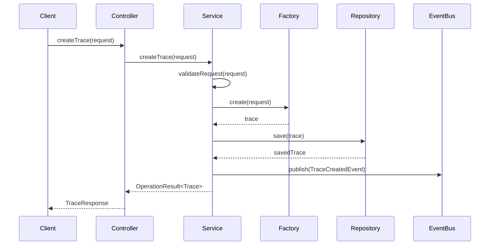
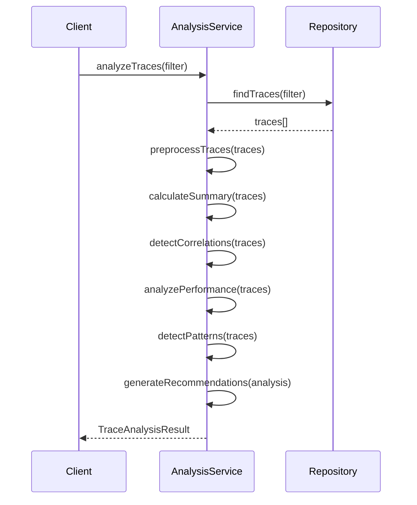

# Trace Module - Architecture Design

**Version**: v1.0.0  
**Last Updated**: 2025-08-09  
**Status**: Production Ready ✅

---

## 📋 **架构概述**

Trace模块采用领域驱动设计(DDD)的分层架构，提供企业级的事件追踪、性能监控和系统可观测性功能。架构设计遵循SOLID原则，确保高内聚、低耦合和良好的可扩展性。

## 🏗️ **DDD分层架构**

### **架构层次结构**
```
src/modules/trace/
├── api/                    # API层 - 对外接口
│   ├── controllers/        # REST控制器
│   │   └── trace.controller.ts
│   └── dto/               # 数据传输对象
│       ├── create-trace.dto.ts
│       ├── query-trace.dto.ts
│       └── trace-response.dto.ts
├── application/           # 应用层 - 业务流程
│   ├── services/          # 应用服务
│   │   ├── trace-management.service.ts
│   │   └── trace-analysis.service.ts
│   ├── commands/          # 命令处理器
│   │   ├── create-trace.command.ts
│   │   └── update-trace.command.ts
│   └── queries/           # 查询处理器
│       ├── get-trace-by-id.query.ts
│       └── search-traces.query.ts
├── domain/                # 领域层 - 核心业务逻辑
│   ├── entities/          # 领域实体
│   │   ├── trace.entity.ts
│   │   └── correlation.entity.ts
│   ├── value-objects/     # 值对象
│   │   ├── trace-event.vo.ts
│   │   ├── performance-metrics.vo.ts
│   │   └── error-information.vo.ts
│   ├── repositories/      # 仓储接口
│   │   └── trace-repository.interface.ts
│   ├── services/          # 领域服务
│   │   ├── trace-factory.service.ts
│   │   └── trace-validation.service.ts
│   └── events/           # 领域事件
│       ├── trace-created.event.ts
│       └── trace-completed.event.ts
├── infrastructure/        # 基础设施层 - 技术实现
│   ├── repositories/      # 仓储实现
│   │   └── trace.repository.ts
│   ├── adapters/         # 外部适配器
│   │   └── trace-module.adapter.ts
│   └── persistence/      # 持久化
│       └── trace.schema.ts
├── module.ts             # 模块集成
├── index.ts              # 公共导出
└── types.ts              # 类型定义
```

## 🎯 **核心组件设计**

### **1. 领域实体 (Domain Entities)**

#### **Trace实体**
```typescript
class Trace {
  // 核心属性
  private readonly _traceId: UUID;
  private readonly _contextId: UUID;
  private readonly _protocolVersion: string;
  private _traceType: TraceType;
  private _severity: TraceSeverity;
  private _event: TraceEvent;
  private _timestamp: Timestamp;
  private _createdAt: Timestamp;
  private _updatedAt: Timestamp;

  // 可选属性
  private _taskId?: UUID;
  private _correlations: Correlation[] = [];
  private _performanceMetrics?: PerformanceMetrics;
  private _errorInformation?: ErrorInformation;
  private _metadata?: TraceMetadata;

  // 业务方法
  addCorrelation(correlation: Correlation): void;
  removeCorrelation(targetId: UUID): void;
  updatePerformanceMetrics(metrics: PerformanceMetrics): void;
  setErrorInformation(error: ErrorInformation): void;
  updateMetadata(metadata: TraceMetadata): void;
  
  // 查询方法
  isError(): boolean;
  isPerformance(): boolean;
  getExecutionDuration(): number | null;
  
  // 不变性验证
  private validateInvariants(): void;
}
```

#### **关联实体**
```typescript
class Correlation {
  constructor(
    public readonly targetId: UUID,
    public readonly type: CorrelationType,
    public readonly strength: number,
    public readonly description?: string
  ) {
    this.validateCorrelation();
  }

  private validateCorrelation(): void {
    if (this.strength < 0 || this.strength > 1) {
      throw new Error('关联强度必须在0-1之间');
    }
  }
}
```

### **2. 值对象 (Value Objects)**

#### **追踪事件值对象**
```typescript
class TraceEvent {
  constructor(
    public readonly type: string,
    public readonly name: string,
    public readonly category: string,
    public readonly source: EventSource,
    public readonly data?: Record<string, any>
  ) {
    this.validateEvent();
  }

  private validateEvent(): void {
    if (!this.type || !this.name || !this.category) {
      throw new Error('事件类型、名称和类别不能为空');
    }
  }
}
```

#### **性能指标值对象**
```typescript
class PerformanceMetrics {
  constructor(
    public readonly executionTime?: number,
    public readonly memoryUsage?: number,
    public readonly cpuUsage?: number,
    public readonly networkLatency?: number,
    public readonly customMetrics?: Record<string, number>
  ) {
    this.validateMetrics();
  }

  private validateMetrics(): void {
    if (this.executionTime !== undefined && this.executionTime < 0) {
      throw new Error('执行时间不能为负数');
    }
    // 其他验证逻辑...
  }
}
```

### **3. 应用服务 (Application Services)**

#### **追踪管理服务**
```typescript
@Injectable()
export class TraceManagementService {
  constructor(
    private readonly traceRepository: ITraceRepository,
    private readonly traceFactory: TraceFactoryService,
    private readonly validator: TraceValidationService,
    private readonly eventBus: EventBus
  ) {}

  async createTrace(request: CreateTraceRequest): Promise<OperationResult<Trace>> {
    // 1. 验证请求
    const validationResult = await this.validator.validateCreateRequest(request);
    if (!validationResult.isValid) {
      return OperationResult.failure(validationResult.errors);
    }

    // 2. 创建追踪实体
    const trace = this.traceFactory.create(request);

    // 3. 持久化
    const savedTrace = await this.traceRepository.save(trace);

    // 4. 发布领域事件
    await this.eventBus.publish(new TraceCreatedEvent(savedTrace));

    return OperationResult.success(savedTrace);
  }

  async getTraceById(traceId: UUID): Promise<OperationResult<Trace>> {
    const trace = await this.traceRepository.findById(traceId);
    if (!trace) {
      return OperationResult.failure(['追踪不存在']);
    }
    return OperationResult.success(trace);
  }

  // 其他业务方法...
}
```

#### **追踪分析服务**
```typescript
@Injectable()
export class TraceAnalysisService {
  async analyzeTraces(traces: Trace[]): Promise<TraceAnalysisResult> {
    // 1. 数据预处理
    const validTraces = this.preprocessTraces(traces);

    // 2. 统计分析
    const summary = this.calculateSummary(validTraces);

    // 3. 关联检测
    const correlations = await this.detectCorrelations(validTraces);

    // 4. 性能分析
    const performance = this.analyzePerformance(validTraces);

    // 5. 模式识别
    const patterns = this.detectPatterns(validTraces);

    // 6. 生成建议
    const recommendations = this.generateRecommendations({
      summary,
      correlations,
      performance,
      patterns
    });

    return {
      summary,
      correlations,
      performance,
      patterns,
      recommendations
    };
  }

  // 分析算法实现...
}
```

### **4. 领域服务 (Domain Services)**

#### **追踪工厂服务**
```typescript
@Injectable()
export class TraceFactoryService {
  create(request: CreateTraceRequest): Trace {
    const traceId = this.generateTraceId();
    const timestamp = new Date().toISOString();

    return new Trace(
      traceId,
      request.contextId,
      '1.0.0', // 协议版本
      request.traceType,
      request.severity || 'info',
      request.event,
      timestamp,
      timestamp,
      timestamp,
      request.taskId,
      request.correlations,
      request.performanceMetrics,
      request.errorInformation,
      request.metadata
    );
  }

  createExecutionTrace(request: CreateExecutionTraceRequest): Trace {
    const event = new TraceEvent(
      'execution',
      request.name,
      'system',
      {
        component: request.component,
        operation: request.operation
      }
    );

    return this.create({
      ...request,
      traceType: 'execution',
      event
    });
  }

  // 其他工厂方法...
}
```

## 🔄 **数据流设计**

### **追踪创建流程**


### **追踪分析流程**


## 🔌 **集成设计**

### **模块适配器**
```typescript
@Injectable()
export class TraceModuleAdapter implements IModuleAdapter {
  constructor(
    private readonly traceManagementService: TraceManagementService,
    private readonly traceAnalysisService: TraceAnalysisService
  ) {}

  async initialize(config: TraceModuleConfig): Promise<void> {
    // 模块初始化逻辑
    await this.validateConfiguration(config);
    await this.setupEventHandlers();
    await this.initializeMetrics();
  }

  async coordinateTracing(request: TraceCoordinationRequest): Promise<TraceCoordinationResult> {
    // 追踪协调逻辑
    const strategy = this.determineTracingStrategy(request);
    return await this.executeTracingStrategy(strategy, request);
  }

  // 其他适配器方法...
}
```

### **事件驱动架构**
```typescript
// 领域事件
export class TraceCreatedEvent implements IDomainEvent {
  constructor(
    public readonly trace: Trace,
    public readonly occurredOn: Date = new Date()
  ) {}
}

// 事件处理器
@EventHandler(TraceCreatedEvent)
export class TraceCreatedEventHandler {
  async handle(event: TraceCreatedEvent): Promise<void> {
    // 处理追踪创建事件
    await this.updateMetrics(event.trace);
    await this.checkAlerts(event.trace);
    await this.notifySubscribers(event.trace);
  }
}
```

## 📊 **性能设计**

### **缓存策略**
```typescript
@Injectable()
export class TraceCacheService {
  private readonly cache = new Map<string, Trace>();
  private readonly TTL = 5 * 60 * 1000; // 5分钟

  async get(traceId: UUID): Promise<Trace | null> {
    const cached = this.cache.get(traceId);
    if (cached && this.isValid(cached)) {
      return cached;
    }
    return null;
  }

  async set(trace: Trace): Promise<void> {
    this.cache.set(trace.traceId, trace);
    setTimeout(() => {
      this.cache.delete(trace.traceId);
    }, this.TTL);
  }
}
```

### **批量处理**
```typescript
@Injectable()
export class TraceBatchProcessor {
  private readonly batchSize = 100;
  private readonly batchTimeout = 1000; // 1秒

  async processBatch(traces: Trace[]): Promise<void> {
    const batches = this.createBatches(traces, this.batchSize);
    
    await Promise.all(
      batches.map(batch => this.processSingleBatch(batch))
    );
  }

  private async processSingleBatch(batch: Trace[]): Promise<void> {
    // 批量处理逻辑
    await this.repository.saveBatch(batch);
    await this.eventBus.publishBatch(
      batch.map(trace => new TraceCreatedEvent(trace))
    );
  }
}
```

## 🛡️ **安全设计**

### **访问控制**
```typescript
@Injectable()
export class TraceSecurityService {
  async checkAccess(userId: UUID, traceId: UUID, operation: string): Promise<boolean> {
    const trace = await this.traceRepository.findById(traceId);
    if (!trace) {
      return false;
    }

    const permissions = await this.getPermissions(userId, trace.contextId);
    return permissions.includes(operation);
  }

  async filterTracesByPermissions(traces: Trace[], userId: UUID): Promise<Trace[]> {
    const filteredTraces: Trace[] = [];
    
    for (const trace of traces) {
      if (await this.checkAccess(userId, trace.traceId, 'read')) {
        filteredTraces.push(trace);
      }
    }
    
    return filteredTraces;
  }
}
```

### **数据脱敏**
```typescript
@Injectable()
export class TraceDataMaskingService {
  maskSensitiveData(trace: Trace): Trace {
    const maskedTrace = { ...trace };
    
    if (maskedTrace.metadata) {
      maskedTrace.metadata = this.maskMetadata(maskedTrace.metadata);
    }
    
    if (maskedTrace.event.data) {
      maskedTrace.event.data = this.maskEventData(maskedTrace.event.data);
    }
    
    return maskedTrace;
  }

  private maskMetadata(metadata: TraceMetadata): TraceMetadata {
    // 脱敏逻辑
    return {
      ...metadata,
      sensitiveField: '***masked***'
    };
  }
}
```

---

**Trace模块的架构设计确保了高性能、高可用性和良好的可扩展性，为MPLP v1.0 L4智能代理操作系统提供了企业级的监控和观测能力。** 🚀
