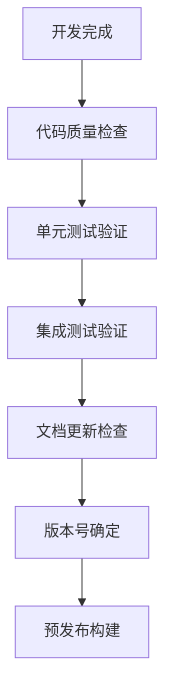
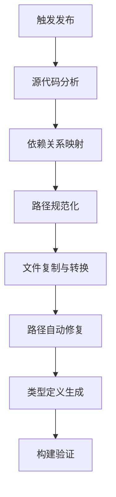
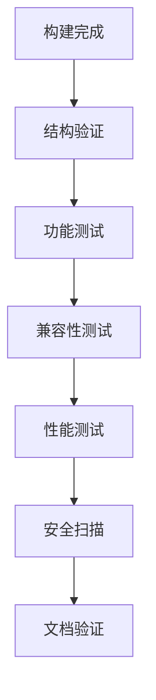
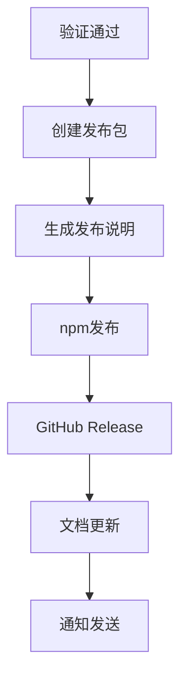

# MPLP 自动发布流程规范

## 🎯 发布流程概述

本文档定义了MPLP项目的完整自动发布流程，确保从开发版本到生产发布的全自动化、高质量交付。

## 📋 发布流程阶段

### 阶段1: 预发布准备 (Pre-Release)


**检查项目:**
- [ ] 所有功能开发完成
- [ ] 代码覆盖率 > 90%
- [ ] 所有测试通过
- [ ] 文档与代码同步
- [ ] 版本号符合语义化版本规范
- [ ] CHANGELOG.md 更新完整

### 阶段2: 发布构建 (Release Build)


**构建步骤:**
1. **源代码分析**: 自动分析项目结构和依赖关系
2. **路径映射**: 建立开发版本到发布版本的路径映射表
3. **文件复制**: 按照映射表复制必要文件
4. **路径修复**: 自动修复所有导入路径
5. **类型生成**: 生成TypeScript类型定义
6. **构建验证**: 验证发布版本可以正常编译

### 阶段3: 质量验证 (Quality Assurance)


**验证项目:**
- [ ] 文件结构完整性
- [ ] 模块导入正确性
- [ ] API接口兼容性
- [ ] 示例代码可运行性
- [ ] 性能基准达标
- [ ] 安全漏洞扫描通过

### 阶段4: 发布部署 (Release Deployment)


**部署步骤:**
1. **发布包创建**: 生成最终的npm包
2. **发布说明**: 自动生成Release Notes
3. **npm发布**: 发布到npm注册表
4. **GitHub Release**: 创建GitHub Release
5. **文档更新**: 更新项目文档网站
6. **通知发送**: 发送发布通知

## 🔧 技术实现规范

### 1. 目录结构规范
```
releases/
├── v{version}/                 # 版本化目录
│   ├── src/                   # 源代码
│   │   ├── core/             # 核心模块
│   │   ├── modules/          # 业务模块
│   │   ├── shared/           # 共享代码
│   │   ├── utils/            # 工具函数
│   │   └── index.ts          # 主入口
│   ├── dist/                 # 编译产物
│   ├── docs/                 # 文档
│   ├── examples/             # 示例代码
│   ├── package.json          # 包配置
│   ├── tsconfig.json         # TS配置
│   ├── README.md             # 说明文档
│   └── CHANGELOG.md          # 变更日志
├── archives/                  # 发布归档
│   └── mplp-protocol-v{version}.tar.gz
└── metadata/                  # 发布元数据
    └── v{version}-metadata.json
```

### 2. 路径映射规范
```typescript
interface PathMapping {
  // 开发版本路径 -> 发布版本路径
  sourcePattern: string;
  targetPattern: string;
  fileTypes: string[];
  required: boolean;
}

const pathMappings: PathMapping[] = [
  {
    sourcePattern: "src/public/modules/core/**/*",
    targetPattern: "src/core/**/*",
    fileTypes: [".ts", ".js"],
    required: true
  },
  {
    sourcePattern: "src/modules/**/*",
    targetPattern: "src/modules/**/*",
    fileTypes: [".ts", ".js"],
    required: true
  },
  {
    sourcePattern: "src/public/shared/types/**/*",
    targetPattern: "src/shared/types/**/*",
    fileTypes: [".ts", ".d.ts"],
    required: true
  }
];
```

### 3. 导入路径修复规范
```typescript
interface ImportPathRule {
  pattern: RegExp;
  replacement: string;
  description: string;
}

const importPathRules: ImportPathRule[] = [
  {
    pattern: /from ['"]\.\.\/\.\.\/\.\.\/public\/shared\/types['"]/g,
    replacement: "from '../../../shared/types'",
    description: "修复共享类型导入路径"
  },
  {
    pattern: /from ['"]\.\.\/\.\.\/\.\.\/public\/utils\/logger['"]/g,
    replacement: "from '../../../utils/logger'",
    description: "修复Logger导入路径"
  }
];
```

## 🚀 自动化脚本规范

### 1. 核心构建脚本
```bash
# 主构建命令
npm run release:build [version] [--dry-run] [--skip-tests]

# 验证命令
npm run release:validate [version] [--full]

# 发布命令
npm run release:publish [version] [--npm] [--github]
```

### 2. CI/CD集成
```yaml
# CircleCI 发布工作流
release:
  jobs:
    - validate-pre-release:
        filters: { tags: { only: /^v.*/ } }
    - build-release:
        requires: [validate-pre-release]
        filters: { tags: { only: /^v.*/ } }
    - test-release:
        requires: [build-release]
        filters: { tags: { only: /^v.*/ } }
    - deploy-release:
        requires: [test-release]
        filters: { tags: { only: /^v.*/ } }
```

## 📊 质量门禁标准

### 1. 构建质量门禁
- [ ] TypeScript编译无错误
- [ ] 所有依赖路径解析正确
- [ ] 包大小在合理范围内 (< 10MB)
- [ ] 无敏感信息泄露

### 2. 功能质量门禁
- [ ] 单元测试覆盖率 > 90%
- [ ] 集成测试全部通过
- [ ] 端到端测试全部通过
- [ ] API兼容性测试通过

### 3. 性能质量门禁
- [ ] 构建时间 < 5分钟
- [ ] 包加载时间 < 1秒
- [ ] 内存使用 < 100MB
- [ ] 响应时间 < 500ms

### 4. 安全质量门禁
- [ ] npm audit 无高危漏洞
- [ ] 代码静态安全扫描通过
- [ ] 依赖许可证合规检查通过
- [ ] 敏感信息扫描通过

## 🔄 版本管理规范

### 1. 语义化版本控制
```
MAJOR.MINOR.PATCH[-PRERELEASE][+BUILD]

示例:
- 1.0.0        # 正式版本
- 1.1.0-beta.1 # 测试版本
- 1.0.1        # 补丁版本
```

### 2. 分支策略
```
main          # 生产分支
develop       # 开发分支
release/*     # 发布分支
hotfix/*      # 热修复分支
feature/*     # 功能分支
```

### 3. 发布触发规则
```bash
# 创建发布标签触发自动发布
git tag v1.0.0
git push origin v1.0.0

# 发布分支合并触发预发布
git checkout -b release/v1.1.0
git push origin release/v1.1.0
```

## 📝 文档更新规范

### 1. 自动生成文档
- [ ] API文档自动生成
- [ ] 类型定义文档更新
- [ ] 示例代码验证
- [ ] README.md版本信息更新

### 2. 变更日志管理
```markdown
## [1.0.0] - 2025-08-01

### Added
- 新增功能列表

### Changed
- 变更功能列表

### Fixed
- 修复问题列表

### Security
- 安全更新列表
```

## 🚨 错误处理和回滚

### 1. 构建失败处理
- 自动回滚到上一个稳定版本
- 发送失败通知给开发团队
- 记录详细的错误日志
- 提供手动修复指导

### 2. 发布失败回滚
- npm包版本撤回
- GitHub Release删除
- 文档版本回退
- 用户通知发送

## 📈 监控和度量

### 1. 发布指标监控
- 发布成功率
- 构建时间趋势
- 质量门禁通过率
- 用户采用率

### 2. 质量趋势分析
- 测试覆盖率趋势
- 缺陷密度变化
- 性能指标趋势
- 用户反馈分析

---

**发布承诺**: 通过这套完整的自动发布流程，确保MPLP项目能够高质量、高效率、零错误地交付给用户。
