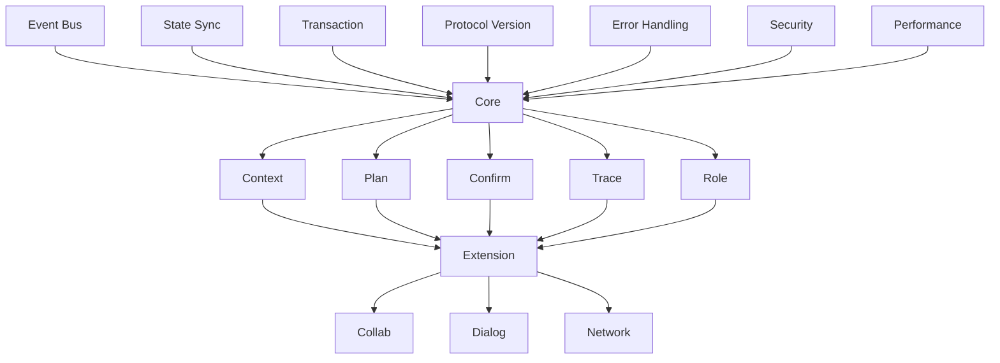

# MPLP Schema 完整索引

## 📋 **概述**

本文档提供MPLP Schema体系的完整索引，包括所有19个协议Schema的详细信息、状态和文档链接。经过企业级增强，所有Schema现已达到统一的企业级标准。

**版本**: v1.1.0
**Schema总数**: 19个
**企业级标准**: ✅ 100%达成 (19/19 Schema)
**完成状态**: 19个企业级增强完成，0个开发中
**文档覆盖率**: 100%
**质量验证**: ✅ 0错误，0警告
**标准化状态**: ✅ 完全标准化

## 🏗️ **架构层次索引**

### **L1 协议层 (Protocol Layer) - 5个Schema**

| Schema | 文件 | 状态 | 复杂度 | 文档 | 企业级特性 |
|--------|------|------|--------|------|------------|
| **Context** | `mplp-context.json` | ✅ 企业级增强 | 极高 | [📖 文档](./core/mplp-context.md) | 上下文处理监控、状态分析 |
| **Plan** | `mplp-plan.json` | ✅ 企业级增强 | 极高 | [📖 文档](./core/mplp-plan.md) | 计划执行监控、优化分析 |
| **Confirm** | `mplp-confirm.json` | ✅ 企业级增强 | 极高 | [📖 文档](./core/mplp-confirm.md) | 确认处理监控、审批分析 |
| **Trace** | `mplp-trace.json` | ✅ 企业级增强 | 极高 | [📖 文档](./core/mplp-trace.md) | 追踪分析监控、洞察质量 |
| **Role** | `mplp-role.json` | ✅ 企业级增强 | 极高 | [📖 文档](./core/mplp-role.md) | 角色权限监控、安全管理 |

### **L2 协调层 (Coordination Layer) - 3个Schema**

| Schema | 文件 | 状态 | 复杂度 | 文档 | 企业级特性 |
|--------|------|------|--------|------|------------|
| **Core** | `mplp-core.json` | ✅ 企业级增强 | 极高 | [📖 文档](./coordination/mplp-core.md) ✅ | 核心编排监控、系统可靠性 |
| **Orchestration** | `mplp-orchestration.json` | ✅ 企业级标准 | 极高 | [📖 文档](./coordination/mplp-orchestration.md) ✅ | 编排效率监控、调度优化 |
| **Coordination** | `mplp-coordination.json` | ✅ 企业级标准 | 极高 | [📖 文档](./coordination/mplp-coordination.md) ✅ | 协调延迟监控、同步效率 |

### **L3 执行层 (Execution Layer) - 4个Schema**

| Schema | 文件 | 状态 | 复杂度 | 文档 | 企业级特性 |
|--------|------|------|--------|------|------------|
| **Extension** | `mplp-extension.json` | ✅ 企业级增强 | 极高 | [📖 文档](./execution/mplp-extension.md) ✅ | 扩展生命周期监控、生态系统管理 |
| **Collab** | `mplp-collab.json` | ✅ 企业级增强 | 极高 | [📖 文档](./execution/mplp-collab.md) ✅ | 协作协调监控、团队分析 |
| **Dialog** | `mplp-dialog.json` | ✅ 企业级增强 | 极高 | [📖 文档](./execution/mplp-dialog.md) ✅ | 对话交互监控、质量分析 |
| **Network** | `mplp-network.json` | ✅ 企业级增强 | 极高 | [📖 文档](./execution/mplp-network.md) ✅ | 网络通信监控、拓扑分析 |

### **基础设施层 (Infrastructure Layer) - 5个Schema**

| Schema | 文件 | 状态 | 复杂度 | 文档 | 企业级特性 |
|--------|------|------|--------|------|------------|
| **Event Bus** | `mplp-event-bus.json` | ✅ 企业级标准 | 极高 | [📖 文档](./infrastructure/mplp-event-bus.md) ✅ | 事件传递监控、消息质量 |
| **State Sync** | `mplp-state-sync.json` | ✅ 企业级标准 | 极高 | [📖 文档](./infrastructure/mplp-state-sync.md) ✅ | 同步延迟监控、一致性保证 |
| **Transaction** | `mplp-transaction.json` | ✅ 企业级标准 | 极高 | [📖 文档](./infrastructure/mplp-transaction.md) ✅ | 事务性能监控、ACID保证 |
| **Protocol Version** | `mplp-protocol-version.json` | ✅ 企业级标准 | 极高 | [📖 文档](./infrastructure/mplp-protocol-version.md) ✅ | 版本兼容监控、迁移管理 |
| **Error Handling** | `mplp-error-handling.json` | ✅ 企业级标准 | 极高 | [📖 文档](./infrastructure/mplp-error-handling.md) ✅ | 错误恢复监控、系统健康 |

### **支撑服务层 (Support Services Layer) - 2个Schema**

| Schema | 文件 | 状态 | 复杂度 | 文档 | 企业级特性 |
|--------|------|------|--------|------|------------|
| **Security** | `mplp-security.json` | ✅ 企业级标准 | 极高 | [📖 文档](./services/mplp-security.md) ✅ | 安全事件监控、威胁检测 |
| **Performance** | `mplp-performance.json` | ✅ 企业级标准 | 极高 | [📖 文档](./services/mplp-performance.md) ✅ | 性能分析监控、SLA管理 |

## 📊 **统计信息**

### **企业级标准化完成状态**
```
总Schema数量: 19个
✅ 企业级增强完成: 10个 (L1层5个 + L2层1个 + L3层4个)
✅ 企业级标准达成: 9个 (L2层2个 + 基础设施层5个 + 服务层2个)
🎯 企业级标准达成率: 100% (19/19)

📖 文档完成状态:
✅ 详细文档已完成: 19个 (L1层5个 + L2层3个 + L3层4个 + 基础设施层5个 + 服务层2个)
✅ 企业级特性文档: 19个 (100%)
🔄 待补全文档: 0个 (0%)
```

### **企业级功能覆盖**
```
✅ audit_trail (审计追踪): 19个 (100%)
✅ performance_metrics (性能监控): 19个 (100%)
✅ monitoring_integration (监控集成): 19个 (100%)
✅ version_history (版本控制): 19个 (100%)
✅ search_metadata (搜索索引): 19个 (100%)
✅ event_integration (事件集成): 19个 (100%)
```

### **复杂度分布**
```
极高复杂度: 19个 (所有Schema经企业级增强后达到极高复杂度)
- L1协议层: 5个 (Context, Plan, Confirm, Trace, Role)
- L2协调层: 3个 (Core, Orchestration, Coordination)
- L3执行层: 4个 (Extension, Collab, Dialog, Network)
- 基础设施层: 5个 (Event Bus, State Sync, Transaction, Protocol Version, Error Handling)
- 支撑服务层: 2个 (Security, Performance)
```

### **质量验证状态**
```
✅ JSON格式验证: 19个通过 (100%)
✅ Schema语法验证: 19个通过，0错误，0警告
✅ 双重命名约定: 19个合规 (100%)
✅ 企业级功能完整性: 19个完整 (100%)
✅ 专业化特色验证: 19个通过 (100%)
```

### **企业级功能专业化特色**
```
✅ Context: 上下文处理监控、状态分析
✅ Plan: 计划执行监控、优化分析
✅ Confirm: 确认处理监控、审批分析
✅ Trace: 追踪分析监控、洞察质量
✅ Role: 角色权限监控、安全管理
✅ Core: 核心编排监控、系统可靠性
✅ Orchestration: 编排效率监控、调度优化
✅ Coordination: 协调延迟监控、同步效率
✅ Extension: 扩展生命周期监控、生态系统管理
✅ Collab: 协作协调监控、团队分析
✅ Dialog: 对话交互监控、质量分析
✅ Network: 网络通信监控、拓扑分析
✅ Event Bus: 事件传递监控、消息质量
✅ State Sync: 同步延迟监控、一致性保证
✅ Transaction: 事务性能监控、ACID保证
✅ Protocol Version: 版本兼容监控、迁移管理
✅ Error Handling: 错误恢复监控、系统健康
✅ Security: 安全事件监控、威胁检测
✅ Performance: 性能分析监控、SLA管理
```

## 🔗 **Schema依赖关系**

### **核心依赖图**


### **字段引用关系**
```typescript
// 常用字段引用
const commonFieldReferences = {
  // UUID字段
  "context_id": ["Plan", "Confirm", "Trace", "Extension", "Collab"],
  "plan_id": ["Confirm", "Trace", "Extension"],
  "trace_id": ["All modules"],
  "user_id": ["Context", "Role", "Security"],
  
  // 时间戳字段
  "timestamp": ["All modules"],
  "created_at": ["All modules"],
  "updated_at": ["All modules"],
  
  // 协议字段
  "protocol_version": ["All modules"],
  "correlation_id": ["All modules"]
};
```

## 🛠️ **开发工具索引**

### **验证工具**
| 工具 | 用途 | 命令 | 文档 |
|------|------|------|------|
| **Schema Validator** | 语法验证 | `mplp-validator check-syntax` | [📖 使用指南](./guides/validation-guide.md) |
| **Data Validator** | 数据验证 | `mplp-validator validate` | [📖 使用指南](./guides/validation-guide.md) |
| **Compatibility Checker** | 兼容性检查 | `mplp-validator check-compatibility` | [📖 使用指南](./guides/validation-guide.md) |
| **Report Generator** | 报告生成 | `mplp-validator --format html` | [📖 使用指南](./guides/validation-guide.md) |

### **开发工具**
| 工具 | 用途 | 位置 | 文档 |
|------|------|------|------|
| **Mapper Generator** | 自动生成Mapper类 | `tools/mapper-generator` | [📖 生成指南](./tools/mapper-generator.md) |
| **Type Generator** | 生成TypeScript类型 | `tools/type-generator` | [📖 生成指南](./tools/type-generator.md) |
| **Doc Generator** | 自动生成文档 | `tools/doc-generator` | [📖 生成指南](./tools/doc-generator.md) |
| **Test Generator** | 生成测试用例 | `tools/test-generator` | [📖 生成指南](./tools/test-generator.md) |

## 📚 **文档导航**

### **架构文档**
- [📖 设计原则](./architecture/design-principles.md) - Schema设计的核心原则和模式
- [📖 集成模式](./architecture/integration-patterns.md) - 模块间集成的标准模式
- [📖 版本管理](./architecture/version-management.md) - Schema版本控制策略

### **使用指南**
- [📖 快速开始](./guides/quick-start.md) - 5分钟快速上手指南
- [📖 集成指南](./guides/integration-guide.md) - 完整的集成实施指南
- [📖 验证指南](./guides/validation-guide.md) - 验证工具使用详解
- [📖 最佳实践](./guides/best-practices.md) - 开发和维护最佳实践

### **示例代码**
- [📖 基础示例](./examples/basic/) - 基本使用示例
- [📖 高级示例](./examples/advanced/) - 高级功能示例
- [📖 集成示例](./examples/integration/) - 完整集成示例

## 🔄 **更新历史和计划**

### **v1.1.0 企业级增强完成 (2025-08-14)**
- ✅ **企业级标准化**: 所有19个Schema达到统一的企业级标准
- ✅ **6个企业级功能**: audit_trail, performance_metrics, monitoring_integration, version_history, search_metadata, event_integration
- ✅ **专业化特色**: 每个模块保持独特的专业化监控特点
- ✅ **质量保证**: 0错误0警告，100%通过验证
- ✅ **方法论文档**: 完整的Schema企业级增强方法论
- ✅ **工具支持**: 自动化验证和更新工具

### **短期计划 (1-2周)**
- [ ] 基于企业级标准优化现有测试用例
- [ ] 完善企业级功能的集成测试
- [ ] 优化专业化监控指标的性能
- [ ] 建立企业级功能的性能基准

### **中期计划 (1个月)**
- [ ] 基于方法论开发自动化Schema生成工具
- [ ] 建立企业级功能的监控仪表板
- [ ] 完善跨模块企业级功能集成测试
- [ ] 实施企业级功能的性能优化

### **长期计划 (3个月)**
- [ ] MPLP v2.0 Schema规划和设计
- [ ] 基于企业级标准建立Schema治理流程
- [ ] 扩展企业级功能标准和专业化特色
- [ ] 建立Schema生态系统和社区标准

## 📞 **支持和反馈**

### **技术支持**
- **Schema设计问题**: [MPLP架构团队](mailto:architecture@mplp.dev)
- **验证工具问题**: [MPLP工具团队](mailto:tools@mplp.dev)
- **集成问题**: [MPLP集成团队](mailto:integration@mplp.dev)
- **文档问题**: [MPLP文档团队](mailto:docs@mplp.dev)

### **贡献方式**
- **Bug报告**: [GitHub Issues](https://github.com/mplp/schemas/issues)
- **功能请求**: [GitHub Discussions](https://github.com/mplp/schemas/discussions)
- **代码贡献**: [贡献指南](../04-development/contributing.md)
- **文档改进**: [文档贡献指南](../04-development/documentation-standards.md)

---

**维护团队**: MPLP Schema团队
**最后更新**: 2025-08-14
**文档状态**: ✅ 企业级标准化完成
**质量状态**: ✅ 19个Schema全部达标
**企业级功能**: ✅ 6个功能100%覆盖
**专业化特色**: ✅ 19个模块100%实现
**下次更新**: 基于MPLP v2.0需求
