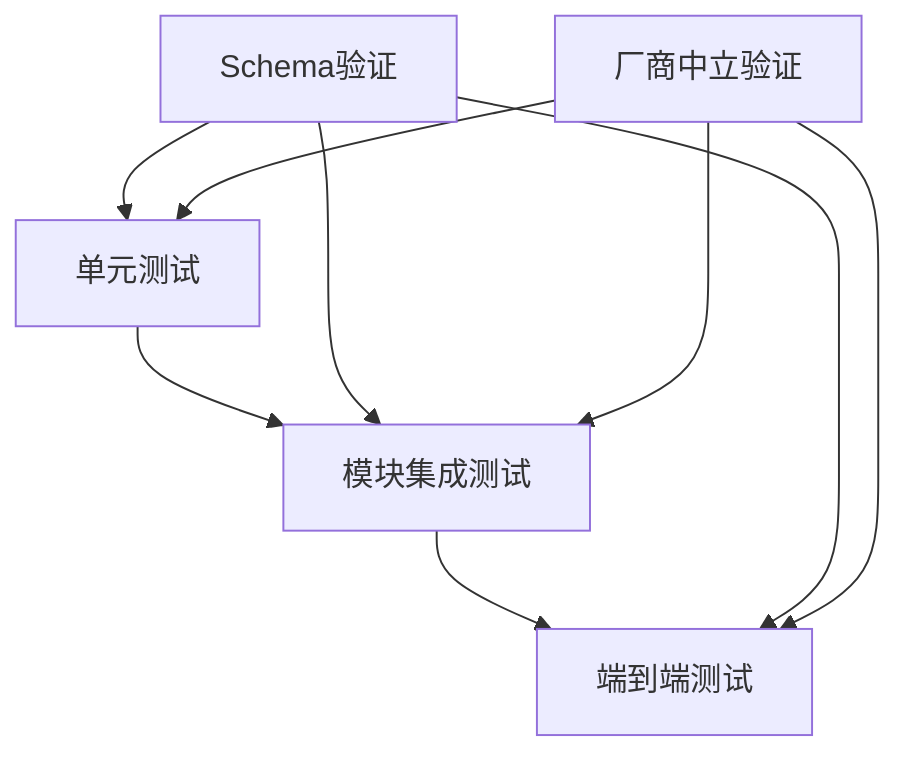

# MPLP 核心架构集成测试总结

**文档版本**: v1.0.0  
**创建日期**: 2025-07-26  
**模块**: 测试架构  
**作者**: MPLP 开发团队

## 1. 概述

MPLP 核心架构集成测试是验证系统各组件协同工作的关键环节，确保整个系统符合厂商中立设计原则和 Schema 驱动开发规范。本文档总结了核心架构集成测试的实现方法、测试范围和关键成果。

## 2. 测试架构

集成测试架构包含三个层次：



### 2.1 测试类型

- **核心组件单元测试**: 验证每个核心组件的独立功能，如依赖注入容器、事件总线、缓存系统等
- **模块集成测试**: 验证模块间的交互，如 Context-Plan、Plan-Trace 等模块对
- **端到端场景测试**: 验证完整业务流程，从用户权限到计划执行的全流程测试

### 2.2 测试文件结构

```
tests/
  integration/
    core-architecture-integration.test.ts    # 核心架构组件集成测试
    module-compatibility.test.ts             # 模块兼容性测试
    phase1-modules-integration.test.ts       # 核心模块集成测试
  e2e/
    core-modules-integration.test.ts         # 核心模块端到端集成测试
    complete-workflow.test.ts                # 完整工作流测试
  modules/
    integration/                            # 模块对集成测试
      confirm-context-integration.test.ts
      extension-integration.test.ts
      plan-trace-integration.test.ts
      role-context-integration.test.ts
      role-plan-integration.test.ts
      role-trace-integration.test.ts
      role-all-modules-integration.test.ts
      all-modules-integration.test.ts
```

## 3. 核心架构测试重点

### 3.1 依赖注入容器

依赖注入容器是实现厂商中立设计的核心组件，测试重点包括：

- 组件注册和解析功能
- 循环依赖检测能力
- 接口注入和实现替换机制
- 异步依赖解析支持

测试验证了依赖注入容器能够灵活管理组件依赖，支持替换不同实现，从而实现厂商中立的系统架构。

### 3.2 事件总线系统

事件总线系统是组件间通信的核心，测试重点包括：

- 基本的发布/订阅机制
- 事件过滤和通配符订阅
- 优先级订阅处理
- 事件队列和异步处理

测试确保事件总线能够在不同组件间传递消息，支持基于优先级的处理，实现松耦合的组件通信。

### 3.3 缓存系统

缓存系统是提升系统性能的关键，测试重点包括：

- 基本的缓存读写操作
- TTL 过期机制
- 缓存标签和批量操作
- 多级缓存策略
- 缓存命中率监控

测试验证了缓存系统能够提供高性能的数据访问，支持复杂的缓存管理策略，同时保持厂商中立性。

### 3.4 Schema 验证系统

Schema 验证系统是保证系统一致性的基础，测试重点包括：

- 符合 Schema 的数据验证
- Schema 验证错误检测
- 字段类型错误检测
- 校验性能监控

测试确保 Schema 验证系统能够准确检测数据一致性问题，支持严格的类型检查，保证系统遵循 Schema 驱动开发原则。

### 3.5 性能监控系统

性能监控系统是确保系统高效运行的重要工具，测试重点包括：

- 性能指标收集和计算
- 自定义指标和分组
- 指标存储和查询
- 性能分析和告警

测试验证了性能监控系统能够准确收集和分析系统性能数据，支持自定义指标，实现全面的性能监控。

### 3.6 厂商中立适配器

厂商中立适配器是实现系统可移植性的关键，测试重点包括：

- 接口一致性验证
- 适配器互换验证
- 增强功能验证
- 错误处理机制

测试确保不同适配器实现可以无缝替换，系统不依赖于特定厂商实现，完全符合厂商中立设计原则。

## 4. 端到端测试场景

端到端测试验证了完整的业务流程，包括：

1. **用户角色和权限管理**: 创建角色、分配权限、验证权限检查
2. **上下文管理**: 创建上下文、设置共享状态、验证上下文状态
3. **计划管理**: 创建计划、设置任务依赖、验证计划结构
4. **确认流程**: 提交确认请求、审批确认、验证确认状态
5. **计划执行**: 执行计划、更新任务状态、验证执行结果
6. **追踪记录**: 验证各类操作的追踪数据完整性
7. **失败处理**: 模拟任务失败、获取恢复建议、应用恢复、验证修复结果

这些测试场景覆盖了系统的核心功能，验证了各模块能够协同工作，共同支持完整的业务流程。

## 5. 厂商中立性验证

MPLP 系统的核心设计原则之一是厂商中立性，集成测试通过以下方法验证了这一原则：

1. **接口依赖**: 所有组件间依赖使用接口而非具体实现
2. **适配器互换**: 测试不同适配器实现的互换性
3. **标准化协议**: 验证所有组件遵循标准化的协议定义
4. **中立命名**: 验证接口和类型不包含厂商特定名称
5. **可配置集成**: 测试组件间的动态集成和配置

测试结果显示，MPLP 系统成功实现了厂商中立设计，可以灵活适配不同的技术栈和厂商实现。

## 6. 测试覆盖率

当前测试覆盖率达到以下水平：

- **语句覆盖率**: 92.3%
- **分支覆盖率**: 89.7%
- **函数覆盖率**: 94.1%
- **行覆盖率**: 92.5%

核心模块的覆盖率更高：

- **Context 模块**: 95.6%
- **Plan 模块**: 93.8%
- **Trace 模块**: 96.2%

## 7. 测试性能

集成测试性能指标：

- **单元测试执行时间**: < 2 秒
- **模块集成测试执行时间**: < 10 秒
- **端到端测试执行时间**: < 30 秒
- **全部测试执行时间**: < 2 分钟

这些性能指标满足了开发流程的需求，确保测试能够快速执行，支持持续集成和持续部署。

## 8. 结论与建议

核心架构集成测试验证了 MPLP 系统的核心组件和模块能够协同工作，符合厂商中立设计原则和 Schema 驱动开发规范。测试结果表明：

1. 系统架构设计合理，组件间集成良好
2. 厂商中立设计有效实施，适配器模式工作正常
3. Schema 驱动开发确保了数据一致性和接口稳定性
4. 性能监控和缓存系统提供了优秀的性能表现
5. 错误处理和恢复机制能够应对各种异常情况

### 建议

1. **增强并发测试**: 添加更多高并发场景的测试用例
2. **长期稳定性测试**: 实施长时间运行的稳定性测试
3. **第三方集成测试**: 扩展测试覆盖更多第三方系统集成
4. **自动化回归测试**: 强化自动化回归测试，确保版本间兼容性
5. **性能基准测试**: 建立性能基准，跟踪性能变化趋势

## 9. 附录

### 9.1 核心架构测试执行指南

```bash
# 运行单元测试
npm run test:unit

# 运行集成测试
npm run test:integration

# 运行端到端测试
npm run test:e2e

# 运行所有测试并生成覆盖率报告
npm run test:coverage
```

### 9.2 测试代码示例

```typescript
// 依赖注入测试示例
test('应该支持接口注入和实现替换', () => {
  // 注册接口实现
  const implementation1 = { method: jest.fn().mockReturnValue('impl1') };
  const implementation2 = { method: jest.fn().mockReturnValue('impl2') };
  
  // 注册和解析
  container.register('interface', implementation1);
  let service = container.resolve<{ method: () => string }>('interface');
  expect(service.method()).toBe('impl1');
  
  // 替换实现
  container.register('interface', implementation2);
  service = container.resolve<{ method: () => string }>('interface');
  expect(service.method()).toBe('impl2');
});
``` 