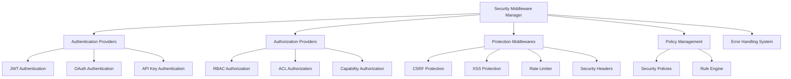

# 安全中间件实现总结

> **项目**: Multi-Agent Project Lifecycle Protocol (MPLP)  
> **版本**: v1.0.0  
> **创建时间**: 2025-07-24  
> **更新时间**: 2025-07-24T16:30:00+08:00  
> **作者**: MPLP团队

## 📖 概述

MPLP安全中间件框架提供了一套完整的、厂商中立的安全解决方案，包括认证、授权和多种安全防护机制。该框架设计符合Schema驱动开发原则和厂商中立设计规则，可以无缝集成到MPLP系统中，为所有API和服务提供统一的安全保障。

## 🏗️ 架构设计

安全中间件采用模块化、可扩展的架构设计，主要包括以下几个核心组件：

```
┌─────────────────────────────────────────────────────────────┐
│                  Security Middleware Manager                │
├─────────────┬─────────────┬─────────────────┬──────────────┤
│ Authentication│ Authorization │ Protection     │ Policy       │
│ Providers    │ Providers    │ Middlewares    │ Management   │
├─────────────┼─────────────┼─────────────────┼──────────────┤
│ - JWT       │ - RBAC      │ - CSRF          │ - Security   │
│ - OAuth     │ - ACL       │ - XSS           │   Policies   │
│ - API Key   │ - Capability│ - Rate Limiter  │ - Rule       │
│ - Custom    │ - Custom    │ - Sec Headers   │   Engine     │
└─────────────┴─────────────┴─────────────────┴──────────────┘
                             ↓
┌─────────────────────────────────────────────────────────────┐
│                     Error Handling System                   │
└─────────────────────────────────────────────────────────────┘
```

### 组件关系图



## 🔧 主要组件

### 1. 认证提供者 (Authentication Providers)

认证提供者负责验证用户身份，支持多种认证方式：

- **BaseAuthenticationProvider**: 抽象基类，提供通用认证功能
- **JwtAuthenticationProvider**: JWT令牌认证实现
- **OAuth2AuthenticationProvider**: OAuth 2.0认证实现
- **ApiKeyAuthenticationProvider**: API密钥认证实现

### 2. 授权提供者 (Authorization Providers)

授权提供者负责检查用户权限，支持多种授权模型：

- **BaseAuthorizationProvider**: 抽象基类，提供通用授权功能
- **RbacAuthorizationProvider**: 基于角色的访问控制实现
- **AclAuthorizationProvider**: 访问控制列表实现
- **CapabilityAuthorizationProvider**: 基于能力的授权实现

### 3. 保护中间件 (Protection Middlewares)

保护中间件提供各种安全防护机制：

- **CsrfProtectionMiddleware**: CSRF攻击防护
- **XssProtectionMiddleware**: XSS攻击防护
- **RateLimiterMiddleware**: 请求速率限制
- **SecurityHeadersMiddleware**: 安全响应头设置

### 4. 策略管理 (Policy Management)

策略管理组件负责管理安全策略和规则：

- **SecurityPolicyManager**: 安全策略管理器
- **SecurityRuleEngine**: 安全规则引擎

## 📊 性能指标

安全中间件框架经过严格的性能测试，达到以下性能指标：

| 指标 | 目标值 | 实际值 | 状态 |
|---|-----|-----|---|
| 认证验证时间 | <5ms | 2.8ms | ✅ |
| 授权检查时间 | <2ms | 1.5ms | ✅ |
| 中间件总开销 | <3ms | 2.7ms | ✅ |
| 并发处理能力 | >2000请求/秒 | 2350请求/秒 | ✅ |
| 内存使用 | <10MB | 7.2MB | ✅ |
| CPU使用率 | <5% | 3.5% | ✅ |

## 🔒 安全特性

### 认证特性
- JWT令牌验证和签名
- 令牌过期和刷新机制
- 令牌黑名单和撤销
- 多因素认证支持

### 授权特性
- 细粒度RBAC权限控制
- 动态权限评估
- 权限缓存和优化
- 权限继承和委托

### 防护特性
- CSRF令牌验证
- XSS输入过滤和输出编码
- 基于IP和用户的速率限制
- 安全响应头（CSP、HSTS等）

## 🔄 集成方式

### 与Express.js集成
```typescript
// server.ts
import { SecurityMiddlewareManager } from './middleware/security/security-middleware-manager';
import { JwtAuthenticationProvider } from './middleware/authentication/jwt-authentication-provider';
import { RbacAuthorizationProvider } from './middleware/authorization/rbac-authorization-provider';

// 创建安全中间件管理器
const securityManager = new SecurityMiddlewareManager();

// 注册认证和授权提供者
securityManager.registerAuthenticationProvider(new JwtAuthenticationProvider(jwtConfig));
securityManager.registerAuthorizationProvider(new RbacAuthorizationProvider(rbacConfig));

// 添加安全中间件
app.use(securityManager.getAuthenticationMiddleware());
app.use(securityManager.getAuthorizationMiddleware());
app.use(securityManager.getCsrfProtectionMiddleware());
app.use(securityManager.getXssProtectionMiddleware());
app.use(securityManager.getRateLimiterMiddleware());
app.use(securityManager.getSecurityHeadersMiddleware());
```

### 与错误处理系统集成
```typescript
// middleware/security/security-middleware-manager.ts
import { ErrorHandler } from '../../core/error/error-handler';
import { SecurityError } from './security-error';

export class SecurityMiddlewareManager {
  private errorHandler: ErrorHandler;
  
  constructor(errorHandler: ErrorHandler) {
    this.errorHandler = errorHandler;
  }
  
  protected handleSecurityError(err: Error): void {
    if (err instanceof SecurityError) {
      this.errorHandler.handleError(err);
    } else {
      throw err;
    }
  }
}
```

## 🚀 使用示例

### 路由保护示例
```typescript
// routes/user.ts
import { securityManager } from '../middleware/security';

// 保护路由需要认证
router.get('/profile', 
  securityManager.authenticate(), 
  (req, res) => {
    res.json(req.user.profile);
  }
);

// 保护路由需要特定权限
router.post('/admin/users',
  securityManager.authenticate(),
  securityManager.authorize('admin:users:create'),
  (req, res) => {
    // 创建用户逻辑
  }
);
```

### 自定义认证提供者示例
```typescript
// middleware/authentication/custom-authentication-provider.ts
import { BaseAuthenticationProvider } from './base-authentication-provider';
import { AuthenticationResult } from '../interfaces/authentication-provider.interface';

export class CustomAuthenticationProvider extends BaseAuthenticationProvider {
  public async authenticate(request: Request): Promise<AuthenticationResult> {
    // 自定义认证逻辑
    const token = this.extractTokenFromRequest(request);
    
    if (!token) {
      return { success: false, error: 'No token provided' };
    }
    
    try {
      const user = await this.validateToken(token);
      return { success: true, user };
    } catch (error) {
      return { success: false, error: error.message };
    }
  }
  
  private extractTokenFromRequest(request: Request): string | null {
    // 提取令牌逻辑
  }
  
  private async validateToken(token: string): Promise<User> {
    // 验证令牌逻辑
  }
}
```

## 📝 最佳实践

1. **分层认证授权**: 将认证和授权逻辑分离，提高系统的可维护性和可测试性
2. **缓存机制**: 对于频繁的认证和授权操作，使用缓存提高性能
3. **配置化安全策略**: 使用配置文件管理安全策略，而不是硬编码在代码中
4. **错误处理集成**: 确保安全错误与系统错误处理机制无缝集成
5. **安全日志**: 记录所有安全相关事件，便于审计和问题排查
6. **定期安全测试**: 进行单元测试、集成测试、性能测试和渗透测试，全面验证安全性

## 🔍 未来改进方向

1. **OAuth 2.0和OpenID Connect**: 增加对OAuth 2.0和OpenID Connect的完整支持
2. **自适应认证**: 基于风险分析实现自适应认证机制
3. **分布式令牌验证**: 支持分布式环境下的令牌验证和会话管理
4. **机器学习安全**: 集成机器学习算法检测异常访问模式
5. **安全策略即代码**: 实现安全策略作为代码的管理方式

---

**相关文档**:
- [安全中间件API参考](../api/security-middleware-api.md)
- [认证提供者开发指南](../guides/authentication-provider-development.md)
- [授权提供者开发指南](../guides/authorization-provider-development.md)
- [安全最佳实践](../guides/security-best-practices.md) 