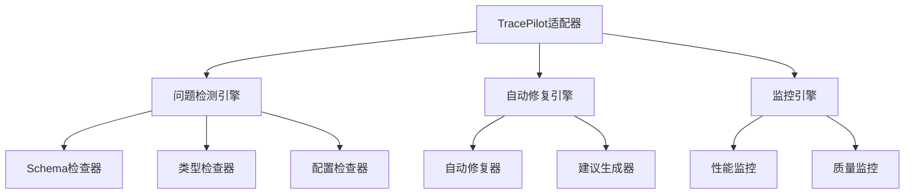

# TracePilot - 智能开发助手

> **项目**: Multi-Agent Project Lifecycle Protocol (MPLP)  
> **模块**: TracePilot MCP工具  
> **版本**: v2.0.0  
> **创建时间**: 2025-01-09  
> **更新时间**: 2025-01-09T25:10:00+08:00  
> **作者**: MPLP团队

## 📖 概述

TracePilot是MPLP协议中的核心MCP(Model Context Protocol)工具，从被动数据收集器演进为智能开发助手。它提供主动问题检测、自动修复建议和持续质量监控功能。

## 📋 目录

- [概述](#概述)
- [核心功能](#核心功能)
- [技术架构](#技术架构)
- [快速开始](#快速开始)
- [API文档](#api文档)
- [配置说明](#配置说明)
- [使用示例](#使用示例)
- [故障排除](#故障排除)

## 🚀 核心功能

### 🔍 智能问题检测
- **主动监控**: 每30秒自动检测开发问题
- **多维度检查**: Schema缺失、类型错误、配置问题等7大类
- **优先级排序**: 自动按影响程度对问题分级

### 🛠️ 自动修复执行
- **一键修复**: 自动解决可修复的问题
- **智能建议**: AI驱动的解决方案生成
- **批量处理**: 支持批量问题修复

### 📊 持续质量保障
- **实时监控**: 性能指标、内存使用、错误率
- **质量门禁**: 自动验证代码质量要求
- **趋势分析**: 性能趋势和质量演进分析

## 🏗️ 技术架构

### 核心组件



### 模块结构

```
src/mcp/
├── enhanced-tracepilot-adapter.ts  # 核心适配器
├── tracepilot-adapter.ts          # 基础适配器  
└── types.ts                       # 类型定义

scripts/
├── immediate-diagnosis.js          # 立即诊断
└── tracepilot-doctor.ts           # 完整诊断CLI

src/schemas/
├── base-protocol.json             # 基础协议Schema
├── context-protocol.json          # Context协议Schema
├── plan-protocol.json             # Plan协议Schema
├── trace-protocol.json            # Trace协议Schema
└── index.ts                       # 统一验证器
```

## 🚀 快速开始

### 安装依赖

```bash
npm install ajv ajv-formats commander chalk ora inquirer @types/inquirer tsx
```

### 立即诊断

```bash
# 基础诊断 (无需额外依赖)
node scripts/immediate-diagnosis.js

# 自动修复模式
node scripts/immediate-diagnosis.js --auto-fix
```

### 完整诊断

```bash
# 完整诊断
npx tsx scripts/tracepilot-doctor.ts diagnose

# 快速检查
npx tsx scripts/tracepilot-doctor.ts check

# 生成报告
npx tsx scripts/tracepilot-doctor.ts report
```

## 📊 使用示例

### 在代码中集成TracePilot

```typescript
import { EnhancedTracePilotAdapter } from '@/mcp/enhanced-tracepilot-adapter';

// 创建TracePilot实例
const tracePilot = new EnhancedTracePilotAdapter(process.cwd());

// 监听问题检测事件
tracePilot.on('issue_detected', (issue) => {
  console.log(`检测到问题: ${issue.title}`);
  console.log(`严重程度: ${issue.severity}`);
  console.log(`建议解决方案: ${issue.suggested_solution}`);
});

// 运行问题检测
const issues = await tracePilot.detectDevelopmentIssues();
console.log(`发现 ${issues.length} 个问题`);

// 生成修复建议
const suggestions = await tracePilot.generateSuggestions();
console.log(`生成 ${suggestions.length} 个修复建议`);

// 执行自动修复
for (const suggestion of suggestions) {
  if (suggestion.type === 'fix' && suggestion.priority === 'critical') {
    const success = await tracePilot.autoFix(suggestion.suggestion_id);
    console.log(`修复 ${suggestion.title}: ${success ? '成功' : '失败'}`);
  }
}
```

### Schema验证

```typescript
import { schemaValidator } from '@/schemas';

// 验证Context协议数据
const contextData = {
  context_id: 'ctx-123',
  user_id: 'user-456',
  shared_state: {},
  version: '1.0.0',
  timestamp: new Date().toISOString()
};

const result = schemaValidator.validateContextProtocol(contextData);
if (result.valid) {
  console.log('数据验证通过');
} else {
  console.log('验证错误:', result.errors);
}
```

## ⚙️ 配置说明

### TracePilot配置

```typescript
interface TracePilotConfig {
  enabled: boolean;                    // 是否启用TracePilot
  checkInterval: number;               // 检查间隔(毫秒)
  autoFix: boolean;                    // 是否自动修复
  monitoringEnabled: boolean;          // 是否启用监控
  performanceThresholds: {             // 性能阈值
    warning: number;
    critical: number;
  };
}

const config: TracePilotConfig = {
  enabled: true,
  checkInterval: 30000,               // 30秒
  autoFix: false,                     // 默认不自动修复
  monitoringEnabled: true,
  performanceThresholds: {
    warning: 100,                     // 100ms警告
    critical: 500                     // 500ms严重
  }
};
```

### Schema验证配置

```typescript
interface SchemaValidatorConfig {
  strict: boolean;                     // 严格模式
  loadRemoteSchemas: boolean;          // 加载远程Schema
  validateFormats: boolean;            // 验证格式
  allErrors: boolean;                  // 返回所有错误
}
```

## 📈 性能指标

### 响应时间要求

| 操作 | 目标时间 | 最大时间 | 测量方法 |
|------|----------|----------|----------|
| 问题检测 | <2s | <5s | 自动化测试 |
| 自动修复 | <1s | <3s | 性能监控 |
| Schema验证 | <10ms | <50ms | 单元测试 |
| 批量处理 | >1000 TPS | >500 TPS | 负载测试 |

### 资源使用限制

- **内存使用**: < 500MB (警告阈值)
- **CPU使用**: < 80% (持续时间)
- **磁盘IO**: < 100MB/s (写入限制)
- **网络IO**: < 50MB/s (同步限制)

## 🔍 故障排除

### 常见问题

#### 1. TracePilot无法启动

**症状**: TracePilot适配器初始化失败

**可能原因**:
- 缺少必要的依赖包
- 项目目录结构不正确
- 权限不足

**解决方案**:
```bash
# 检查依赖
npm install

# 验证项目结构
node scripts/immediate-diagnosis.js

# 检查权限
ls -la src/mcp/
```

#### 2. Schema验证失败

**症状**: 数据验证总是返回错误

**可能原因**:
- Schema文件损坏或缺失
- 数据格式不正确
- Ajv配置问题

**解决方案**:
```bash
# 检查Schema文件
ls src/schemas/

# 验证Schema格式
cat src/schemas/base-protocol.json | jq .

# 重新生成Schema
node scripts/immediate-diagnosis.js --auto-fix
```

#### 3. 自动修复不工作

**症状**: 自动修复功能无响应

**可能原因**:
- 问题类型不支持自动修复
- 文件权限问题
- 修复逻辑错误

**解决方案**:
```typescript
// 检查问题是否可自动修复
const issues = await tracePilot.detectDevelopmentIssues();
const fixableIssues = issues.filter(issue => issue.auto_fixable);
console.log(`可修复问题数量: ${fixableIssues.length}`);

// 查看详细错误日志
tracePilot.on('auto_fix_failed', (error) => {
  console.error('自动修复失败:', error);
});
```

## 📚 相关文档

- [TracePilot API参考](./api-reference.md)
- [配置指南](./configuration-guide.md)
- [开发指南](./development-guide.md)
- [Schema设计规范](../architecture/schema-design.md)
- [MCP工具开发](../mcp/mcp-development.md)

## 🤝 贡献指南

### 开发环境设置

```bash
# 克隆项目
git clone <repository-url>
cd mplp-v1.0

# 安装依赖
npm install

# 运行测试
npm test

# 启动开发服务器
npm run dev
```

### 代码提交规范

遵循 [MPLP提交规范](.cursor/rules/commit-guideline.mdc):

```bash
git commit -m "feat(tracepilot): 添加自动修复功能"
git commit -m "fix(schema): 修复Context协议验证错误"
git commit -m "docs(tracepilot): 更新API文档"
```

## 📞 支持

如有问题或建议，请：

1. 查看 [常见问题](#故障排除)
2. 提交 [Issue](../issues/new)
3. 参与 [讨论](../discussions)
4. 联系开发团队

---

> **版权声明**: 本文档属于MPLP项目，遵循项目开源协议。 