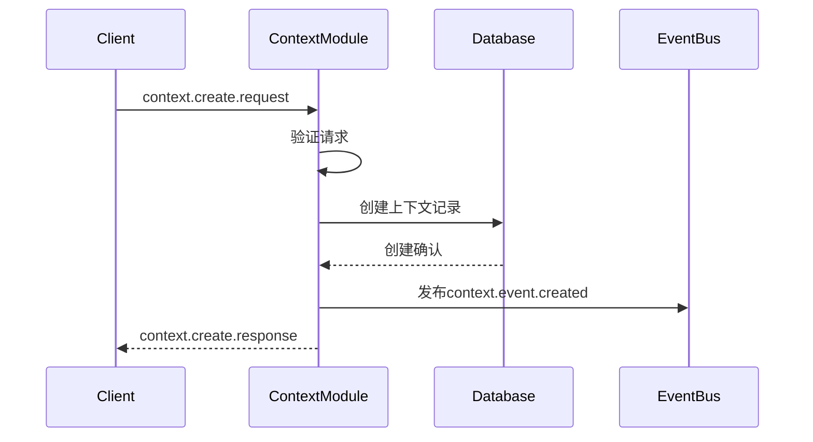
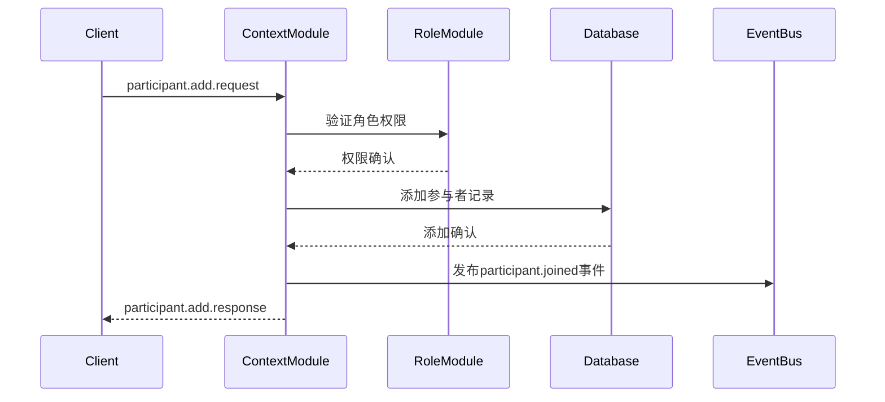
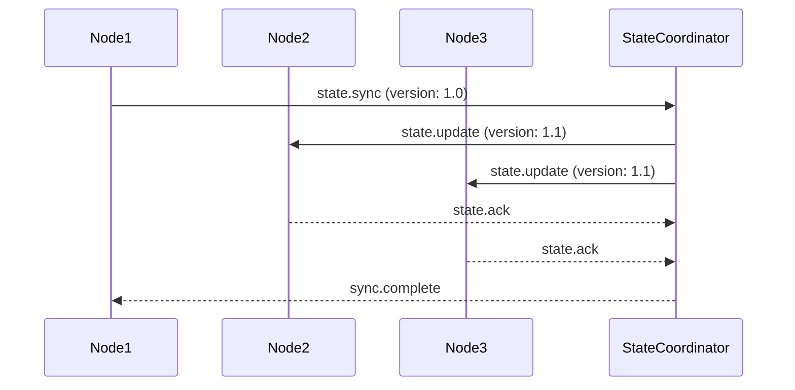

# Context模块协议规范

> **🌐 语言导航**: [English](../../../en/modules/context/protocol-specification.md) | [中文](protocol-specification.md)


**多智能体协议生命周期平台 - Context模块协议规范 v1.0.0-alpha**

[](../../protocol-foundation/protocol-specification.md)
[](./README.md)
[](./implementation-guide.md)
[](../../en/modules/context/protocol-specification.md)

---

## 🎯 协议概览

本文档定义了Context模块的完整协议规范，包括消息格式、通信模式、状态管理协议和集成接口。Context模块协议支持分布式多智能体系统中的标准化上下文管理和参与者协调。

### **协议范围**
- **上下文生命周期协议**: 上下文的创建、管理和终止
- **参与者协调协议**: 参与者注册、角色管理和协调
- **状态同步协议**: 分布式节点间的实时状态同步
- **事件通知协议**: 上下文相关事件的发布和订阅
- **集成协议**: 跨模块集成和协调模式

### **协议合规性**
- **MPLP核心协议**: 完全符合MPLP v1.0.0-alpha核心协议
- **消息格式**: 基于JSON的消息格式，带有Schema验证
- **传输层**: 支持HTTP/HTTPS、WebSocket和消息队列
- **安全性**: 所有通信都需要TLS加密和身份验证
- **版本控制**: 语义版本控制，保证向后兼容性

---

## 📋 消息格式规范

### **基础消息结构**

所有Context模块协议消息都遵循MPLP基础消息格式：

```json
{
  "protocol_version": "1.0.0-alpha",
  "message_id": "msg-ctx-{uuid}",
  "message_type": "context.{operation}",
  "timestamp": "2025-09-03T10:00:00.000Z",
  "sender": {
    "sender_id": "string",
    "sender_type": "agent|system|service",
    "sender_version": "string"
  },
  "recipient": {
    "recipient_id": "string",
    "recipient_type": "agent|system|service|broadcast"
  },
  "correlation_id": "string",
  "reply_to": "string",
  "headers": {
    "content_type": "application/json",
    "encoding": "utf-8",
    "compression": "gzip",
    "priority": "normal|high|critical",
    "ttl": 30000
  },
  "payload": {
    // 消息特定载荷
  },
  "metadata": {
    "trace_id": "string",
    "span_id": "string",
    "context_id": "string",
    "session_id": "string"
  }
}
```

### **消息类型**

#### **上下文生命周期消息**
- `context.create.request` - 创建新上下文的请求
- `context.create.response` - 上下文创建请求的响应
- `context.update.request` - 更新上下文配置的请求
- `context.update.response` - 上下文更新请求的响应
- `context.delete.request` - 删除上下文的请求
- `context.delete.response` - 上下文删除请求的响应
- `context.get.request` - 检索上下文信息的请求
- `context.get.response` - 包含上下文信息的响应
- `context.list.request` - 列出上下文的请求
- `context.list.response` - 包含上下文列表的响应

#### **参与者管理消息**
- `context.participant.add.request` - 添加参与者的请求
- `context.participant.add.response` - 添加参与者请求的响应
- `context.participant.remove.request` - 移除参与者的请求
- `context.participant.remove.response` - 移除参与者请求的响应
- `context.participant.update.request` - 更新参与者的请求
- `context.participant.update.response` - 更新参与者请求的响应
- `context.participant.list.request` - 列出参与者的请求
- `context.participant.list.response` - 包含参与者列表的响应

#### **状态同步消息**
- `context.state.sync` - 状态同步消息
- `context.state.update` - 状态更新通知
- `context.state.conflict` - 状态冲突通知
- `context.state.resolved` - 状态冲突解决通知

#### **事件通知消息**
- `context.event.created` - 上下文创建事件
- `context.event.updated` - 上下文更新事件
- `context.event.deleted` - 上下文删除事件
- `context.event.participant_joined` - 参与者加入事件
- `context.event.participant_left` - 参与者离开事件
- `context.event.state_changed` - 状态变更事件

---

## 🔄 协议操作流程

### **上下文创建协议**



#### **创建请求消息**
```json
{
  "message_type": "context.create.request",
  "payload": {
    "context_name": "协作规划会话",
    "context_type": "planning_session",
    "configuration": {
      "max_participants": 10,
      "max_sessions": 5,
      "timeout_ms": 3600000,
      "persistence_level": "session",
      "isolation_level": "shared"
    },
    "metadata": {
      "project_id": "proj-123",
      "department": "engineering",
      "priority": "high"
    },
    "created_by": "user-456"
  }
}
```

#### **创建响应消息**
```json
{
  "message_type": "context.create.response",
  "payload": {
    "context_id": "ctx-789",
    "context_name": "协作规划会话",
    "context_type": "planning_session",
    "status": "active",
    "configuration": {
      "max_participants": 10,
      "max_sessions": 5,
      "timeout_ms": 3600000,
      "persistence_level": "session",
      "isolation_level": "shared"
    },
    "metadata": {
      "project_id": "proj-123",
      "department": "engineering",
      "priority": "high"
    },
    "created_at": "2025-09-03T10:00:00.000Z",
    "created_by": "user-456"
  }
}
```

### **参与者管理协议**

#### **添加参与者流程**


#### **添加参与者请求**
```json
{
  "message_type": "context.participant.add.request",
  "payload": {
    "context_id": "ctx-789",
    "user_id": "user-123",
    "role": "collaborator",
    "capabilities": [
      "context:read",
      "context:write",
      "participant:invite"
    ],
    "notification_preferences": {
      "email": true,
      "push": false,
      "in_app": true
    }
  }
}
```

### **状态同步协议**

#### **状态同步流程**


#### **状态同步消息**
```json
{
  "message_type": "context.state.sync",
  "payload": {
    "context_id": "ctx-789",
    "state_version": "1.1",
    "state_data": {
      "participants": [
        {
          "participant_id": "part-123",
          "user_id": "user-123",
          "status": "active",
          "last_activity": "2025-09-03T10:05:00.000Z"
        }
      ],
      "sessions": [
        {
          "session_id": "sess-456",
          "status": "active",
          "created_at": "2025-09-03T10:00:00.000Z"
        }
      ],
      "metadata": {
        "last_updated": "2025-09-03T10:05:00.000Z",
        "update_count": 5
      }
    },
    "checksum": "sha256:abc123...",
    "sync_timestamp": "2025-09-03T10:05:00.000Z"
  }
}
```

---

## 🔐 安全协议

### **身份验证协议**

```json
{
  "headers": {
    "authorization": "Bearer {jwt_token}",
    "x-api-key": "{api_key}",
    "x-signature": "sha256={request_signature}"
  },
  "payload": {
    "authentication": {
      "method": "jwt",
      "token": "{jwt_token}",
      "expires_at": "2025-09-03T11:00:00.000Z"
    }
  }
}
```

### **授权验证**

```json
{
  "payload": {
    "authorization": {
      "user_id": "user-123",
      "permissions": [
        "context:create",
        "context:read",
        "context:update",
        "participant:manage"
      ],
      "context_permissions": {
        "ctx-789": [
          "context:read",
          "context:write",
          "participant:invite"
        ]
      }
    }
  }
}
```

---

## 🔄 错误处理协议

### **错误响应格式**

```json
{
  "message_type": "context.error.response",
  "payload": {
    "error": {
      "code": "CONTEXT_NOT_FOUND",
      "message": "指定的上下文不存在",
      "details": {
        "context_id": "ctx-invalid",
        "requested_at": "2025-09-03T10:00:00.000Z"
      },
      "retry_after": 5000,
      "correlation_id": "req-123"
    }
  }
}
```

### **标准错误代码**

- `CONTEXT_NOT_FOUND` - 上下文未找到
- `PARTICIPANT_NOT_FOUND` - 参与者未找到
- `PERMISSION_DENIED` - 权限被拒绝
- `VALIDATION_ERROR` - 验证错误
- `CONFLICT_ERROR` - 冲突错误
- `RATE_LIMIT_EXCEEDED` - 速率限制超出
- `SERVICE_UNAVAILABLE` - 服务不可用
- `TIMEOUT_ERROR` - 超时错误

---

## 🔗 相关文档

- [Context模块概览](./README.md) - 模块概览和架构
- [API参考](./api-reference.md) - API参考文档
- [配置指南](./configuration-guide.md) - 配置选项
- [实施指南](./implementation-guide.md) - 实施指南
- [性能指南](./performance-guide.md) - 性能优化
- [测试指南](./testing-guide.md) - 测试策略
- [集成示例](./integration-examples.md) - 集成示例

---

**协议版本**: 1.0.0-alpha  
**最后更新**: 2025年9月3日  
**下次审查**: 2025年12月3日  
**状态**: 稳定  

**⚠️ Alpha版本说明**: Context模块协议规范在Alpha版本中提供稳定的协议定义。额外的高级协议功能和扩展将在Beta版本中添加。
