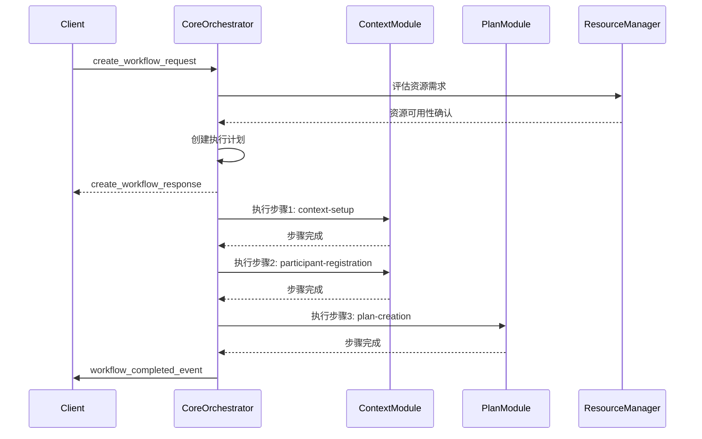
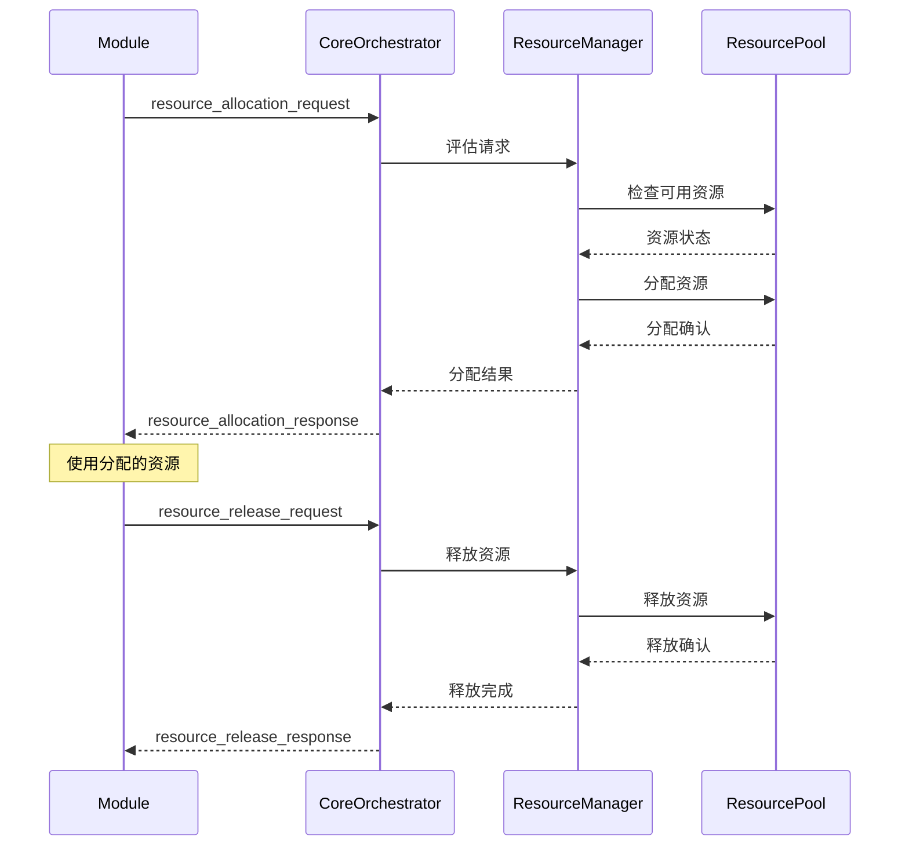

# Core模块协议规范

> **🌐 语言导航**: [English](../../../en/modules/core/protocol-specification.md) | [中文](protocol-specification.md)


**MPLP L2协调层 - Core模块协议定义**

[](./README.md)
[](../../architecture/schema-system.md)
[](../../../../ALPHA-RELEASE-NOTES.md)
[](../../en/modules/core/protocol-specification.md)

---

## 🎯 协议概览

Core模块协议定义了MPLP中央协调系统的标准化通信接口。该协议支持所有L2模块之间的无缝协调、资源管理、工作流编排和系统健康监控。

### **协议特性**
- **版本**: 1.0.0-alpha
- **Schema标准**: JSON Schema Draft-07
- **序列化**: JSON，可选二进制扩展
- **传输**: HTTP/HTTPS、WebSocket、gRPC
- **身份验证**: 基于JWT的角色访问控制
- **命名约定**: 协议使用snake_case，TypeScript使用camelCase

---

## 📋 消息类型

### **1. 系统控制消息**

#### **系统状态请求**
```json
{
  "message_type": "system_status_request",
  "message_id": "msg-001",
  "timestamp": "2025-09-03T10:00:00Z",
  "sender": {
    "module_id": "client-001",
    "module_type": "external_client"
  },
  "request": {
    "include_modules": true,
    "include_metrics": true,
    "include_health": true,
    "time_range": {
      "start": "2025-09-03T09:00:00Z",
      "end": "2025-09-03T10:00:00Z"
    }
  }
}
```

#### **系统状态响应**
```json
{
  "message_type": "system_status_response",
  "message_id": "msg-001",
  "correlation_id": "msg-001",
  "timestamp": "2025-09-03T10:00:01Z",
  "sender": {
    "module_id": "core-orchestrator",
    "module_type": "core_module"
  },
  "response": {
    "system_id": "mplp-system-001",
    "status": "healthy",
    "uptime": 86400,
    "version": "1.0.0-alpha",
    "modules": {
      "context_module": {
        "status": "healthy",
        "version": "1.0.0-alpha",
        "active_contexts": 15,
        "response_time_ms": 45
      },
      "plan_module": {
        "status": "healthy",
        "version": "1.0.0-alpha",
        "active_plans": 8,
        "response_time_ms": 32
      }
    },
    "metrics": {
      "total_requests": 125000,
      "success_rate": 0.998,
      "average_response_time_ms": 38,
      "active_workflows": 23,
      "resource_utilization": {
        "cpu_percent": 45.2,
        "memory_percent": 62.8,
        "disk_percent": 23.1,
        "network_mbps": 15.7
      }
    }
  }
}
```

### **2. 工作流管理消息**

#### **创建工作流请求**
```json
{
  "message_type": "create_workflow_request",
  "message_id": "msg-002",
  "timestamp": "2025-09-03T10:01:00Z",
  "sender": {
    "module_id": "workflow-client",
    "module_type": "external_client"
  },
  "request": {
    "workflow_definition": {
      "workflow_id": "multi-agent-collaboration",
      "name": "多智能体协作工作流",
      "description": "协调多个智能体完成复杂任务",
      "version": "1.0",
      "steps": [
        {
          "step_id": "context-setup",
          "name": "上下文设置",
          "module": "context",
          "action": "create_context",
          "parameters": {
            "context_name": "协作会话",
            "context_type": "collaboration",
            "max_participants": 5
          },
          "timeout_ms": 30000
        },
        {
          "step_id": "participant-registration",
          "name": "参与者注册",
          "module": "context",
          "action": "add_participants",
          "dependencies": ["context-setup"],
          "parameters": {
            "participants": [
              {"agent_id": "agent-001", "role": "coordinator"},
              {"agent_id": "agent-002", "role": "analyst"},
              {"agent_id": "agent-003", "role": "executor"}
            ]
          },
          "timeout_ms": 20000
        },
        {
          "step_id": "plan-creation",
          "name": "计划创建",
          "module": "plan",
          "action": "create_plan",
          "dependencies": ["participant-registration"],
          "parameters": {
            "plan_type": "collaborative",
            "objectives": ["分析数据", "生成报告", "执行决策"],
            "timeline": "2025-09-03T12:00:00Z"
          },
          "timeout_ms": 60000
        }
      ],
      "error_handling": {
        "retry_policy": {
          "max_retries": 3,
          "retry_delay_ms": 5000,
          "backoff_multiplier": 2.0
        },
        "failure_actions": ["rollback", "notify_admin"]
      }
    },
    "execution_options": {
      "priority": "high",
      "max_execution_time_ms": 300000,
      "resource_requirements": {
        "cpu_cores": 4,
        "memory_mb": 2048,
        "storage_mb": 1024
      }
    }
  }
}
```

#### **创建工作流响应**
```json
{
  "message_type": "create_workflow_response",
  "message_id": "msg-002",
  "correlation_id": "msg-002",
  "timestamp": "2025-09-03T10:01:01Z",
  "sender": {
    "module_id": "core-orchestrator",
    "module_type": "core_module"
  },
  "response": {
    "workflow_instance_id": "wf-inst-001",
    "workflow_id": "multi-agent-collaboration",
    "status": "created",
    "created_at": "2025-09-03T10:01:01Z",
    "estimated_completion": "2025-09-03T10:06:01Z",
    "resource_allocation": {
      "allocation_id": "alloc-001",
      "cpu_cores": 4,
      "memory_mb": 2048,
      "storage_mb": 1024,
      "allocated_at": "2025-09-03T10:01:01Z"
    },
    "execution_plan": {
      "total_steps": 3,
      "estimated_duration_ms": 110000,
      "parallel_execution_groups": [
        {
          "group_id": "group-1",
          "steps": ["context-setup"]
        },
        {
          "group_id": "group-2", 
          "steps": ["participant-registration"],
          "depends_on": ["group-1"]
        },
        {
          "group_id": "group-3",
          "steps": ["plan-creation"],
          "depends_on": ["group-2"]
        }
      ]
    }
  }
}
```

### **3. 资源管理消息**

#### **资源分配请求**
```json
{
  "message_type": "resource_allocation_request",
  "message_id": "msg-003",
  "timestamp": "2025-09-03T10:02:00Z",
  "sender": {
    "module_id": "plan-module",
    "module_type": "l2_module"
  },
  "request": {
    "allocation_type": "compute",
    "resource_requirements": {
      "cpu_cores": 2,
      "memory_mb": 1024,
      "storage_mb": 512,
      "network_bandwidth_mbps": 10
    },
    "duration_estimate_ms": 180000,
    "priority": "normal",
    "tags": {
      "workload_type": "planning",
      "agent_id": "agent-001",
      "context_id": "ctx-001"
    }
  }
}
```

#### **资源分配响应**
```json
{
  "message_type": "resource_allocation_response",
  "message_id": "msg-003",
  "correlation_id": "msg-003",
  "timestamp": "2025-09-03T10:02:01Z",
  "sender": {
    "module_id": "core-orchestrator",
    "module_type": "core_module"
  },
  "response": {
    "allocation_id": "alloc-002",
    "status": "allocated",
    "allocated_resources": {
      "cpu_cores": 2,
      "memory_mb": 1024,
      "storage_mb": 512,
      "network_bandwidth_mbps": 10,
      "node_id": "node-003"
    },
    "allocation_details": {
      "allocated_at": "2025-09-03T10:02:01Z",
      "expires_at": "2025-09-03T10:05:01Z",
      "renewable": true,
      "cost_estimate": {
        "cpu_cost": 0.05,
        "memory_cost": 0.02,
        "storage_cost": 0.01,
        "total_cost": 0.08,
        "currency": "credits"
      }
    }
  }
}
```

### **4. 健康监控消息**

#### **健康检查请求**
```json
{
  "message_type": "health_check_request",
  "message_id": "msg-004",
  "timestamp": "2025-09-03T10:03:00Z",
  "sender": {
    "module_id": "monitoring-service",
    "module_type": "external_service"
  },
  "request": {
    "check_type": "comprehensive",
    "include_modules": ["context", "plan", "role", "confirm"],
    "include_metrics": true,
    "include_diagnostics": true
  }
}
```

#### **健康检查响应**
```json
{
  "message_type": "health_check_response",
  "message_id": "msg-004",
  "correlation_id": "msg-004",
  "timestamp": "2025-09-03T10:03:01Z",
  "sender": {
    "module_id": "core-orchestrator",
    "module_type": "core_module"
  },
  "response": {
    "overall_health": {
      "status": "healthy",
      "score": 0.95,
      "last_check": "2025-09-03T10:03:01Z"
    },
    "module_health": {
      "context": {
        "status": "healthy",
        "response_time_ms": 25,
        "error_rate": 0.001,
        "active_connections": 45,
        "last_error": null
      },
      "plan": {
        "status": "healthy",
        "response_time_ms": 32,
        "error_rate": 0.002,
        "active_plans": 12,
        "last_error": null
      }
    },
    "system_metrics": {
      "cpu_usage_percent": 45.2,
      "memory_usage_percent": 62.8,
      "disk_usage_percent": 23.1,
      "network_throughput_mbps": 15.7,
      "active_workflows": 8,
      "queued_tasks": 3
    },
    "diagnostics": {
      "database_connections": {
        "total": 50,
        "active": 23,
        "idle": 27,
        "health": "good"
      },
      "cache_performance": {
        "hit_rate": 0.89,
        "miss_rate": 0.11,
        "eviction_rate": 0.05,
        "health": "good"
      }
    }
  }
}
```

---

## 🔄 协议流程

### **工作流执行流程**



### **资源管理流程**



---

## 🔐 安全协议

### **身份验证**
```json
{
  "headers": {
    "authorization": "Bearer {jwt_token}",
    "x-module-id": "context-module",
    "x-signature": "sha256:{message_signature}"
  }
}
```

### **访问控制**
```json
{
  "permissions": {
    "workflow_management": ["create", "read", "update", "delete"],
    "resource_management": ["allocate", "release", "monitor"],
    "system_monitoring": ["read", "health_check"],
    "module_coordination": ["register", "unregister", "communicate"]
  }
}
```

---

## 🔗 相关文档

- [Core模块概览](./README.md) - 模块概览和架构
- [L2协调层架构](../../architecture/l2-coordination-layer.md) - 整体架构文档
- [工作流引擎](../../workflow/workflow-engine.md) - 工作流引擎详细文档
- [资源管理](../../infrastructure/resource-management.md) - 资源管理详细文档

---

**协议版本**: 1.0.0-alpha  
**最后更新**: 2025年9月3日  
**下次审查**: 2025年12月3日  
**状态**: 稳定  

**⚠️ Alpha版本说明**: Core模块协议在Alpha版本中提供稳定的协议定义。额外的高级协议功能和扩展将在Beta版本中添加。
