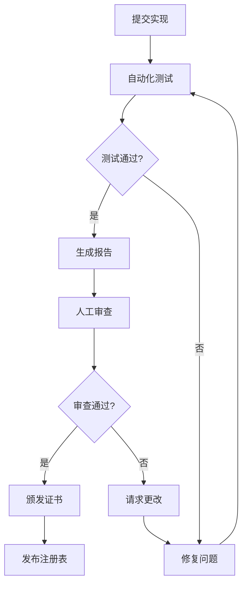

# MPLP合规性测试

> **🌐 语言导航**: [English](../../en/protocol-foundation/compliance-testing.md) | [中文](compliance-testing.md)


**协议一致性测试和验证框架**

[](./protocol-specification.md)
[](https://www.iso.org/standard/54534.html)
[](./interoperability.md)
[](../../en/protocol-foundation/compliance-testing.md)

---

## 摘要

本文档定义了MPLP（多智能体协议生命周期平台）合规性验证的综合测试框架。它建立了标准化的测试程序、验证标准和认证流程，以确保协议实现满足所需的规范和互操作性标准。

---

## 1. 测试框架概览

### 1.1 **测试目标**

#### **主要目标**
- **协议一致性**：验证对MPLP规范的遵循
- **互操作性**：确保跨实现兼容性
- **性能验证**：确认性能要求
- **安全合规性**：验证安全实现
- **可靠性保证**：测试系统稳定性和容错性

#### **测试范围**
- **消息格式验证**：JSON Schema合规性
- **协议行为测试**：状态机和操作验证
- **API合规性测试**：RESTful和WebSocket API验证
- **安全测试**：身份验证、授权和加密
- **性能测试**：负载、压力和耐久性测试
- **集成测试**：多模块和跨实现测试

### 1.2 **测试架构**

#### **测试套件结构**
```
mplp-compliance-tests/
├── core/                    # 核心协议测试
│   ├── message-format/      # 消息验证测试
│   ├── state-machine/       # 协议状态测试
│   └── error-handling/      # 错误响应测试
├── modules/                 # 模块特定测试
│   ├── context/            # Context模块测试
│   ├── plan/               # Plan模块测试
│   └── [other-modules]/    # 其他模块测试
├── security/               # 安全合规性测试
│   ├── authentication/     # 认证机制测试
│   ├── authorization/      # 访问控制测试
│   └── encryption/         # 数据保护测试
├── performance/            # 性能验证测试
│   ├── load/              # 负载测试
│   ├── stress/            # 压力测试
│   └── endurance/         # 长期运行测试
└── interoperability/      # 跨实现测试
    ├── cross-platform/    # 平台兼容性
    └── cross-language/    # 语言兼容性
```

---

## 2. 核心协议测试

### 2.1 **消息格式测试**

#### **JSON Schema验证**
```javascript
// 测试消息格式合规性
describe('消息格式合规性', () => {
  test('协议消息通过schema验证', () => {
    const message = {
      protocol_version: '1.0.0-alpha',
      message_id: generateUUID(),
      timestamp: new Date().toISOString(),
      source: { agent_id: 'test-agent', module: 'context' },
      target: { agent_id: 'target-agent', module: 'plan' },
      message_type: 'request',
      payload: { operation: 'create', data: {} }
    };
    
    expect(validateMessageSchema(message)).toBe(true);
  });
  
  test('无效消息格式被拒绝', () => {
    const invalidMessage = { invalid: 'format' };
    expect(validateMessageSchema(invalidMessage)).toBe(false);
  });
});
```

#### **数据类型验证**
```yaml
data_type_tests:
  string_validation:
    - test: "UTF-8编码支持"
      input: "Hello 世界 🌍"
      expected: valid
    - test: "空字符串处理"
      input: ""
      expected: valid
  
  number_validation:
    - test: "IEEE 754合规性"
      input: 3.14159265359
      expected: valid
    - test: "整数边界"
      input: 9223372036854775807
      expected: valid
  
  uuid_validation:
    - test: "UUID v4格式"
      input: "550e8400-e29b-41d4-a716-446655440000"
      expected: valid
    - test: "无效UUID格式"
      input: "invalid-uuid"
      expected: invalid
```

### 2.2 **协议状态机测试**

#### **状态转换验证**
```javascript
describe('协议状态机', () => {
  test('有效状态转换', async () => {
    const context = await createContext();
    expect(context.state).toBe('inactive');
    
    await activateContext(context.id);
    expect(context.state).toBe('active');
    
    await suspendContext(context.id);
    expect(context.state).toBe('suspended');
    
    await completeContext(context.id);
    expect(context.state).toBe('completed');
  });
  
  test('无效状态转换被拒绝', async () => {
    const context = await createContext();
    expect(context.state).toBe('inactive');
    
    // 无效转换：inactive -> completed
    await expect(completeContext(context.id))
      .rejects.toThrow('Invalid state transition');
  });
});
```

#### **并发状态管理**
```javascript
describe('并发状态管理', () => {
  test('并发操作正确处理', async () => {
    const context = await createContext();
    
    // 模拟并发状态更改
    const operations = [
      activateContext(context.id),
      updateContext(context.id, { data: 'test1' }),
      updateContext(context.id, { data: 'test2' })
    ];
    
    await Promise.all(operations);
    
    const finalContext = await getContext(context.id);
    expect(finalContext.state).toBe('active');
    expect(finalContext.data).toBeDefined();
  });
});
```

---

## 3. 模块特定测试

### 3.1 **Context模块测试**

#### **Context生命周期测试**
```javascript
describe('Context模块合规性', () => {
  test('Context创建和管理', async () => {
    // 创建context
    const context = await mplp.context.create({
      name: 'test-context',
      type: 'collaborative',
      metadata: { project: 'test' }
    });
    
    expect(context.id).toBeDefined();
    expect(context.state).toBe('inactive');
    
    // 激活context
    await mplp.context.activate(context.id);
    const activeContext = await mplp.context.get(context.id);
    expect(activeContext.state).toBe('active');
    
    // 更新context
    await mplp.context.update(context.id, {
      metadata: { project: 'updated' }
    });
    
    // 查询contexts
    const contexts = await mplp.context.query({
      type: 'collaborative'
    });
    expect(contexts.length).toBeGreaterThan(0);
  });
});
```

### 3.2 **Plan模块测试**

#### **规划工作流测试**
```javascript
describe('Plan模块合规性', () => {
  test('Plan创建和执行', async () => {
    // 创建plan
    const plan = await mplp.plan.create({
      name: 'test-plan',
      goal: 'Complete testing',
      steps: [
        { id: 'step1', action: 'setup', dependencies: [] },
        { id: 'step2', action: 'execute', dependencies: ['step1'] }
      ]
    });
    
    expect(plan.state).toBe('draft');
    
    // 执行plan
    await mplp.plan.execute(plan.id);
    const executingPlan = await mplp.plan.get(plan.id);
    expect(executingPlan.state).toBe('executing');
    
    // 监控执行
    const status = await mplp.plan.getStatus(plan.id);
    expect(status.progress).toBeDefined();
    expect(status.currentStep).toBeDefined();
  });
});
```

---

## 4. 安全合规性测试

### 4.1 **身份验证测试**

#### **JWT身份验证测试**
```javascript
describe('JWT身份验证合规性', () => {
  test('有效JWT令牌被接受', async () => {
    const token = generateValidJWT({
      sub: 'test-agent',
      roles: ['context:read', 'plan:write'],
      exp: Math.floor(Date.now() / 1000) + 3600
    });
    
    const response = await mplp.authenticate(token);
    expect(response.authenticated).toBe(true);
    expect(response.permissions).toContain('context:read');
  });
  
  test('过期JWT令牌被拒绝', async () => {
    const expiredToken = generateValidJWT({
      sub: 'test-agent',
      exp: Math.floor(Date.now() / 1000) - 3600 // 已过期
    });
    
    await expect(mplp.authenticate(expiredToken))
      .rejects.toThrow('Token expired');
  });
  
  test('无效JWT签名被拒绝', async () => {
    const invalidToken = 'invalid.jwt.token';
    
    await expect(mplp.authenticate(invalidToken))
      .rejects.toThrow('Invalid token signature');
  });
});
```

### 4.2 **授权测试**

#### **基于角色的访问控制测试**
```javascript
describe('RBAC授权合规性', () => {
  test('授权操作成功', async () => {
    const token = generateValidJWT({
      sub: 'test-agent',
      roles: ['context:write']
    });
    
    const context = await mplp.context.create({
      name: 'test-context'
    }, { token });
    
    expect(context.id).toBeDefined();
  });
  
  test('未授权操作被拒绝', async () => {
    const token = generateValidJWT({
      sub: 'test-agent',
      roles: ['context:read'] // 无写权限
    });
    
    await expect(mplp.context.create({
      name: 'test-context'
    }, { token })).rejects.toThrow('Insufficient permissions');
  });
});
```

### 4.3 **加密测试**

#### **数据加密测试**
```javascript
describe('数据加密合规性', () => {
  test('敏感数据在传输中加密', async () => {
    const sensitiveData = { secret: 'confidential-information' };
    
    // 模拟网络捕获
    const networkCapture = captureNetworkTraffic();
    
    await mplp.context.create({
      name: 'secure-context',
      data: sensitiveData
    });
    
    const capturedData = networkCapture.getPayload();
    expect(capturedData).not.toContain('confidential-information');
    expect(capturedData).toMatch(/^[A-Za-z0-9+/]+=*$/); // Base64模式
  });
  
  test('数据解密正常工作', async () => {
    const originalData = { message: 'test-message' };
    
    const context = await mplp.context.create({
      name: 'test-context',
      data: originalData
    });
    
    const retrievedContext = await mplp.context.get(context.id);
    expect(retrievedContext.data).toEqual(originalData);
  });
});
```

---

## 5. 性能测试

### 5.1 **负载测试**

#### **吞吐量测试**
```javascript
describe('性能合规性', () => {
  test('最低吞吐量要求', async () => {
    const startTime = Date.now();
    const operations = [];
    
    // 生成1000个并发操作
    for (let i = 0; i < 1000; i++) {
      operations.push(mplp.context.create({
        name: `context-${i}`
      }));
    }
    
    await Promise.all(operations);
    const endTime = Date.now();
    const duration = (endTime - startTime) / 1000; // 秒
    const throughput = 1000 / duration; // 每秒操作数
    
    expect(throughput).toBeGreaterThan(1000); // 最低要求
  });
});
```

#### **响应时间测试**
```javascript
describe('响应时间合规性', () => {
  test('P95响应时间低于100ms', async () => {
    const responseTimes = [];
    
    // 执行100个操作并测量响应时间
    for (let i = 0; i < 100; i++) {
      const startTime = Date.now();
      await mplp.context.get('test-context-id');
      const endTime = Date.now();
      responseTimes.push(endTime - startTime);
    }
    
    responseTimes.sort((a, b) => a - b);
    const p95Index = Math.floor(responseTimes.length * 0.95);
    const p95ResponseTime = responseTimes[p95Index];
    
    expect(p95ResponseTime).toBeLessThan(100); // 100ms要求
  });
});
```

### 5.2 **压力测试**

#### **资源限制测试**
```javascript
describe('压力测试合规性', () => {
  test('系统优雅处理资源耗尽', async () => {
    const contexts = [];
    
    try {
      // 创建contexts直到资源限制
      for (let i = 0; i < 10000; i++) {
        const context = await mplp.context.create({
          name: `stress-context-${i}`
        });
        contexts.push(context);
      }
    } catch (error) {
      // 应该优雅失败并提供适当的错误消息
      expect(error.message).toContain('Resource limit exceeded');
      expect(error.code).toBe('RESOURCE_EXHAUSTED');
    }
    
    // 系统应该仍然响应
    const healthCheck = await mplp.health.check();
    expect(healthCheck.status).toBe('degraded'); // 不是'failed'
  });
});
```

---

## 6. 互操作性测试

### 6.1 **跨实现测试**

#### **多语言兼容性**
```javascript
describe('跨实现合规性', () => {
  test('Node.js客户端与Python服务器', async () => {
    const nodeClient = new MPLPClient({
      endpoint: 'http://python-server:8080',
      version: '1.0.0-alpha'
    });
    
    await nodeClient.connect();
    
    const context = await nodeClient.context.create({
      name: 'cross-impl-test'
    });
    
    expect(context.id).toBeDefined();
    expect(context.name).toBe('cross-impl-test');
    
    // 验证context在Python服务器上存在
    const retrievedContext = await nodeClient.context.get(context.id);
    expect(retrievedContext).toEqual(context);
  });
});
```

### 6.2 **协议版本兼容性**

#### **版本协商测试**
```javascript
describe('版本兼容性', () => {
  test('版本协商正常工作', async () => {
    const client = new MPLPClient({
      endpoint: 'http://server:8080',
      supportedVersions: ['1.0.0-alpha', '0.9.0']
    });
    
    const negotiation = await client.negotiateVersion();
    
    expect(negotiation.agreedVersion).toBe('1.0.0-alpha');
    expect(negotiation.supportedFeatures).toContain('context');
    expect(negotiation.supportedFeatures).toContain('plan');
  });
});
```

---

## 7. 测试执行和报告

### 7.1 **自动化测试执行**

#### **持续集成**
```yaml
# .github/workflows/compliance-testing.yml
name: MPLP合规性测试

on: [push, pull_request]

jobs:
  compliance-tests:
    runs-on: ubuntu-latest
    strategy:
      matrix:
        implementation: [nodejs, python, java, go, rust]
    
    steps:
      - uses: actions/checkout@v3
      - name: 设置实现
        run: ./scripts/setup-${{ matrix.implementation }}.sh
      - name: 运行合规性测试
        run: |
          mplp test compliance --implementation ${{ matrix.implementation }}
          mplp test interop --target ${{ matrix.implementation }}
      - name: 生成报告
        run: mplp report generate --format junit --output results.xml
      - name: 上传结果
        uses: actions/upload-artifact@v3
        with:
          name: compliance-results-${{ matrix.implementation }}
          path: results.xml
```

### 7.2 **测试报告**

#### **合规性报告格式**
```json
{
  "test_run": {
    "id": "run-2025-09-03-001",
    "timestamp": "2025-09-03T10:30:00Z",
    "implementation": "nodejs",
    "version": "1.0.0-alpha",
    "duration": 1200
  },
  "results": {
    "total_tests": 1250,
    "passed": 1248,
    "failed": 2,
    "skipped": 0,
    "success_rate": 99.84
  },
  "categories": {
    "core_protocol": { "passed": 450, "failed": 0, "rate": 100.0 },
    "modules": { "passed": 380, "failed": 1, "rate": 99.74 },
    "security": { "passed": 200, "failed": 0, "rate": 100.0 },
    "performance": { "passed": 150, "failed": 1, "rate": 99.33 },
    "interoperability": { "passed": 68, "failed": 0, "rate": 100.0 }
  },
  "failures": [
    {
      "test": "Plan模块 - 复杂工作流执行",
      "category": "modules",
      "error": "30秒后超时",
      "severity": "medium"
    }
  ]
}
```

---

## 8. 认证过程

### 8.1 **认证级别**

#### **基础认证**
- **要求**：核心协议合规性（100%）
- **测试**：消息格式、基本操作、错误处理
- **有效期**：6个月
- **续期**：通过测试自动续期

#### **高级认证**
- **要求**：完整功能合规性（95%+）
- **测试**：所有模块、安全、基本性能
- **有效期**：12个月
- **续期**：需要人工审查

#### **高级认证**
- **要求**：完全合规性（98%+）
- **测试**：包括压力测试在内的所有类别
- **有效期**：24个月
- **续期**：需要全面审计

### 8.2 **认证工作流**



---

## 9. 测试工具和实用程序

### 9.1 **测试框架**

#### **MPLP测试运行器**
```bash
# 安装测试运行器
npm install -g @mplp/test-runner

# 运行合规性测试
mplp test compliance --implementation nodejs
mplp test compliance --implementation python --verbose

# 运行特定测试类别
mplp test core --implementation java
mplp test security --implementation go
mplp test performance --implementation rust

# 生成报告
mplp test report --format html --output compliance-report.html
mplp test report --format json --output compliance-report.json
```

### 9.2 **模拟服务**

#### **测试环境设置**
```yaml
# docker-compose.test.yml
version: '3.8'
services:
  mplp-test-server:
    image: mplp/test-server:1.0.0-alpha
    ports:
      - "8080:8080"
    environment:
      - MPLP_VERSION=1.0.0-alpha
      - MPLP_MODULES=context,plan,role,confirm
  
  mplp-mock-auth:
    image: mplp/mock-auth:1.0.0-alpha
    ports:
      - "8081:8081"
    environment:
      - JWT_SECRET=test-secret
      - TOKEN_EXPIRY=3600
```

---

## 10. 合规性监控

### 10.1 **持续合规性**

#### **监控仪表板**
- **实时测试结果**：实时合规性状态
- **趋势分析**：历史合规性趋势
- **警报系统**：失败的即时通知
- **性能指标**：响应时间和吞吐量跟踪

### 10.2 **合规性指标**

#### **关键绩效指标**
```json
{
  "compliance_kpis": {
    "overall_compliance_rate": 99.2,
    "critical_test_pass_rate": 100.0,
    "security_compliance_rate": 100.0,
    "performance_compliance_rate": 98.5,
    "interop_compliance_rate": 99.8,
    "mean_time_to_fix": 2.5,
    "compliance_trend": "improving"
  }
}
```

---

**文档版本**：1.0  
**最后更新**：2025年9月3日  
**下次审查**：2025年12月3日  
**测试框架版本**：1.0.0-alpha  
**语言**：简体中文

**⚠️ Alpha版本说明**：合规性测试程序可能会根据实现反馈和测试经验进行完善。
