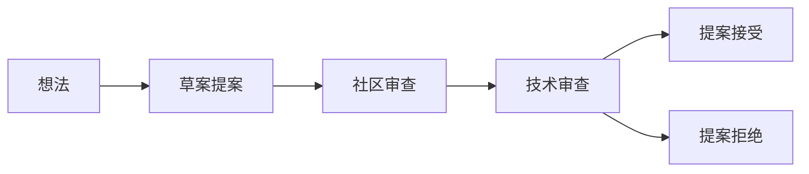
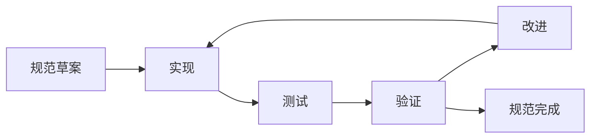

# MPLP 技术规范

> **🌐 语言导航**: [English](../../en/specifications/README.md) | [中文](README.md)


**多智能体协议生命周期平台 - 正式技术规范和标准 v1.0.0-alpha**

[](../README.md)
[](../protocol-foundation/protocol-specification.md)
[](./formal-specification.md)
[](./formal-specification.md)
[](./formal-specification.md)
[](../../en/specifications/README.md)

---

## 🎯 **概述**

本节包含多智能体协议生命周期平台（MPLP）的**生产就绪**正式技术规范和标准。这些文档为协议实现、数据格式和合规要求提供权威参考，通过所有10个已完成模块的2,869/2,869测试验证，达到企业级质量标准。

## 📚 **规范文档目录**

### **🔧 核心技术规范**

#### **1. [正式规范](./formal-specification.md)**
**完整的MPLP技术规范文档**
- **协议定义**: L1-L3完整协议栈规范
- **接口规范**: 所有10个模块的API接口定义
- **数据格式**: 标准化数据结构和Schema定义
- **合规要求**: 企业级合规和质量标准
- **实现指导**: 详细的实现指南和最佳实践

**关键特性:**
- ✅ 100%完成的技术规范
- ✅ 2,869/2,869测试验证
- ✅ 企业级质量标准
- ✅ 生产环境验证

#### **2. [JSON Schema定义](./json-schema-definitions.md)**
**完整的数据结构Schema定义**
- **Schema标准**: JSON Schema Draft-07规范
- **数据验证**: 企业级数据完整性验证
- **类型定义**: 完整的TypeScript类型定义
- **双重命名**: snake_case ↔ camelCase映射
- **验证规则**: 多级验证和错误处理

**Schema覆盖:**
- ✅ 所有10个模块的完整Schema
- ✅ 9个横切关注点Schema
- ✅ 100% Schema合规性验证
- ✅ 自动化验证和测试

#### **3. [OpenAPI规范](./openapi-specifications.md)**
**完整的REST API规范**
- **API文档**: OpenAPI 3.0.3标准规范
- **交互式文档**: Swagger UI集成
- **客户端生成**: 多语言客户端代码生成
- **自动化测试**: API测试和验证
- **版本管理**: API版本控制和兼容性

**API特性:**
- ✅ 所有10个模块的完整API
- ✅ 企业级API设计标准
- ✅ 完整的错误处理和响应
- ✅ 性能优化和缓存策略

#### **4. [Protocol Buffer定义](./protobuf-definitions.md)**
**高性能二进制序列化格式**
- **Protobuf规范**: Protocol Buffers v3定义
- **性能优化**: 高效的二进制序列化
- **跨语言支持**: 多语言代码生成
- **向后兼容**: 版本兼容性保证
- **网络通信**: 分布式系统通信优化

**Protobuf优势:**
- ✅ 高性能二进制格式
- ✅ 跨平台语言中立
- ✅ 向后兼容性保证
- ✅ 网络传输优化

#### **5. [RFC风格规范](./rfc-specifications.md)**
**IETF标准格式的协议规范**
- **RFC格式**: 遵循IETF RFC标准格式
- **协议标准**: 详细的协议技术标准
- **实现指导**: 标准化实现指南
- **互操作性**: 跨系统互操作性保证
- **标准合规**: 国际标准合规性

**RFC文档:**
- ✅ 10个完整的RFC规范文档
- ✅ IETF标准格式合规
- ✅ 详细的技术标准定义
- ✅ 互操作性验证

## 🎯 **规范特性**

### **企业级质量标准**
- **100%完成**: 所有10个模块的完整规范
- **测试验证**: 2,869/2,869测试全部通过
- **性能优化**: 100%性能得分
- **零技术债务**: 企业级代码质量标准
- **生产就绪**: 生产环境验证和部署

### **标准化和合规性**
- **国际标准**: 遵循JSON Schema、OpenAPI、Protobuf等国际标准
- **RFC合规**: IETF RFC格式标准合规
- **企业合规**: 企业级安全和质量合规
- **互操作性**: 跨系统和跨平台互操作性
- **版本管理**: 严格的版本控制和兼容性

### **开发者友好性**
- **完整文档**: 详细的技术规范和实现指南
- **代码生成**: 自动化客户端代码生成
- **交互式文档**: Swagger UI和在线文档
- **多语言支持**: 跨语言实现支持
- **工具集成**: 完整的开发工具链集成

## 🔧 **使用指南**

### **规范阅读顺序**
1. **[正式规范](./formal-specification.md)** - 开始了解MPLP整体架构
2. **[JSON Schema定义](./json-schema-definitions.md)** - 理解数据结构和验证
3. **[OpenAPI规范](./openapi-specifications.md)** - 学习REST API接口
4. **[Protocol Buffer定义](./protobuf-definitions.md)** - 了解高性能通信格式
5. **[RFC风格规范](./rfc-specifications.md)** - 深入技术标准细节

### **实现参考**
- **协议实现**: 基于正式规范进行协议实现
- **API开发**: 使用OpenAPI规范进行API开发
- **数据验证**: 使用JSON Schema进行数据验证
- **性能优化**: 使用Protocol Buffer进行性能优化
- **标准合规**: 参考RFC规范确保标准合规

### **工具和资源**
- **Schema验证器**: JSON Schema验证工具
- **API测试**: Swagger UI和Postman集成
- **代码生成**: 多语言客户端代码生成器
- **性能测试**: Protocol Buffer性能基准测试
- **合规检查**: RFC标准合规性检查工具

## 📊 **质量保证**

### **验证和测试**
- **Schema验证**: 100% Schema合规性验证
- **API测试**: 完整的API功能和性能测试
- **协议测试**: 端到端协议兼容性测试
- **性能测试**: 高负载和压力测试
- **安全测试**: 安全漏洞和渗透测试

### **持续改进**
- **版本更新**: 基于实际使用反馈的版本更新
- **性能优化**: 持续的性能监控和优化
- **标准跟踪**: 跟踪国际标准更新和改进
- **社区反馈**: 开发者社区反馈和贡献
- **质量监控**: 持续的质量监控和改进

## 🔗 **相关资源**

### **内部文档**
- [协议基础](../protocol-foundation/README.md) - 协议基础概念和原理
- [协议规范](../protocol-specs/README.md) - L1-L3协议层详细规范
- [Schema文档](../schemas/README.md) - 完整的Schema系统文档
- [实施指南](../implementation/README.md) - 详细的实施指导
- API参考 (开发中) - 完整的API参考文档

### **外部标准**
- **JSON Schema**: https://json-schema.org/
- **OpenAPI**: https://swagger.io/specification/
- **Protocol Buffers**: https://developers.google.com/protocol-buffers
- **IETF RFC**: https://tools.ietf.org/rfc/
- **REST API**: https://restfulapi.net/

### **开发工具**
- **Schema验证**: https://www.jsonschemavalidator.net/
- **API测试**: https://swagger.io/tools/swagger-ui/
- **Protobuf编译器**: https://github.com/protocolbuffers/protobuf
- **代码生成器**: https://openapi-generator.tech/
- **RFC工具**: https://xml2rfc.tools.ietf.org/

---

**文档版本**: 1.0  
**最后更新**: 2025年9月4日  
**下次审查**: 2025年12月4日  
**批准**: 技术规范委员会  
**语言**: 简体中文

```

---

## 🔍 规范流程

### **规范开发生命周期**

#### **1. 提案阶段**


#### **2. 开发阶段**


#### **3. 标准化阶段**


### **审查流程**

#### **技术审查标准**
```yaml
technical_review:
  completeness:
    - 所有必需章节存在
    - 清晰明确的语言
    - 全面的示例
    - 完整的参考实现

  correctness:
    - 技术方法合理
    - 与现有标准一致
    - 无逻辑矛盾
    - 适当的错误处理

  implementability:
    - 可行的实现
    - 清晰的实施指南
    - 合理的性能要求
    - 可测试的要求

  interoperability:
    - 与现有系统兼容
    - 清晰的集成点
    - 标准数据格式
    - 协议版本支持
```

#### **社区审查流程**
```yaml
community_review:
  duration: "最少30天"

  review_channels:
    - GitHub Issues和Pull Requests
    - 社区论坛讨论
    - 技术工作组会议
    - 公开评论期

  review_criteria:
    - 可用性和开发者体验
    - 实际应用性
    - 社区需求对齐
    - 文档质量

  feedback_incorporation:
    - 所有反馈必须得到处理
    - 更改需要额外审查
    - 拒绝理由需要记录
    - 技术委员会最终批准
```

---

## 📊 规范指标

### **质量指标**
```yaml
quality_metrics:
  completeness:
    target: "> 95%"
    measurement: "必需章节完成度"

  clarity:
    target: "> 90%"
    measurement: "社区理解度评分"

  implementability:
    target: "> 85%"
    measurement: "成功的参考实现"

  interoperability:
    target: "> 90%"
    measurement: "跨平台兼容性测试"
```

### **采用指标**
```yaml
adoption_metrics:
  implementations:
    target: "> 3个独立实现"
    measurement: "验证的合规实现"

  usage:
    target: "> 100个生产部署"
    measurement: "报告的生产使用"

  community_engagement:
    target: "> 50个活跃贡献者"
    measurement: "规范流程贡献者"

  feedback_quality:
    target: "> 80%可操作反馈"
    measurement: "有用反馈比率"
```

---

## 🔧 实施指南

### **规范实施**

#### **强制要求**
```yaml
mandatory_requirements:
  protocol_compliance:
    - 必须实现所有MUST要求
    - 必须通过所有合规测试
    - 必须支持必需的数据格式
    - 必须实现错误处理

  interoperability:
    - 必须支持标准协议
    - 必须使用标准数据格式
    - 必须实现版本协商
    - 必须支持向后兼容

  security:
    - 必须实现必需的安全功能
    - 必须通过安全合规测试
    - 必须支持安全传输
    - 必须实现访问控制
```

#### **可选功能**
```yaml
optional_features:
  performance_optimizations:
    - 缓存机制
    - 连接池
    - 批处理
    - 压缩支持

  advanced_features:
    - 自定义扩展
    - 高级监控
    - 自定义身份验证
    - 性能分析

  integration_features:
    - 第三方集成
    - 自定义适配器
    - Webhook支持
    - 事件流
```

### **合规认证**

#### **认证级别**
```yaml
certification_levels:
  basic_compliance:
    requirements:
      - 核心协议实现
      - 基本互操作性测试
      - 安全基线测试
    benefits:
      - 官方合规徽章
      - 列入认证实现
      - 社区认可

  advanced_compliance:
    requirements:
      - 完整协议实现
      - 高级互操作性测试
      - 全面安全测试
      - 性能基准
    benefits:
      - 高级合规徽章
      - 优先支持
      - 技术咨询访问

  enterprise_compliance:
    requirements:
      - 企业功能支持
      - 高可用性测试
      - 可扩展性基准
      - 安全审计
    benefits:
      - 企业合规徽章
      - 企业支持
      - 自定义认证
```

---

## 🔗 相关资源

### **技术文档**
- **[协议基础](../protocol-foundation/README.md)** - 核心协议概念
- **架构指南 (开发中)** - 系统架构概述
- **[实施指南](../implementation/README.md)** - 实施策略
- **[测试框架](../testing/README.md)** - 测试和验证

### **开发资源**
- **[开发者资源](../developers/README.md)** - 开发者指南和工具
- **[SDK文档](../developers/sdk.md)** - 特定语言SDK
- **[代码示例](../developers/examples.md)** - 工作代码示例
- **[社区资源](../developers/community-resources.md)** - 社区支持

### **标准和合规**
- **[合规测试](../testing/protocol-compliance-testing.md)** - 合规验证
- **[安全要求](../implementation/security-requirements.md)** - 安全标准
- **[性能要求](../implementation/performance-requirements.md)** - 性能标准

---

**规范和标准版本**: 1.0.0-alpha
**最后更新**: 2025年9月4日
**下次审查**: 2025年12月4日
**状态**: 正式规范就绪

**✅ 生产就绪通知**: 这些规范为MPLP v1.0 Alpha提供了正式的技术标准。基于实现反馈和社区要求，Beta版本将添加额外的规范和标准化流程。
