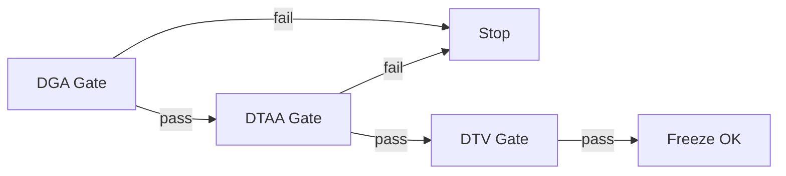

# METHOD-DGA-01: Docs Narrative & Entry Alignment Audit


---

## 0. Purpose

DGA (Docs Governance for Alignment) ensures that documentation content remains within its designated **layer boundaries** and **entry surface contracts**, preventing narrative drift into framework/platform/marketing territory.

> **Relationship to DTAA**:
> - **DTAA** prevents new semantics (pointer + authority)
> - **DGA** prevents narrative drift (layer + entry + fingerprint)

---

## 1. Scope

### 1.1 Directories

```
docs/docs/specification/**   # 100% coverage required
docs/docs/guides/**          # Sample coverage (20%)
docs/docs/evaluation/**      # 100% coverage required
docs/docs/meta/**            # Sample coverage (20%)
```

### 1.2 Audit Dimensions

| Dimension | Reference | Gate Type |
|:---|:---|:---|
| **D1: Layer Boundary** | CONST-006 §1 | Hard Gate |
| **D2: Doc Type Outline** | CONST-006 §2 | Hard Gate |
| **D3: Entry Contract** | CONST-006 §3 | Hard Gate |
| **D4: Narrative Drift** | CONST-006 §4 (F1-F4) | Hard Gate |

---

## 2. Execution Tracks

### 2.1 Track A: Structural Compliance (Automated)

**Trigger**: CI/Pre-commit or manual scan

**Checks**:
- [ ] Frontmatter `entry_surface` matches content
- [ ] Mandatory sections present per doc type (CONST-006 §2)
- [ ] Forbidden verb scan (runs, executes, guarantees, etc.)
- [ ] Forbidden pattern scan (Step 1/2/3 dominance)

**Output**: `DGA_SCAN_REPORT_<date>.md`

---

### 2.2 Track B: Narrative Alignment (Manual Review)

**Trigger**: After Track A PASS or for high-risk pages

**Checks**:
- [ ] Layer boundary respected (L1 content stays L1)
- [ ] No capability marketing narrative
- [ ] No endorsement/certification language
- [ ] No authority inversion (prose > schema)

**Output**: `DGA_ADJUDICATION_TABLE_<scope>.md`

---

## 3. Narrative Drift Detection

### 3.1 Fingerprints (from CONST-006 §4)

| ID | Pattern | Detection Method |
|:---|:---|:---|
| **F1** | Implementation Prescription | Step 1/2/3 structure, architecture diagrams |
| **F2** | Capability Packaging | Features/Benefits, missing Non-Goals |
| **F3** | Endorsement Drift | Ranking, tiers, "must pass for conformant" |
| **F4** | Authority Inversion | Definitions in prose not schema |

### 3.2 Fingerprint Verdicts

| Finding | Verdict | Action |
|:---|:---|:---|
| F1 detected | ⚠️ MOVE | Relocate to guides/ or ops/ |
| F2 detected | ⚠️ MOVE | Relocate to Website |
| F3 detected | ⚠️ REWORD | Add strict non-endorsement |
| F4 detected | ⚠️ REWORD | Collapse to schema restatement |
| No drift | ✅ PASS | — |
| Irreparable | ❌ REMOVE | Delete or archive |

---

## 4. Verdict Categories

### 4.1 Final Verdicts

| Verdict | Meaning | Escalation |
|:---|:---|:---|
| **PASS** | Narrative aligned, layer respected | None |
| **REWORD** | Narrative drift minor, repairable | Author |
| **MOVE** | Wrong location, content valid | Author + relocate |
| **REMOVE** | Irreparable narrative violation | MPGC |

### 4.2 Escalation Thresholds

| Condition | Action |
|:---|:---|
| 3+ F1 in same doc | Mandatory structural rewrite |
| F4 on normative page | MPGC review required |
| F3 in evaluation/ | Immediate non-endorsement patch |

---

## 5. Evidence Requirements

### 5.1 Per-Document Evidence

For each audited document:

```markdown
| File | Layer Claimed | Layer Actual | Drift Fingerprints | Verdict | Notes |
|:---|:---|:---|:---|:---|:---|
| l1-core-protocol.md | L1 | L1 | None | ✅ PASS | — |
| l1-l4-deep-dive.md | L1-L4 | L1-L4 | F1 (minor) | ⚠️ REWORD | Add informative disclaimer |
```

### 5.2 Drift Findings Evidence

For each drift finding:

```markdown
| File | Fingerprint | Evidence (excerpt) | Verdict | Remediation |
|:---|:---|:---|:---|:---|
| integration-spec.md | F2 | "MPLP provides integration capabilities..." | REWORD | Remove capability framing |
```

---

## 6. Integration with DTAA

### 6.1 Ordering



### 6.2 Rationale

| Gate | Question |
|:---|:---|
| **DGA** | Is the content in the right place, right form? |
| **DTAA** | Is the content not introducing new semantics? |
| **DTV** | Is the content factually correct vs truth source? |

---

## 7. Execution Checklist

### Phase 1: Structural Scan
- [ ] Run forbidden verb scan
- [ ] Run mandatory section check
- [ ] Generate `DGA_SCAN_REPORT`

### Phase 2: Manual Review (high-risk)
- [ ] Layer boundary check
- [ ] Narrative drift fingerprint detection
- [ ] Entry contract validation

### Phase 3: Adjudication
- [ ] Generate `DGA_ADJUDICATION_TABLE`
- [ ] Log drift findings in `DGA_DRIFT_FINDINGS.md`

### Phase 4: Remediation
- [ ] REWORD flagged content
- [ ] MOVE misplaced content
- [ ] REMOVE irreparable content

### Phase 5: Verification
- [ ] Re-scan post-remediation
- [ ] Update adjudication table
- [ ] Sign off

---

## 8. Output Artifacts

| Artifact | Purpose |
|:---|:---|
| `DGA_SCAN_REPORT_<date>.md` | Structural scan results |
| `DGA_ADJUDICATION_TABLE_<scope>.md` | Per-doc verdicts |
| `DGA_DRIFT_FINDINGS.md` | Drift evidence log |
| `DGA_FREEZE_DECLARATION.md` | Completion record |

---

## Document Status

| Property | Value |
|:---|:---|
| Document Type | Governance Method |
| Status | Draft |
| Operationalizes | CONST-006 |
| Parallel To | DTAA (METHOD-DTAA-01) |

---

**© 2026 MPGC — MPLP Protocol Governance Committee**
