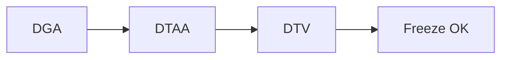

# METHOD-DTV-01: Docs Truth Verification

> **Governance Method**
>
> Version: 1.0.0
> Status: READY
> Effective: 2026-01-05

---

## 0. Purpose

DTV (Docs Truth Verification) ensures that every **factual assertion** in documentation is bound to a verifiable **evidence source**. Unlike DTAA (boundary enforcement), DTV addresses **factual correctness**.

> **DTV answers**: "Is what the document says actually true, and what is the evidence?"

---

## 1. Evidence Types

Every factual statement in docs must declare its evidence type:

| Evidence Type | Source | Verification Method | Authority Level |
|:---|:---|:---|:---|
| **Schema** | `schemas/v2/*.schema.json` | JSON pointer exists | Normative |
| **Invariant** | `schemas/v2/invariants/*.yaml` | Rule ID exists | Normative |
| **Constitutional** | `governance/01-constitutional/` | Section ref exists | Normative |
| **Method** | `governance/02-methods/` | Section ref exists | Procedural |
| **Implementation** | SDK source code | Symbol/file exists | Informative |
| **Test** | Test files/Golden Flows | Test ID exists | Evaluation |
| **Interpretive** | Author explanation | None | Non-authoritative |

---

## 2. Verification Gates

### 2.1 Gate 1: Pointer Existence

For every `Schema: ... / Pointer: ...` block:

- [ ] Schema file exists at specified path
- [ ] JSON pointer resolves to a node

**Tool**: JSON Schema dereferencing

---

### 2.2 Gate 2: Example Validity

For every JSON/YAML example in docs:

- [ ] Example passes schema validation
- [ ] Example uses correct field names

**Tool**: `ajv` or equivalent JSON Schema validator

---

### 2.3 Gate 3: Implementation Reference Validity

For statements referencing SDK/code:

- [ ] Symbol/file exists at specified path
- [ ] Version matches claimed version

**Tool**: AST parsing or simple file check

---

### 2.4 Gate 4: Evidence Declaration Completeness

For all MUST/SHALL statements:

- [ ] Evidence block present
- [ ] Evidence type declared
- [ ] Source identified

---

## 3. Evidence Block Format

### 3.1 Schema Evidence

```markdown
> **Evidence**
> Type: Schema
> Source: `schemas/v2/mplp-plan.schema.json`
> Pointer: `#/properties/context_id`
```

### 3.2 Implementation Evidence (Informative)

```markdown
> **Evidence**
> Type: Implementation
> Source: `@mplp/sdk-ts v1.0.5`
> Status: Best-effort, non-normative
```

### 3.3 Interpretive (No Authority)

```markdown
> **Evidence**
> Type: Interpretive
> Status: Author explanation, non-authoritative
```

---

## 4. Execution

### Phase 1: Schema Pointer Scan
- [ ] Extract all `Schema: ... / Pointer: ...` blocks
- [ ] Verify each pointer exists in schema

### Phase 2: Example Validation
- [ ] Extract all code blocks with JSON/YAML
- [ ] Identify corresponding schema
- [ ] Run validation

### Phase 3: Evidence Completeness
- [ ] Extract all MUST/SHALL statements
- [ ] Check for evidence block presence

### Phase 4: Report
- [ ] Generate `DTV_VERIFICATION_REPORT_<date>.md`

---

## 5. Output Artifacts

| Artifact | Purpose |
|:---|:---|
| `DTV_VERIFICATION_REPORT.md` | Verification results |
| `DTV_POINTER_VALIDITY.md` | Pointer check results |
| `DTV_EXAMPLE_VALIDITY.md` | Example validation results |

---

## 6. Integration

### 6.1 Gate Order



### 6.2 Failure Handling

| Gate | Failure Action |
|:---|:---|
| DTV Gate 1 | Fix pointer or remove claim |
| DTV Gate 2 | Fix example or mark informative |
| DTV Gate 3 | Update reference or add disclaimer |
| DTV Gate 4 | Add evidence block |

---

## 7. Scope for v1.0

**In Scope**:
- Pointer existence verification
- Example schema validation
- Evidence block presence check

**Out of Scope (Future)**:
- Semantic equivalence checking (does prose match schema meaning?)
- Behavioral testing (does SDK behave as documented?)

---

## Document Status

| Property | Value |
|:---|:---|
| Document Type | Governance Method |
| Status | READY |
| Complements | DTAA (METHOD-DTAA-01), DGA (METHOD-DGA-01) |

---

**© 2026 MPGC — MPLP Protocol Governance Committee**
