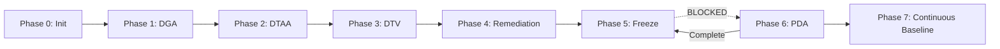

# METHOD-PDA-01 — Per-Document Audit Execution

**MPGC ID**: METHOD-PDA-01
**Version**: 1.0.0
**Status**: NORMATIVE
**Authority**: MPGC
**Effective Date**: 2026-01-05
**References**: 
- CHECKLIST-DOCS-GOV-01 v2.2.0
- CONST-006_DOC_TYPE_OUTLINES_AND_DEPTH_RULES
- SOP-AUDIT-01_PER_DOCUMENT_AUDIT

---

## 1. Purpose

Phase 6 (Per-Document Audit) ensures that **every individual document** in the specification corpus has been:
- Structurally validated (DGA)
- Semantically verified (DTAA)
- Truth-verified with evidence anchors (DTV)
- Issued an explicit Verdict

> [!IMPORTANT]
> **Phase 6 is EXECUTION, not VALIDATION.**
> DGA/DTAA/DTV define the rules. Phase 6 enforces them on every document.

---

## 2. Scope

### 2.1 Execution Batches (Mandatory Order)

| Batch | Directory | Priority | Waiver Allowed |
|:---:|:---|:---|:---:|
| 1 | `architecture/*.md` | 🔴 Critical | ❌ |
| 2 | `architecture/cross-cutting-kernel-duties/*.md` | 🔴 Critical | ❌ |
| 3 | `golden-flows/*.md` | 🔴 Critical | ❌ |
| 4 | `evaluation/*.md`, `semantic-alignment-*.md` | 🟠 High | ❌ |
| 5 | `modules/*.md` | 🟡 Medium | ✅ Track 1b |
| 6 | `observability/*.md`, other specs | 🟢 Standard | ✅ Track 1b |

### 2.2 Execution Unit

| Level | Unit |
|:---|:---|
| Batch | Directory |
| Object | Single Document |
| Granularity | Single Assertion |

---

## 3. Auditor Constraints

### 3.1 Permitted Actions

| Action | Allowed |
|:---|:---:|
| Extract metadata | ✅ |
| Scan for drift patterns (F1-F4) | ✅ |
| Test Subject/Action grammar | ✅ |
| Classify assertions | ✅ |
| Issue Verdict (PASS/REWORD/MOVE/REMOVE) | ✅ |
| Generate remediation patch | ✅ |

### 3.2 Forbidden Actions

| Action | Allowed | Reason |
|:---|:---:|:---|
| Modify document content directly | ❌ | Separation of audit and remediation |
| Explain or interpret MPLP | ❌ | Auditor role, not author role |
| Optimize language or style | ❌ | Not in scope |
| Give PASS without complete tables | ❌ | Evidence requirement |
| Skip any factual statement | ❌ | 100% coverage required |
| Use "I think", "seems reasonable" | ❌ | No subjective judgment |

---

## 4. Execution Steps

### Step 0 — Batch Initialization

```yaml
batch: <batch_number>
directory: <path>
run_id: PDA-RUN-YYYY-MM-DD-XX
checklist_version: v2.2.0
total_files: <count>
```

### Step 1 — Per-Document Metadata Extraction

For each document, extract:

| Field | Source |
|:---|:---|
| doc_type | frontmatter |
| claimed_layer | frontmatter |
| entry_surface | frontmatter |
| authority | frontmatter |
| status | frontmatter |

**Gate**: Missing required field → Document FAIL

### Step 2 — DGA Structural Audit

#### 2.1 Mandatory Sections (per CONST-006)

Check doc_type-specific required sections:
- L1/L2/L3/L4: Purpose, Scope, Authoritative Reference
- Module: Schema Reference, Evidence Block
- Golden Flow: Flow Definition, Validation Criteria

#### 2.2 Drift Fingerprint Scan

| ID | Pattern | Risk | Action if Found |
|:---|:---|:---|:---|
| F1 | Implementation prescription | High | REWORD |
| F2 | Capability packaging | High | REWORD/MOVE |
| F3 | Endorsement drift | Critical | FAIL |
| F4 | Authority inversion | Critical | FAIL |

#### 2.3 Subject/Action Grammar Test

For each major paragraph:
- **Subject** must be: protocol, specification, schema, invariant, constraint
- **Subject** must NOT be: MPLP, system, framework, platform, runtime
- **Action executor** must NOT be MPLP

> Rule: "MPLP constrains" ✅ "MPLP does/executes/provides" ❌

### Step 3 — DTAA Semantic Audit

#### 3.1 New Concept Detection

Scan for definitions not anchored to:
- Schema (schemas/v2/*.schema.json)
- Invariant (invariants/*.yaml)
- Constitutional (CONST-*)

**Gate**: Unanchored definition → FAIL

#### 3.2 Normative Language Audit

| Doc Type | MUST/SHALL Requirement |
|:---|:---|
| Normative | Must point to invariant/schema |
| Informative | Must be downgraded or disclaimed |

### Step 4 — DTV Assertion Index

Extract ALL:
- **Numeric**: quantities, limits, thresholds
- **Normative**: MUST, SHALL, REQUIRED, SHOULD, MAY
- **Definitional**: "X is", "X means", "defined as"

For each assertion:

| Field | Requirement |
|:---|:---|
| Evidence Type | Schema/Invariant/Constitutional/Method/Implementation/Test/Interpretive |
| Source | File path or ID |
| Pointer | Specific anchor (line, section, key) |
| Verifiable | true/false |
| Action | anchor/downgrade/disclaimer/remove |

**Gate**: Any assertion without Evidence Type → Document FAIL

### Step 5 — Final Verdict

| Verdict | Definition | Next Action |
|:---|:---|:---|
| **PASS** | All checks passed, all tables complete | Include in freeze |
| **REWORD** | Drift/grammar issues, content correct | Generate patch, re-audit |
| **MOVE** | Wrong layer/doc_type, content correct | Relocate, re-audit |
| **REMOVE** | Unfixable violation | Delete, document reason |

---

## 5. Output Artifacts

### Per-Document Output

```
<RUN_ID>__AUDIT_<filename>.md
├── §1 Metadata
├── §2 DGA Check (Sections, F1-F4, Subject/Action)
├── §3 DTAA Check (Concepts, Normative Language)
├── §4 Assertion Index
├── §5 Verdict
└── §6 Remediation Plan (if not PASS)
```

### Per-Batch Output

```
outputs/
├── <RUN_ID>__PDA_BATCH_SUMMARY.md
├── <RUN_ID>__PDA_VERDICT_TABLE.md
├── <RUN_ID>__PDA_FAILED_LIST.md
└── <RUN_ID>__PDA_PASS_LIST.md
```

---

## 6. Gate Rules

### 6.1 Phase 6 Completion Gate

Phase 6 is COMPLETE when:
- 100% of batch files have audit records
- 100% of high-risk batches have Verdict = PASS (or remediated)
- All REWORD patches generated and applied
- Batch summary produced

### 6.2 Freeze Dependency

> [!CAUTION]
> **Phase 5 Freeze Declaration is INVALID until Phase 6 is complete for all high-risk batches.**

| Batch | Freeze Dependency |
|:---|:---|
| 1-4 (Critical/High) | REQUIRED before Freeze |
| 5-6 (Medium/Standard) | May be deferred with Waiver |

---

## 7. Relationship to Other Phases



**Key Insight**: Phase 6 runs **after** initial Freeze is drafted, but **before** Freeze becomes effective.

---

## 8. Continuous Governance (Phase 7 Preview)

Once Phase 6 baseline is established:
- Any new/modified document → Triggers PDA
- CI can enforce PDA on PR
- Drift detection becomes automated

---

**Method Status**: NORMATIVE
