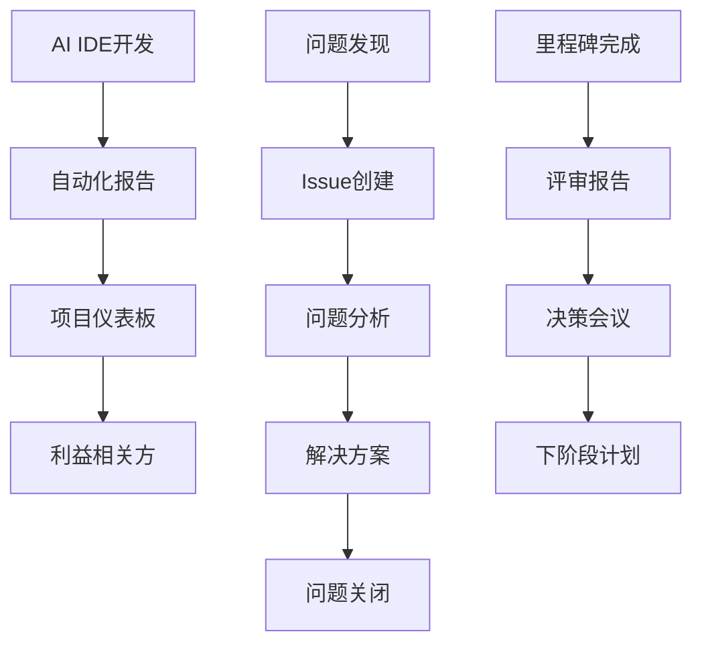
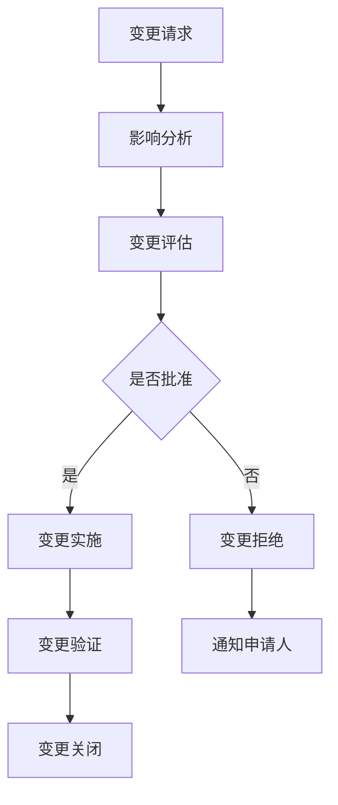
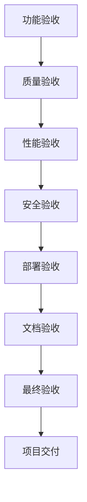

# MPLP 1.0 项目管理计划
## Multi-Agent Project Lifecycle Protocol v1.0 Project Management Plan

> **文档版本**: v2.1  
> **更新日期**: 2025-07-09T19:04:01+08:00  
> **项目经理**: Coregentis 项目团队  
> **项目周期**: 12周 (2025-07-09 至 2025-10-01)  
> **适用范围**: Multi-Agent Project Lifecycle Protocol (MPLP) v1.0 完整开发周期  
> **关联文档**: [产品需求文档](./09_产品需求文档.md) | [技术设计](./01_技术设计文档.md) | [开发规范](./02_开发规范文档.md) | [MPLP协议开发专项路线图](./mplp_protocol_roadmap.md)  
> **协议版本**: v1.0 (完全基于Roadmap v1.0规划)

---

## 📋 项目概述

### MPLP统一项目管理标准

本项目管理计划完全基于[MPLP协议开发专项路线图 v1.0](./mplp_protocol_roadmap.md)制定，确保项目执行与协议版本规划、5个开发阶段、交付物清单和验收标准保持完全一致。

#### 技术实现标准（与Roadmap完全同步）
- **开发环境**: Node.js 18+ + TypeScript 5.0+ + Docker（匹配Roadmap技术栈）
- **代码规范**: ESLint + Prettier + Conventional Commits
- **测试要求**: 单元测试≥90%，集成测试≥80%，E2E测试≥60%（符合Roadmap验收标准）
- **性能基准**: API响应P95<100ms，协议解析<10ms，TPS>10,000，可用性99.9%（匹配Roadmap性能指标）
- **安全要求**: TLS 1.3，JWT认证，0个高危漏洞，完整审计
- **文档同步**: 代码变更必须同步更新相关文档和Schema

#### 项目管控标准（基于Roadmap开发阶段）
- **迭代周期**: 按Roadmap 5个开发阶段进行，每个阶段2-3周Sprint
- **代码审查**: 100%PR Review，至少2人审批，CI/CD自动检查
- **质量门禁**: 自动化测试通过，安全扫描通过，性能基准达标
- **部署策略**: 蓝绿部署，零停机更新，自动回滚机制
- **监控告警**: Prometheus监控，实时告警，故障自动恢复

### 项目目标
MPLP 1.0旨在建立一个标准化的多Agent项目生命周期协议，为AI驱动的软件开发提供统一的通信和协作框架，完全按照Roadmap v1.0的版本规划实施。

### 核心目标（与Roadmap目标对齐）
- **建立覆盖完整生命周期的标准化协议**: 基于Context、Plan、Confirm、Trace、Role、Extension六个核心模块，定义统一的通信规范和数据格式
- **提供可追踪可审计的执行流程**: 实现完整的操作记录和审计机制，支持全链路追踪
- **支持跨平台和厂商中立**: 确保在不同平台和框架间的互操作性，避免厂商锁定
- **为TracePilot和Coregentis等平台提供统一支撑**: 深度集成多个AI开发平台，提供标准化接口
- **达成Roadmap v1.0验收标准**: 完成所有交付物，满足技术标准、功能标准和质量标准

### 项目范围（基于Roadmap交付物清单）
- **核心协议**: 6个核心协议模块(Context、Plan、Confirm、Trace、Role、Extension)的设计与实现
- **核心组件**: 协议引擎、Schema验证器、扩展管理器、状态管理器、追踪收集器、安全管理器
- **技术栈**: TypeScript + Node.js + PostgreSQL + Redis + Docker + Kubernetes
- **API接口**: REST API + GraphQL API + WebSocket API
- **平台适配**: TracePilot + Coregentis + 第三方平台 + 开源生态
- **测试覆盖**: 单元测试 + 集成测试 + 端到端测试 + 性能测试 + 安全测试
- **文档交付**: 技术文档 + API文档 + 协议规范 + 用户指南 + 最佳实践

### 项目约束（匹配Roadmap要求）
- **开发模式**: AI IDE协助开发，人工审核，持续集成
- **开发周期**: 12周 (2025-07-09 至 2025-10-01)，按5个开发阶段执行
- **质量标准**: 代码覆盖率 ≥ 90%，协议解析性能 < 10ms，API响应时间P95 < 100ms
- **兼容性**: 支持JSON Schema Draft 7+，跨平台兼容，厂商中立
- **安全要求**: 通过安全扫描，无高危漏洞，支持端到端加密
- **性能要求**: 支持1000+并发，99.9%可用性，水平扩展
- **文档要求**: 完整的技术文档、API文档、协议规范和用户指南

---

## 🏗️ 工作分解结构 (WBS)

### 1. 项目启动阶段 (1.0)

#### 1.1 项目规划 (1.1)
- **1.1.1** 需求分析和确认
- **1.1.2** 技术架构设计
- **1.1.3** 项目计划制定
- **1.1.4** 风险评估和缓解策略
- **1.1.5** 开发环境准备

#### 1.2 文档准备 (1.2)
- **1.2.1** 产品需求文档 (PRD)
- **1.2.2** 技术设计文档 (TDD)
- **1.2.3** 开发规范文档
- **1.2.4** 测试策略文档
- **1.2.5** 项目管理计划

### 2. 设计阶段 (2.0)

#### 2.1 系统架构设计 (2.1)
- **2.1.1** 整体架构设计
- **2.1.2** 协议层设计
- **2.1.3** 实现层设计
- **2.1.4** 应用层设计
- **2.1.5** 安全架构设计

#### 2.2 详细设计 (2.2)
- **2.2.1** 数据库设计
- **2.2.2** API接口设计
- **2.2.3** 协议规范设计
- **2.2.4** 性能设计
- **2.2.5** 监控设计

### 3. 开发阶段 (3.0)

#### 3.1 核心框架开发 (3.1)
- **3.1.1** 基础类型定义
- **3.1.2** 协议引擎开发
- **3.1.3** 验证引擎开发
- **3.1.4** 适配器框架开发
- **3.1.5** 工具函数开发

#### 3.2 JSON Schema标准化 (3.2)
- **3.2.1** 基础类型Schema定义
- **3.2.2** 协议模块Schema设计
- **3.2.3** Schema验证引擎开发
- **3.2.4** Schema版本管理机制
- **3.2.5** Schema兼容性验证

#### 3.3 核心协议模块开发 (3.3)
- **3.3.1** Context协议模块 - 上下文管理和状态跟踪
- **3.3.2** Plan协议模块 - 任务规划和依赖管理
- **3.3.3** Confirm协议模块 - 确认机制和验证流程
- **3.3.4** Trace协议模块 - 执行追踪和审计日志
- **3.3.5** Role协议模块 - 角色定义和权限管理
- **3.3.6** Extension协议模块 - 扩展机制和插件管理

#### 3.4 核心组件开发 (3.4)
- **3.4.1** 协议引擎 - 协议解析、验证、序列化
- **3.4.2** Schema验证器 - JSON Schema验证和管理
- **3.4.3** 扩展管理器 - 扩展加载、生命周期管理
- **3.4.4** 状态管理器 - 状态持久化和同步
- **3.4.5** 追踪收集器 - 执行数据收集和分析
- **3.4.6** 安全管理器 - 认证、授权、加密

#### 3.5 基础验证机制 (3.5)
- **3.5.1** 数据完整性验证
- **3.5.2** 业务规则验证
- **3.5.3** 性能验证机制
- **3.5.4** 安全验证机制
- **3.5.5** 兼容性验证机制

#### 3.6 API层开发 (3.6)
- **3.6.1** REST API开发 - 基于6个核心模块的RESTful接口
- **3.6.2** GraphQL API开发 - 统一查询接口
- **3.6.3** WebSocket API开发 - 实时通信接口
- **3.6.4** 中间件开发 - 认证、限流、日志
- **3.6.5** 错误处理开发 - 统一错误响应

#### 3.7 数据层开发 (3.7)
- **3.7.1** 数据模型开发 - 基于6个核心模块的数据模型
- **3.7.2** 数据仓库开发 - 数据访问层抽象
- **3.7.3** 数据库迁移 - Schema版本管理
- **3.7.4** 缓存层开发 - Redis缓存策略
- **3.7.5** 数据访问优化 - 查询性能优化

#### 3.8 业务服务开发 (3.8)
- **3.8.1** 协议服务开发 - 核心协议处理逻辑
- **3.8.2** 执行服务开发 - 任务执行和调度
- **3.8.3** 追踪服务开发 - 执行链路追踪
- **3.8.4** 认证服务开发 - 用户认证和授权
- **3.8.5** 平台适配器开发 - 多平台集成适配

#### 3.9 性能监控系统 (3.9)
- **3.9.1** 实时监控指标收集
- **3.9.2** 性能数据分析
- **3.9.3** 告警机制开发
- **3.9.4** 监控仪表板开发
- **3.9.5** 性能优化建议系统

### 4. 测试阶段 (4.0)

#### 4.1 单元测试 (4.1)
- **4.1.1** 核心模块单元测试
- **4.1.2** 协议模块单元测试
- **4.1.3** API层单元测试
- **4.1.4** 服务层单元测试
- **4.1.5** 工具函数单元测试

#### 4.2 集成测试 (4.2)
- **4.2.1** API集成测试
- **4.2.2** 数据库集成测试
- **4.2.3** 服务集成测试
- **4.2.4** 第三方集成测试
- **4.2.5** 性能集成测试

#### 4.3 系统测试 (4.3)
- **4.3.1** 端到端测试
- **4.3.2** 性能测试
- **4.3.3** 安全测试
- **4.3.4** 兼容性测试
- **4.3.5** 压力测试

### 5. 部署阶段 (5.0)

#### 5.1 环境准备 (5.1)
- **5.1.1** 开发环境配置
- **5.1.2** 测试环境配置
- **5.1.3** 预生产环境配置
- **5.1.4** 生产环境配置
- **5.1.5** 监控环境配置

#### 5.2 部署实施 (5.2)
- **5.2.1** 容器化部署
- **5.2.2** Kubernetes部署
- **5.2.3** 数据库部署
- **5.2.4** 缓存部署
- **5.2.5** 负载均衡配置

### 6. 文档和交付 (6.0)

#### 6.1 技术文档 (6.1)
- **6.1.1** API文档编写
- **6.1.2** 协议规范文档
- **6.1.3** 架构文档
- **6.1.4** 部署文档
- **6.1.5** 运维文档

#### 6.2 用户文档 (6.2)
- **6.2.1** 快速开始指南
- **6.2.2** 集成指南
- **6.2.3** 最佳实践指南
- **6.2.4** 故障排除指南
- **6.2.5** FAQ文档

---

## 📅 项目时间表

### 总体时间线
```
项目周期: 2025-01-27 至 2025-04-07 (10周，50个工作日)

里程碑1: 项目启动与架构设计    [Week 1-2]  ████████████████████
里程碑2: 核心框架与Schema     [Week 3-4]  ████████████████████
里程碑3: 核心协议模块开发     [Week 5-6]  ████████████████████
里程碑4: 核心组件与API开发    [Week 7-8]  ████████████████████
里程碑5: 集成测试与优化       [Week 9]    ████████████████████
里程碑6: 部署与发布准备       [Week 10]   ████████████████████
```

### 详细里程碑计划

#### 里程碑1: 项目启动与架构设计 (2025-01-27 - 2025-02-07)

**主要目标**
- 完成项目启动和团队组建
- 确定技术架构和开发规范
- 建立开发环境和CI/CD流程

**具体任务**
- [ ] 项目启动会议 (2025-01-27)
- [ ] 技术架构设计评审 (2025-01-29)
- [ ] 6个核心模块详细设计 (2025-01-31)
- [ ] JSON Schema标准化设计 (2025-02-03)
- [ ] 开发环境搭建 (2025-02-04)
- [ ] CI/CD流程建立 (2025-02-05)
- [ ] 代码规范制定 (2025-02-06)
- [ ] 项目基础框架搭建 (2025-02-07)

**交付物**
- 项目管理计划
- 技术架构文档
- 开发规范文档
- JSON Schema设计规范
- 基础项目框架
- CI/CD流水线

**验收标准**
- [ ] 所有团队成员明确角色和职责
- [ ] 技术架构通过评审
- [ ] 开发环境可正常使用
- [ ] CI/CD流程验证通过

#### 里程碑2: 核心框架与Schema (2025-02-10 - 2025-02-21)

**主要目标**
- 完成核心框架和基础类型定义
- 建立协议引擎和Schema验证器
- 实现6个核心模块的JSON Schema定义

**具体任务**
- [ ] 基础类型定义 (2025-02-10)
- [ ] 协议引擎核心功能 (2025-02-12)
- [ ] Schema验证器开发 (2025-02-14)
- [ ] 6个核心模块Schema设计 (2025-02-17)
- [ ] Schema版本管理机制 (2025-02-19)
- [ ] Schema兼容性验证 (2025-02-21)

**交付物**
- 基础类型定义和工具函数
- 协议引擎核心功能
- Schema验证器和管理机制
- 6个核心模块的JSON Schema
- Schema版本管理和兼容性验证

**验收标准**
- [ ] 协议引擎功能完整实现
- [ ] Schema验证器正常工作
- [ ] 6个核心模块Schema验证通过
- [ ] 单元测试覆盖率>90%

#### 里程碑3: 核心协议模块开发 (2025-02-24 - 2025-03-07)

**主要目标**
- 完成6个核心协议模块的实现
- 建立模块间的协作机制
- 实现基础的验证和错误处理

**具体任务**
- [ ] Context协议模块实现 (2025-02-24)
- [ ] Plan协议模块实现 (2025-02-26)
- [ ] Confirm协议模块实现 (2025-02-28)
- [ ] Trace协议模块实现 (2025-03-03)
- [ ] Role协议模块实现 (2025-03-05)
- [ ] Extension协议模块实现 (2025-03-07)

**交付物**
- 6个核心协议模块完整实现
- 模块间集成和协作机制
- 基础验证和错误处理
- 完整的单元测试套件
- 模块使用文档和示例

**验收标准**
- [ ] 6个核心模块功能完整实现
- [ ] 模块间集成测试通过
- [ ] 错误处理机制有效
- [ ] 单元测试覆盖率>90%
- [ ] 性能基准测试通过

**Day 5: 协议模块开发 (1)**
- [ ] Context协议实现
- [ ] Context协议测试
- [ ] Plan协议实现
- [ ] Plan协议测试

#### 第二周 (Day 6-10)

**Day 6: 协议模块开发 (2)**
- [ ] Execute协议实现
- [ ] Execute协议测试
- [ ] Confirm协议实现
- [ ] Confirm协议测试

**Day 7: 协议模块开发 (3)**
- [ ] Learn协议实现
- [ ] Trace协议实现
- [ ] Test协议实现
- [ ] 协议模块集成测试

**Day 8: 协议模块开发 (4)**
- [ ] Role协议实现
- [ ] Workflow协议实现
- [ ] Delivery协议实现
- [ ] 所有协议模块测试

**Day 9: API层开发 (1)**
- [ ] REST API中间件
- [ ] REST API路由
- [ ] REST API控制器
- [ ] REST API验证器

**Day 10: API层开发 (2)**
- [ ] GraphQL Schema
- [ ] GraphQL解析器
- [ ] GraphQL订阅
- [ ] API层集成测试

#### 第三周 (Day 11-15)

**Day 11: 数据层开发**
- [ ] 数据模型实现
- [ ] 数据仓库实现
- [ ] 数据库迁移
- [ ] 缓存层实现

**Day 12: 业务服务开发**
- [ ] 协议服务实现
- [ ] 执行服务实现
- [ ] 追踪服务实现
- [ ] 认证服务实现

**Day 13: 平台适配器开发**
- [ ] 基础适配器框架
- [ ] TracePilot适配器
- [ ] Coregentis适配器
- [ ] 适配器测试

**Day 14: 集成测试 (1)**
- [ ] API集成测试
- [ ] 数据库集成测试
- [ ] 服务集成测试
- [ ] 性能基准测试

**Day 15: 集成测试 (2)**
- [ ] 端到端测试
- [ ] 安全测试
- [ ] 兼容性测试
- [ ] 压力测试

#### 第四周 (Day 16-20)

**Day 16: 系统优化**
- [ ] 性能优化
- [ ] 内存优化
- [ ] 查询优化
- [ ] 缓存优化

**Day 17: 安全加固**
- [ ] 安全漏洞修复
- [ ] 权限控制完善
- [ ] 数据加密实现
- [ ] 审计日志完善

**Day 18: 部署准备**
- [ ] 容器化配置
- [ ] Kubernetes配置
- [ ] 环境变量配置
- [ ] 部署脚本编写

**Day 19: 部署实施**
- [ ] 开发环境部署
- [ ] 测试环境部署
- [ ] 预生产环境部署
- [ ] 监控配置

**Day 20: 文档编写**
- [ ] API文档生成
- [ ] 用户指南编写
- [ ] 部署文档编写
- [ ] 故障排除指南

#### 第五周 (Day 21-25)

**Day 21: 最终测试**
- [ ] 全面回归测试
- [ ] 性能验收测试
- [ ] 安全验收测试
- [ ] 用户验收测试

**Day 22: 生产部署**
- [ ] 生产环境部署
- [ ] 数据迁移
- [ ] 服务启动
- [ ] 监控验证

**Day 23: 验收和交付**
- [ ] 功能验收
- [ ] 性能验收
- [ ] 安全验收
- [ ] 文档交付

**Day 24: 项目收尾**
- [ ] 项目总结
- [ ] 经验教训整理
- [ ] 知识库更新
- [ ] 后续计划制定

**Day 25: 项目结束**
- [ ] 项目归档
- [ ] 资源释放
- [ ] 团队解散
- [ ] 维护交接

---

## 👥 团队组织结构

### AI IDE开发团队

#### 核心团队角色
```
AI IDE项目团队
├── 项目管理AI
│   ├── 项目计划制定
│   ├── 进度跟踪
│   ├── 风险管理
│   └── 质量控制
├── 架构设计AI
│   ├── 系统架构设计
│   ├── 技术选型
│   ├── 性能设计
│   └── 安全设计
├── 后端开发AI
│   ├── 核心引擎开发
│   ├── 协议模块开发
│   ├── API开发
│   └── 数据层开发
├── 测试AI
│   ├── 测试策略制定
│   ├── 测试用例编写
│   ├── 自动化测试
│   └── 性能测试
├── DevOps AI
│   ├── 环境配置
│   ├── CI/CD配置
│   ├── 部署自动化
│   └── 监控配置
└── 文档AI
    ├── 技术文档编写
    ├── API文档生成
    ├── 用户指南编写
    └── 维护文档更新
```

#### 责任分工矩阵 (RACI)

| 任务/角色 | 项目管理 | 架构设计 | 后端开发 | 测试 | DevOps | 文档 |
|-----------|----------|----------|----------|------|--------|------|
| 项目规划 | R | C | I | I | I | I |
| 架构设计 | A | R | C | I | C | I |
| 核心开发 | A | C | R | I | I | I |
| API开发 | A | C | R | I | I | C |
| 测试执行 | A | I | C | R | I | I |
| 部署实施 | A | C | I | I | R | I |
| 文档编写 | A | C | C | I | I | R |
| 质量保证 | R | C | C | C | C | C |

**说明**:
- R (Responsible): 负责执行
- A (Accountable): 最终负责
- C (Consulted): 需要咨询
- I (Informed): 需要知情

---

## 📊 资源分配计划

### 计算资源需求

#### 开发环境资源
```yaml
开发环境:
  CPU: 8 cores
  内存: 16GB RAM
  存储: 500GB SSD
  网络: 1Gbps
  
测试环境:
  CPU: 16 cores
  内存: 32GB RAM
  存储: 1TB SSD
  网络: 1Gbps
  
生产环境:
  CPU: 32 cores
  内存: 64GB RAM
  存储: 2TB SSD
  网络: 10Gbps
  负载均衡: 2台
  数据库: 主从复制
  缓存: Redis集群
```

#### 软件资源需求
```yaml
开发工具:
  - Node.js 18+
  - TypeScript 5+
  - PostgreSQL 15+
  - Redis 7+
  - Docker
  - Kubernetes
  
监控工具:
  - Prometheus
  - Grafana
  - ELK Stack
  - Jaeger
  
安全工具:
  - Snyk
  - SonarQube
  - OWASP ZAP
```

### 时间资源分配

#### 各阶段工作量分布
```
项目启动: 3天 (12%)
设计阶段: 3天 (12%)
开发阶段: 12天 (48%)
测试阶段: 5天 (20%)
部署阶段: 2天 (8%)
```

#### AI IDE工作时间分配
```
核心开发: 40%
测试编写: 25%
文档编写: 15%
配置管理: 10%
问题修复: 10%
```

---

## ⚠️ 风险管理

### 风险识别和评估

#### 技术风险

| 风险项 | 概率 | 影响 | 风险等级 | 缓解策略 |
|--------|------|------|----------|----------|
| TypeScript类型复杂度过高 | 中 | 中 | 中 | 渐进式类型定义，分阶段实现 |
| 性能不达标 | 低 | 高 | 中 | 早期性能测试，持续优化 |
| 第三方依赖冲突 | 中 | 中 | 中 | 版本锁定，依赖审查 |
| 数据库设计缺陷 | 低 | 高 | 中 | 详细设计评审，迁移策略 |
| 安全漏洞 | 中 | 高 | 高 | 安全扫描，代码审查 |

#### 项目风险

| 风险项 | 概率 | 影响 | 风险等级 | 缓解策略 |
|--------|------|------|----------|----------|
| 需求变更 | 中 | 中 | 中 | 需求冻结，变更控制 |
| 进度延期 | 中 | 高 | 高 | 缓冲时间，并行开发 |
| 质量不达标 | 低 | 高 | 中 | 持续集成，自动化测试 |
| 资源不足 | 低 | 中 | 低 | 资源预留，弹性扩容 |
| 集成问题 | 中 | 中 | 中 | 早期集成，接口契约 |

#### 外部风险

| 风险项 | 概率 | 影响 | 风险等级 | 缓解策略 |
|--------|------|------|----------|----------|
| 第三方服务不可用 | 低 | 中 | 低 | 服务降级，备用方案 |
| 网络连接问题 | 低 | 低 | 低 | 离线开发，本地缓存 |
| 硬件故障 | 低 | 中 | 低 | 备份策略，云端部署 |
| 安全攻击 | 低 | 高 | 中 | 安全防护，监控告警 |

### 风险应对策略

#### 1. 技术风险应对
```markdown
## TypeScript类型复杂度管理
- 采用渐进式类型定义策略
- 使用工具类型简化复杂类型
- 定期重构和优化类型定义
- 建立类型定义最佳实践

## 性能风险应对
- 建立性能基准测试
- 实施持续性能监控
- 采用性能优化最佳实践
- 预留性能优化时间

## 安全风险应对
- 集成安全扫描工具
- 实施安全代码审查
- 建立安全开发规范
- 定期安全评估
```

#### 2. 项目风险应对
```markdown
## 进度风险应对
- 设置20%的缓冲时间
- 采用并行开发策略
- 实施每日进度跟踪
- 建立快速决策机制

## 质量风险应对
- 实施持续集成
- 建立自动化测试
- 设置质量门禁
- 定期质量评审

## 集成风险应对
- 早期接口定义
- 建立接口契约测试
- 实施持续集成
- 定期集成验证
```

### 风险监控和报告

#### 风险监控指标
```yaml
技术指标:
  - 代码复杂度: <= 10
  - 测试覆盖率: >= 90%
  - 性能基准: 达标率 >= 95%
  - 安全扫描: 高危漏洞 = 0
  
项目指标:
  - 进度偏差: <= 10%
  - 质量缺陷: <= 5个/千行代码
  - 需求变更: <= 5%
  - 资源利用率: 80-95%
```

#### 风险报告机制
```markdown
## 日报告
- 当日风险状态
- 新识别风险
- 风险处理进展
- 需要关注的问题

## 周报告
- 风险趋势分析
- 风险处理效果
- 风险等级变化
- 下周风险预测

## 里程碑报告
- 阶段风险总结
- 风险应对效果
- 经验教训
- 后续风险预防
```

---

## 📈 质量管理

### 质量目标

#### 功能质量目标
```yaml
功能完整性: 100%
  - 所有需求功能实现
  - 所有API接口可用
  - 所有协议模块正常
  
功能正确性: >= 99%
  - 业务逻辑正确
  - 数据处理准确
  - 错误处理完善
  
功能稳定性: >= 99.9%
  - 系统运行稳定
  - 无内存泄漏
  - 无死锁问题
```

#### 非功能质量目标
```yaml
性能目标:
  - 响应时间: <= 100ms (P95)
  - 吞吐量: >= 1000 TPS
  - 并发用户: >= 1000
  
可靠性目标:
  - 系统可用性: >= 99.9%
  - 故障恢复时间: <= 5分钟
  - 数据一致性: 100%
  
安全性目标:
  - 安全漏洞: 0个高危
  - 数据加密: 100%
  - 访问控制: 100%覆盖
```

### 质量保证活动

#### 1. 代码质量保证
```markdown
## 静态代码分析
- ESLint规则检查
- TypeScript类型检查
- SonarQube质量扫描
- 代码复杂度分析

## 代码审查
- 同行代码审查
- 架构一致性检查
- 安全代码审查
- 性能代码审查

## 编码规范
- 命名规范检查
- 注释规范检查
- 结构规范检查
- 风格规范检查
```

#### 2. 测试质量保证
```markdown
## 测试策略
- 单元测试: 70%
- 集成测试: 20%
- 端到端测试: 10%

## 测试覆盖率
- 行覆盖率: >= 90%
- 分支覆盖率: >= 90%
- 函数覆盖率: >= 90%
- 语句覆盖率: >= 90%

## 测试自动化
- 自动化测试比例: >= 95%
- 测试执行时间: <= 10分钟
- 测试稳定性: >= 99%
```

#### 3. 性能质量保证
```markdown
## 性能测试
- 负载测试
- 压力测试
- 容量测试
- 稳定性测试

## 性能监控
- 实时性能监控
- 性能趋势分析
- 性能瓶颈识别
- 性能优化建议

## 性能优化
- 算法优化
- 数据库优化
- 缓存优化
- 网络优化
```

### 质量度量和报告

#### 质量度量指标
```yaml
代码质量指标:
  - 代码行数: 统计
  - 圈复杂度: <= 10
  - 重复代码率: <= 5%
  - 技术债务: <= 1天
  
测试质量指标:
  - 测试覆盖率: >= 90%
  - 测试通过率: >= 99%
  - 缺陷密度: <= 5个/千行
  - 缺陷修复时间: <= 24小时
  
性能质量指标:
  - 响应时间: <= 100ms
  - 吞吐量: >= 1000 TPS
  - 资源利用率: 80-90%
  - 错误率: <= 0.1%
```

#### 质量报告
```markdown
## 日质量报告
- 当日构建状态
- 测试执行结果
- 代码质量指标
- 发现的问题

## 周质量报告
- 质量趋势分析
- 质量目标达成情况
- 质量改进建议
- 下周质量计划

## 里程碑质量报告
- 阶段质量总结
- 质量目标达成评估
- 质量问题分析
- 质量改进计划
```

---

## 📞 沟通管理

### 沟通计划

#### 内部沟通
```yaml
日常沟通:
  频率: 每日
  形式: 自动化报告
  内容: 进度、问题、计划
  参与者: 所有AI模块
  
周例会:
  频率: 每周
  形式: 状态同步
  内容: 进展、风险、决策
  参与者: 核心AI模块
  
里程碑评审:
  频率: 每个里程碑
  形式: 正式评审
  内容: 交付物、质量、计划
  参与者: 所有相关方
```

#### 外部沟通
```yaml
利益相关方沟通:
  频率: 双周
  形式: 进度报告
  内容: 进展、风险、变更
  参与者: 项目发起人
  
用户沟通:
  频率: 按需
  形式: 反馈收集
  内容: 需求、建议、问题
  参与者: 最终用户
```

### 沟通工具和渠道

#### 沟通工具
```markdown
## 项目管理工具
- GitHub Projects: 任务管理
- GitHub Issues: 问题跟踪
- GitHub Discussions: 讨论交流
- GitHub Wiki: 知识管理

## 文档工具
- Markdown: 文档编写
- GitHub Pages: 文档发布
- OpenAPI: API文档
- JSDoc: 代码文档

## 监控工具
- GitHub Actions: CI/CD状态
- Codecov: 覆盖率报告
- SonarCloud: 代码质量
- Dependabot: 依赖更新
```

#### 信息流转


---

## 📋 配置管理

### 配置管理策略

#### 版本控制策略
```markdown
## Git分支策略
- main: 生产环境代码
- develop: 开发集成分支
- feature/*: 功能开发分支
- bugfix/*: 缺陷修复分支
- hotfix/*: 热修复分支
- release/*: 发布准备分支

## 版本命名规范
- 主版本: v1.0.0 (重大变更)
- 次版本: v1.1.0 (功能增加)
- 修订版本: v1.0.1 (缺陷修复)
- 预发布: v1.0.0-alpha.1
```

#### 配置项管理
```yaml
代码配置:
  - 源代码文件
  - 配置文件
  - 脚本文件
  - 文档文件
  
构建配置:
  - 构建脚本
  - 依赖配置
  - 环境配置
  - 部署配置
  
测试配置:
  - 测试用例
  - 测试数据
  - 测试环境
  - 测试脚本
```

### 变更控制流程

#### 变更请求流程


#### 变更分类
```yaml
紧急变更:
  - 安全漏洞修复
  - 生产故障修复
  - 数据丢失恢复
  审批: 快速通道
  
标准变更:
  - 功能增强
  - 性能优化
  - 缺陷修复
  审批: 标准流程
  
重大变更:
  - 架构调整
  - 技术栈变更
  - 接口变更
  审批: 正式评审
```

---

## 📊 项目监控和控制

### 监控指标体系

#### 进度监控指标
```yaml
计划执行指标:
  - 任务完成率: 已完成任务/总任务
  - 里程碑达成率: 按时达成/总里程碑
  - 进度偏差: (实际进度-计划进度)/计划进度
  - 工作量偏差: (实际工作量-计划工作量)/计划工作量
  
质量指标:
  - 缺陷密度: 缺陷数/千行代码
  - 测试覆盖率: 覆盖行数/总行数
  - 代码质量分: SonarQube评分
  - 性能达标率: 达标指标/总指标
```

#### 资源监控指标
```yaml
资源利用指标:
  - CPU利用率: 平均CPU使用率
  - 内存利用率: 平均内存使用率
  - 存储利用率: 已用存储/总存储
  - 网络利用率: 平均网络使用率
  
成本指标:
  - 开发成本: 实际成本/预算成本
  - 运维成本: 月度运维费用
  - 基础设施成本: 云服务费用
  - 工具成本: 开发工具费用
```

### 项目仪表板

#### 实时监控面板
```markdown
## 项目概览
- 项目进度: 75% ████████████████████░░░░░
- 质量状态: 优秀 ✅
- 风险等级: 低 🟢
- 团队状态: 正常 ✅

## 关键指标
- 代码覆盖率: 92% ✅
- 构建成功率: 98% ✅
- 性能基准: 达标 ✅
- 安全扫描: 通过 ✅

## 近期里程碑
- ✅ 核心框架完成 (Day 4)
- ✅ 协议模块完成 (Day 8)
- 🔄 API层开发 (Day 10)
- ⏳ 集成测试 (Day 15)
```

#### 趋势分析图表
```markdown
## 进度趋势
- 计划进度 vs 实际进度
- 任务完成趋势
- 里程碑达成情况

## 质量趋势
- 代码质量变化
- 缺陷发现和修复
- 测试覆盖率变化

## 性能趋势
- 响应时间变化
- 吞吐量变化
- 资源利用率变化
```

### 控制措施

#### 进度控制
```markdown
## 进度偏差处理
1. 偏差识别
   - 每日进度检查
   - 里程碑评估
   - 趋势分析

2. 原因分析
   - 技术难度评估
   - 资源可用性
   - 外部依赖

3. 纠正措施
   - 资源重新分配
   - 并行任务调整
   - 范围调整
   - 时间缓冲使用
```

#### 质量控制
```markdown
## 质量问题处理
1. 问题识别
   - 自动化检测
   - 代码审查
   - 测试发现

2. 问题分析
   - 根因分析
   - 影响评估
   - 优先级排序

3. 解决措施
   - 立即修复
   - 重构优化
   - 流程改进
   - 预防措施
```

---

## 📝 项目收尾

### 项目验收

#### 验收标准
```yaml
功能验收:
  - 所有需求功能实现: 100%
  - API接口正常工作: 100%
  - 协议模块正确运行: 100%
  - 平台适配器正常: 100%
  
质量验收:
  - 代码覆盖率: >= 90%
  - 性能基准达标: 100%
  - 安全扫描通过: 100%
  - 文档完整性: 100%
  
部署验收:
  - 生产环境部署成功: 100%
  - 监控系统正常: 100%
  - 备份恢复验证: 100%
  - 运维文档完整: 100%
```

#### 验收流程


### 项目总结

#### 成果总结
```markdown
## 交付成果
1. MPLP 1.0协议实现
   - 10个核心协议模块
   - 完整的API接口
   - 平台适配器

2. 技术文档
   - API文档
   - 协议规范
   - 部署指南
   - 用户手册

3. 测试套件
   - 单元测试
   - 集成测试
   - 性能测试
   - 安全测试

4. 部署包
   - Docker镜像
   - Kubernetes配置
   - 监控配置
   - 运维脚本
```

#### 经验教训
```markdown
## 成功经验
1. AI IDE开发模式
   - 高效的自动化开发
   - 一致的代码质量
   - 快速的迭代周期

2. 质量保证体系
   - 全面的自动化测试
   - 持续的质量监控
   - 严格的代码审查

3. 项目管理实践
   - 清晰的里程碑规划
   - 有效的风险管理
   - 及时的沟通协调

## 改进建议
1. 技术方面
   - 更早的性能测试
   - 更完善的错误处理
   - 更灵活的配置管理

2. 流程方面
   - 更细化的任务分解
   - 更频繁的集成验证
   - 更主动的风险识别

3. 工具方面
   - 更智能的监控告警
   - 更自动化的部署流程
   - 更完善的文档生成
```

### 知识转移

#### 知识库建设
```markdown
## 技术知识库
1. 架构设计文档
   - 系统架构图
   - 技术选型说明
   - 设计决策记录

2. 开发知识库
   - 编码规范
   - 最佳实践
   - 常见问题解答

3. 运维知识库
   - 部署指南
   - 监控配置
   - 故障排除

4. 项目知识库
   - 项目文档
   - 会议记录
   - 决策记录
```

#### 维护交接
```markdown
## 维护团队交接
1. 系统交接
   - 系统架构介绍
   - 关键组件说明
   - 运行环境配置

2. 代码交接
   - 代码结构说明
   - 核心逻辑解释
   - 扩展点介绍

3. 运维交接
   - 监控指标说明
   - 告警处理流程
   - 备份恢复流程

4. 支持交接
   - 用户支持流程
   - 问题升级机制
   - 知识库维护
```

---

## 📞 联系信息

**项目经理**: AI IDE 项目管理团队  
**技术负责人**: AI IDE 架构设计团队  
**开发团队**: AI IDE 开发团队  
**测试团队**: AI IDE 测试团队  
**运维团队**: AI IDE DevOps团队  

**项目仓库**: https://github.com/coregentis/mplp-v1  
**文档站点**: https://mplp.coregentis.com/docs  
**问题跟踪**: https://github.com/coregentis/mplp-v1/issues  
**讨论区**: https://github.com/coregentis/mplp-v1/discussions  

---

*本项目管理计划将随着项目进展持续更新，请确保使用最新版本。*