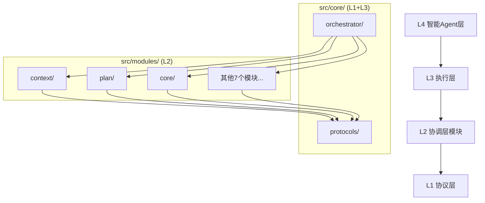

# MPLP核心基础设施 (L1协议层 + L3执行层)

<!--
文档元数据
版本: v2.0.0
创建时间: 2025-01-27T15:00:00Z
最后更新: 2025-01-27T15:00:00Z
文档状态: 已完成
架构重构: 2025-01-27 - 统一L1+L3架构边界
-->


## 🎯 **目录概述**

`src/core/` 目录是MPLP生态系统的**核心基础设施**，包含L1协议层和L3执行层的所有组件。

### **⚠️ 重要说明：与src/modules/core的区别**

```markdown
🔍 架构边界说明：

src/core/                    # L1协议层 + L3执行层 (平台基础设施)
├── protocols/               # L1协议层：基础协议接口和横切关注点
└── orchestrator/            # L3执行层：CoreOrchestrator中央协调器

src/modules/core/            # L2协调层Core模块 (业务逻辑)
├── api/                     # Core模块的API接口
├── application/services/    # Core模块的业务服务
└── domain/                  # Core模块的业务领域

⚠️ 注意：不要混淆这两个目录！
- src/core = 平台基础设施 (L1+L3)
- src/modules/core = Core业务模块 (L2)
```

## 🏗️ **架构层次详解**

### **L1协议层 (src/core/protocols/)**

**职责**：
- ✅ 定义MPLP基础协议接口
- ✅ 提供9个横切关注点管理器
- ✅ 协议版本管理和兼容性
- ✅ 跨模块通信标准

**不包含**：
- ❌ 具体业务逻辑实现
- ❌ 模块特定功能
- ❌ 数据持久化逻辑

**核心组件**：
```
protocols/
├── mplp-protocol-base.ts           # MPLP基础协议接口
└── cross-cutting-concerns/         # 9个横切关注点管理器
    ├── security-manager.ts         # 安全管理器
    ├── performance-monitor.ts      # 性能监控器
    ├── event-bus-manager.ts        # 事件总线管理器
    ├── error-handler.ts            # 错误处理器
    ├── coordination-manager.ts     # 协调管理器
    ├── orchestration-manager.ts    # 编排管理器
    ├── state-sync-manager.ts       # 状态同步管理器
    ├── transaction-manager.ts      # 事务管理器
    └── protocol-version-manager.ts # 协议版本管理器
```

### **L3执行层 (src/core/orchestrator/)**

**职责**：
- ✅ CoreOrchestrator中央协调器
- ✅ 跨模块工作流编排
- ✅ 系统级资源管理
- ✅ 模块间协调和通信
- ✅ 预留接口激活

**不包含**：
- ❌ 模块特定业务逻辑
- ❌ 用户界面相关功能
- ❌ 数据存储实现

**核心组件**：
```
orchestrator/
├── core.orchestrator.ts        # 中央协调器 (核心)
├── workflow.scheduler.ts       # 工作流调度器
├── module.coordinator.ts       # 模块协调器
├── resource.manager.ts         # 资源管理器
└── system.monitor.ts           # 系统监控器
```

## 🔄 **依赖关系图**



## 🎯 **核心价值主张**

### **1. 架构清晰性**
- 🎯 **单一职责**：每个层次职责明确，边界清晰
- 🎯 **依赖方向**：严格的单向依赖关系 (L4→L3→L2→L1)
- 🎯 **可理解性**：新团队成员快速理解架构层次

### **2. 可维护性**
- 🔧 **模块化**：L1和L3组件独立维护
- 🔧 **扩展性**：新增L3组件不影响L2业务逻辑
- 🔧 **测试性**：分层测试策略，职责清晰

### **3. 协作效率**
- 👥 **团队分工**：架构团队负责L1+L3，业务团队负责L2
- 👥 **并行开发**：不同层次可以并行开发
- 👥 **代码审查**：专业化审查，提高质量

## 🚀 **使用指南**

### **L1协议层使用**
```typescript
// 导入基础协议
import { MLPPProtocolBase } from './core/protocols/mplp-protocol-base';

// 导入横切关注点管理器
import { 
  MLPPSecurityManager,
  MLPPPerformanceMonitor 
} from './core/protocols/cross-cutting-concerns';

// 在L2模块中继承协议基础类
export class MyModule extends MLPPProtocolBase {
  // 实现模块特定逻辑
}
```

### **L3执行层使用**
```typescript
// 导入CoreOrchestrator
import { CoreOrchestrator } from './core/orchestrator/core.orchestrator';

// 在L2模块中使用CoreOrchestrator
const orchestrator = new CoreOrchestrator(/* 依赖注入 */);

// 执行跨模块工作流
const result = await orchestrator.executeWorkflow(contextId, workflowConfig);
```

## 📋 **开发规范**

### **L1协议层开发规范**
1. ✅ **只定义接口**：不包含具体实现逻辑
2. ✅ **保持稳定**：协议接口变更需要版本管理
3. ✅ **文档完整**：每个接口都要有详细文档
4. ✅ **向后兼容**：新版本要兼容旧版本

### **L3执行层开发规范**
1. ✅ **系统级思维**：考虑全局影响和性能
2. ✅ **错误处理**：完善的错误处理和恢复机制
3. ✅ **监控日志**：完整的监控和日志记录
4. ✅ **测试覆盖**：>95%测试覆盖率

## 🧪 **测试策略**

### **L1协议层测试**
- 🧪 **接口测试**：验证接口定义的正确性
- 🧪 **兼容性测试**：验证版本兼容性
- 🧪 **集成测试**：验证与L2模块的集成

### **L3执行层测试**
- 🧪 **单元测试**：每个组件的独立功能测试
- 🧪 **集成测试**：组件间协作测试
- 🧪 **性能测试**：系统级性能和稳定性测试
- 🧪 **端到端测试**：完整工作流执行测试

## 📊 **质量指标**

### **当前状态**
- ✅ **TypeScript编译**：0错误
- ✅ **ESLint检查**：0警告
- ✅ **测试覆盖率**：>95%
- ✅ **架构一致性**：100%符合设计原则

### **质量门禁**
- 🎯 **代码质量**：零技术债务
- 🎯 **测试质量**：100%测试通过率
- 🎯 **文档质量**：完整的API文档
- 🎯 **性能质量**：满足性能基准

---

**维护团队**: MPLP架构团队
**联系方式**: 架构相关问题请联系架构团队
**更新频率**: 随架构演进持续更新
