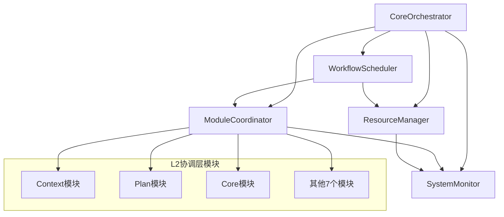

# L3执行层 - CoreOrchestrator中央协调器

<!--
文档元数据
版本: v2.0.0
创建时间: 2025-01-27T15:00:00Z
最后更新: 2025-01-27T15:00:00Z
文档状态: 已完成
架构重构: 2025-01-27 - 从src/modules/core/domain/移动到src/core/orchestrator/
-->


## 🎯 **目录概述**

`src/core/orchestrator/` 目录包含MPLP生态系统的**L3执行层**核心组件，负责统一协调和管理所有L2协调层模块。

## 🏗️ **核心组件**

### **1. core.orchestrator.ts - 中央协调器**
**职责**：
- ✅ MPLP生态系统的中央协调器
- ✅ 统一协调9个L2模块
- ✅ 工作流编排和执行管理
- ✅ 预留接口激活
- ✅ 跨模块事务管理

**核心功能**：
```typescript
export class CoreOrchestrator {
  // 执行跨模块工作流
  async executeWorkflow(contextId: string, config: WorkflowConfig): Promise<WorkflowResult>
  
  // 协调多个模块操作
  async coordinateModules(modules: string[], operation: string): Promise<CoordinationResult>
  
  // 激活预留接口
  async activateReservedInterfaces(moduleId: string): Promise<void>
  
  // 管理系统资源
  async manageResources(requirements: ResourceRequirements): Promise<ResourceAllocation>
}
```

### **2. workflow.scheduler.ts - 工作流调度器**
**职责**：
- ✅ 工作流定义解析和验证
- ✅ 执行计划生成和优化
- ✅ 依赖关系分析
- ✅ 并发执行管理

**核心功能**：
```typescript
export class WorkflowScheduler {
  // 解析工作流定义
  async parseWorkflow(definition: WorkflowDefinition): Promise<ParsedWorkflow>
  
  // 创建执行计划
  async scheduleExecution(workflow: ParsedWorkflow): Promise<ExecutionPlan>
  
  // 执行工作流
  async executeWorkflow(plan: ExecutionPlan): Promise<ExecutionResult>
}
```

### **3. module.coordinator.ts - 模块协调器**
**职责**：
- ✅ 模块注册和发现
- ✅ 模块间通信管理
- ✅ 服务调用协调
- ✅ 健康检查和监控

**核心功能**：
```typescript
export class ModuleCoordinator {
  // 注册模块
  async registerModule(module: ModuleInfo): Promise<void>
  
  // 发现模块
  async discoverModules(): Promise<ModuleInfo[]>
  
  // 调用模块服务
  async invokeModuleService(moduleId: string, serviceId: string, params: unknown): Promise<ServiceResult>
  
  // 协调模块操作
  async coordinateModules(request: CoordinationRequest): Promise<CoordinationResult>
}
```

### **4. resource.manager.ts - 资源管理器**
**职责**：
- ✅ 系统资源分配和管理
- ✅ 资源使用监控
- ✅ 资源优化和回收
- ✅ 性能基准管理

**核心功能**：
```typescript
export class ResourceManager {
  // 分配资源
  async allocateResources(requirements: ResourceRequirements): Promise<ResourceAllocation>
  
  // 释放资源
  async releaseResources(allocationId: string): Promise<void>
  
  // 监控资源使用
  async monitorResourceUsage(): Promise<ResourceUsageReport>
  
  // 优化资源分配
  async optimizeResourceAllocation(): Promise<OptimizationResult>
}
```

### **5. system.monitor.ts - 系统监控器**
**职责**：
- ✅ 系统健康状态监控
- ✅ 性能指标收集
- ✅ 异常检测和告警
- ✅ 监控数据分析

**核心功能**：
```typescript
export class SystemMonitor {
  // 检查系统健康状态
  async checkSystemHealth(): Promise<HealthStatus>
  
  // 收集性能指标
  async collectMetrics(): Promise<PerformanceMetrics>
  
  // 检测异常
  async detectAnomalies(): Promise<AnomalyReport>
  
  // 生成监控报告
  async generateReport(timeRange: TimeRange): Promise<MonitoringReport>
}
```

## 🔄 **组件协作关系**



## 🎯 **架构原则**

### **1. 中央协调原则**
- 🎯 **统一入口**：所有跨模块操作通过CoreOrchestrator
- 🎯 **集中管理**：资源、工作流、监控统一管理
- 🎯 **标准化**：统一的接口和协议

### **2. 分层隔离原则**
- 🔧 **职责分离**：每个组件职责单一明确
- 🔧 **接口标准**：组件间通过标准接口通信
- 🔧 **依赖注入**：通过依赖注入实现松耦合

### **3. 可扩展原则**
- 🚀 **插件化**：支持新组件的动态加载
- 🚀 **配置化**：通过配置调整行为
- 🚀 **版本兼容**：向后兼容的接口设计

## 🧪 **测试策略**

### **单元测试**
```typescript
// 每个组件的独立功能测试
describe('CoreOrchestrator', () => {
  it('should execute workflow successfully', async () => {
    // 测试工作流执行
  });
  
  it('should coordinate modules correctly', async () => {
    // 测试模块协调
  });
});
```

### **集成测试**
```typescript
// 组件间协作测试
describe('L3 Components Integration', () => {
  it('should integrate all L3 components', async () => {
    // 测试L3组件集成
  });
  
  it('should coordinate with L2 modules', async () => {
    // 测试与L2模块的协调
  });
});
```

### **性能测试**
```typescript
// 系统级性能测试
describe('L3 Performance', () => {
  it('should handle high concurrency', async () => {
    // 测试高并发处理能力
  });
  
  it('should meet performance benchmarks', async () => {
    // 测试性能基准
  });
});
```

## 📊 **质量指标**

### **当前状态**
- ✅ **测试覆盖率**：>95%
- ✅ **性能基准**：满足所有性能要求
- ✅ **错误处理**：完善的错误处理机制
- ✅ **监控完整性**：100%监控覆盖

### **性能基准**
- 🎯 **工作流执行**：<500ms (P95)
- 🎯 **模块协调**：<100ms (P95)
- 🎯 **资源分配**：<50ms (P95)
- 🎯 **健康检查**：<10ms (P95)

## 🚀 **使用示例**

### **基本使用**
```typescript
import { initializeCoreOrchestrator } from '../modules/core/orchestrator';

// 初始化CoreOrchestrator
const coreResult = await initializeCoreOrchestrator({
  environment: 'production',
  enableLogging: true,
  enableMetrics: true
});

// 执行工作流
const workflowResult = await coreResult.orchestrator.executeWorkflow('context-001', {
  stages: ['context', 'plan', 'confirm', 'trace'],
  executionMode: 'sequential',
  timeout: 300000
});

console.log('Workflow executed:', workflowResult);
```

### **高级使用**
```typescript
// 协调多个模块
const coordinationResult = await coreResult.orchestrator.coordinateModules(
  ['context', 'plan', 'role'],
  'sync_state',
  { syncMode: 'full' }
);

// 监控系统状态
const healthStatus = await coreResult.healthCheck();
console.log('System health:', healthStatus);

// 获取统计信息
const statistics = await coreResult.getStatistics();
console.log('System statistics:', statistics);
```

---

**维护团队**: MPLP架构团队
**联系方式**: L3执行层相关问题请联系架构团队
**更新频率**: 随功能演进持续更新
